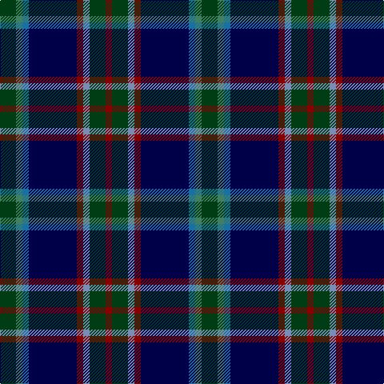

In pattern [GGBBRBGR](/patterns/ggbbrbgr/).

This was sourced from register-of-tartans.  It is a [8 stripes tartan](/stripes/stripes8/).

Original link https://www.tartanregister.gov.uk/tartanDetails.aspx?ref=11098

## Thread count
DG/20 G8 Ba8 DB60 DR8 B8 DG20 DR/8

## Palette
Each colour and its ΔE from the base-6 reference it is a variant of.

| Colour | Shade | Base | ΔE (OKLab) |
|---|---|---|---|
| B | <code style="background-color:#788CB4;">#788CB4</code> `#788CB4` | B <code style="background-color:#2A418A;">#2A418A</code> | 0.25 |
| Ba | <code style="background-color:#1870A4;">#1870A4</code> `#1870A4` | B <code style="background-color:#2A418A;">#2A418A</code> | 0.13 |
| DB | <code style="background-color:#000048;">#000048</code> `#000048` | B <code style="background-color:#2A418A;">#2A418A</code> | 0.22 |
| DG | <code style="background-color:#003C14;">#003C14</code> `#003C14` | G <code style="background-color:#006100;">#006100</code> | 0.13 |
| DR | <code style="background-color:#880000;">#880000</code> `#880000` | R <code style="background-color:#CC0000;">#CC0000</code> | 0.15 |
| G | <code style="background-color:#408060;">#408060</code> `#408060` | G <code style="background-color:#006100;">#006100</code> | 0.14 |

# Sample pattern

## Nearest tartans

The nearest existing variants by ΔTartan distance.

1. [Robert Burns Legacy](/setts/s9/b10g42ba8bb8ba8k24ba8b71r10-b1c0070-ba2c2c80-bb2888c4-g006818-k101010-rc80000/) — ΔT 0.81
1. [Yates](/setts/s8/k74r8b60ba14k20w10ba20g14-b000064-ba505050-g808080-k101010-rdc0000-we0e0e0/) — ΔT 0.90
1. [Yates (Personal)](/setts/s8/k58r6b48ba12k16w8ba16ra12-b003c64-ba5c5c5c-k101010-rc80000-ra888888-we0e0e0/) — ΔT 0.93
1. [Schmidt (2014)](/setts/s10/k6b40ba16b8g40k4g4r4g6y6-b000048-ba202060-g005448-k101010-rc8002c-ye0a126/) — ΔT 0.93
1. [McComb](/setts/s7/b6r4b36k12g36y4ga6-b304080-g003000-ga008000-k000000-rc00000-yf0c000/) — ΔT 0.98
1. [Grandfather Mountain Games (District](/setts/s7/r6g40k4b22k4ba40y4-b606060-ba000048-g044028-k000000-rc80000-yb0b0b0/) — ΔT 0.99
1. [Suzugamine (Corporate)](/setts/s9/b8g10ga38ba10g10k10g10b72y6-b2c2c80-ba780078-g384020-ga006818-k000000-yd8d898/) — ΔT 1.02
1. [McComb (Personal)](/setts/s7/b6r4b36k12g36y4ga6-b2c2c80-g006818-ga408060-k101010-rc80000-ye8c000/) — ΔT 1.07
1. [Fed. of Circles & Solitaries (Corp.)](/setts/s10/b18k60b18ba6b10r6b10y6b10g6-b202060-ba2888c4-g006818-k101010-rc80000-ye8c000/) — ΔT 1.11
1. [Blairmore House](/setts/s8/b68w8b8r8b8ba48g64y12-b003478-ba3c2010-g0c5454-r8c0000-wffffff-yc88c00/) — ΔT 1.12

## Neighbour map

Every grey dot is one of 15726 variants placed by the first two principal components of the ΔTartan feature space (44% of its variance). Red is this tartan; blue dots are its nearest — click one to open its page.

<svg viewBox="0 0 640 380" role="img" style="max-width:100%;height:auto;border:1px solid #e0e0e0;border-radius:4px;display:block" xmlns="http://www.w3.org/2000/svg"><image href="/nn/cloud.v1.png" width="640" height="380"/><a href="/setts/s9/b10g42ba8bb8ba8k24ba8b71r10-b1c0070-ba2c2c80-bb2888c4-g006818-k101010-rc80000/"><circle cx="187.6" cy="170.5" r="4" fill="#3465a4"><title>Robert Burns Legacy</title></circle></a><a href="/setts/s8/k74r8b60ba14k20w10ba20g14-b000064-ba505050-g808080-k101010-rdc0000-we0e0e0/"><circle cx="169.7" cy="175.1" r="4" fill="#3465a4"><title>Yates</title></circle></a><a href="/setts/s8/k58r6b48ba12k16w8ba16ra12-b003c64-ba5c5c5c-k101010-rc80000-ra888888-we0e0e0/"><circle cx="170.0" cy="175.0" r="4" fill="#3465a4"><title>Yates (Personal)</title></circle></a><a href="/setts/s10/k6b40ba16b8g40k4g4r4g6y6-b000048-ba202060-g005448-k101010-rc8002c-ye0a126/"><circle cx="186.1" cy="165.1" r="4" fill="#3465a4"><title>Schmidt (2014)</title></circle></a><a href="/setts/s7/b6r4b36k12g36y4ga6-b304080-g003000-ga008000-k000000-rc00000-yf0c000/"><circle cx="172.3" cy="178.2" r="4" fill="#3465a4"><title>McComb</title></circle></a><a href="/setts/s7/r6g40k4b22k4ba40y4-b606060-ba000048-g044028-k000000-rc80000-yb0b0b0/"><circle cx="149.5" cy="178.7" r="4" fill="#3465a4"><title>Grandfather Mountain Games (District</title></circle></a><a href="/setts/s9/b8g10ga38ba10g10k10g10b72y6-b2c2c80-ba780078-g384020-ga006818-k000000-yd8d898/"><circle cx="218.7" cy="151.0" r="4" fill="#3465a4"><title>Suzugamine (Corporate)</title></circle></a><a href="/setts/s7/b6r4b36k12g36y4ga6-b2c2c80-g006818-ga408060-k101010-rc80000-ye8c000/"><circle cx="180.1" cy="180.1" r="4" fill="#3465a4"><title>McComb (Personal)</title></circle></a><a href="/setts/s10/b18k60b18ba6b10r6b10y6b10g6-b202060-ba2888c4-g006818-k101010-rc80000-ye8c000/"><circle cx="232.6" cy="160.3" r="4" fill="#3465a4"><title>Fed. of Circles &amp; Solitaries (Corp.)</title></circle></a><a href="/setts/s8/b68w8b8r8b8ba48g64y12-b003478-ba3c2010-g0c5454-r8c0000-wffffff-yc88c00/"><circle cx="171.5" cy="183.8" r="4" fill="#3465a4"><title>Blairmore House</title></circle></a><circle cx="184.6" cy="183.0" r="5" fill="#c00000"/></svg>

ID: /setts/s8/g20ga8b8ba60r8bb8g20r8-b1870a4-ba000048-bb788cb4-g003c14-ga408060-r880000/
