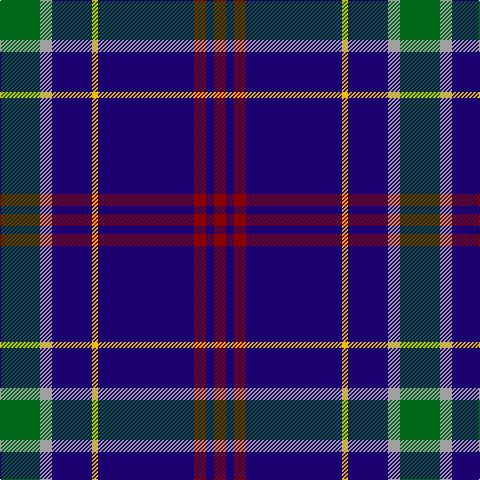

This page is one **sett** — a single exact thread-count. It belongs to the [tartan](/tartans/g20n6db20y3db48dr6db4dr6/)
(the same proportion at any scale), whose colour order is pattern [GYBYBRBR](/stripes/gybybrbr/).

Sourced from tartans-authority.  It is a [8 stripe tartan](/stripes/stripes8/).

Original link http://www.tartansauthority.com/tartan-ferret/display/2196/

## Thread count
G/40 N12 DB40 Y6 DB96 DR12 DB8 DR/12

## Palette
Each colour and the base-6 reference it is a variant of.

| Colour | Shade | Base |
|---|---|---|
| DB | <code style="background-color:#1C0070;">#1C0070</code> `oklch(26.3% 0.162 277.1)` <small>#1C0070</small> | B <code style="background-color:#2A418A;">#2A418A</code> |
| DR | <code style="background-color:#880000;">#880000</code> `oklch(39.4% 0.162 29.2)` <small>#880000</small> | R <code style="background-color:#CC0000;">#CC0000</code> |
| G | <code style="background-color:#006818;">#006818</code> `oklch(45.0% 0.142 145.0)` <small>#006818</small> | G <code style="background-color:#006100;">#006100</code> |
| N | <code style="background-color:#A0A0A0;">#A0A0A0</code> `oklch(70.6% 0.000 89.9)` <small>#A0A0A0</small> | Y <code style="background-color:#F2BF00;">#F2BF00</code> |
| Y | <code style="background-color:#E8C000;">#E8C000</code> `oklch(81.9% 0.168 93.7)` <small>#E8C000</small> | Y <code style="background-color:#F2BF00;">#F2BF00</code> |

# Sample pattern

## Nearest tartans

The nearest existing variants by ΔTartan distance, with this tartan at the top so the swatches line up against it.

ΔTartan

Tartan

Sett

—

<a href="/ttd/edit/#slug=g20lr6db20ly3db48r6db4r6~x2">Warren Wilson College (Corporate)</a> <a class="nn-out" href="/setts/s8/g20lr6db20ly3db48r6db4r6~x2/" title="open its dictionary page">↗</a>

0.95

<a href="/ttd/edit/#slug=r3db21r3db3k13db13t3db3w2~x2">Fitzgerald, Blue</a> <a class="nn-out" href="/setts/s9/r3db21r3db3k13db13t3db3w2~x2/" title="open its dictionary page">↗</a>

1.01

<a href="/ttd/edit/#slug=db30r3db3ly3db3g30db36w5~x2">De Nardi Hunting (Personal)</a> <a class="nn-out" href="/setts/s8/db30r3db3ly3db3g30db36w5~x2/" title="open its dictionary page">↗</a>

1.04

<a href="/ttd/edit/#slug=r1db12k5lo3db5lb1~x4">Massachusetts (Unofficial)</a> <a class="nn-out" href="/setts/s6/r1db12k5lo3db5lb1~x4/" title="open its dictionary page">↗</a>

1.09

<a href="/ttd/edit/#slug=r1db12k5o3db5w1~x4">Massachusetts</a> <a class="nn-out" href="/setts/s6/r1db12k5o3db5w1~x4/" title="open its dictionary page">↗</a>

1.16

<a href="/ttd/edit/#slug=k1ly2k3n12k18w1~x2">Jon's Theme</a> <a class="nn-out" href="/setts/s6/k1ly2k3n12k18w1~x2/" title="open its dictionary page">↗</a>

1.16

<a href="/ttd/edit/#slug=db20dy1db1dy1dg8k1w3~x2">Chestico</a> <a class="nn-out" href="/setts/s7/db20dy1db1dy1dg8k1w3~x2/" title="open its dictionary page">↗</a>

1.19

<a href="/ttd/edit/#slug=r1dt23lo3b16lo3dt22r1w1~x2">Schöbitz (2016)</a> <a class="nn-out" href="/setts/s8/r1dt23lo3b16lo3dt22r1w1~x2/" title="open its dictionary page">↗</a>

1.19

<a href="/ttd/edit/#slug=db34lo6g6r2w2r2g10lo8db23w2~x2">International Pairs (Corporate)</a> <a class="nn-out" href="/setts/s10/db34lo6g6r2w2r2g10lo8db23w2~x2/" title="open its dictionary page">↗</a>

1.20

<a href="/ttd/edit/#slug=db10k1g2k2t3k2g2k1db10w1~x8">Isle of Harris</a> <a class="nn-out" href="/setts/s10/db10k1g2k2t3k2g2k1db10w1~x8/" title="open its dictionary page">↗</a>

1.21

<a href="/ttd/edit/#slug=k2db22g4k7lo2k2w2db2~x2">Glasgow, University of</a> <a class="nn-out" href="/setts/s8/k2db22g4k7lo2k2w2db2~x2/" title="open its dictionary page">↗</a>

## Neighbour map

Every grey dot is one of 14299 variants placed by the first two principal components of the ΔTartan feature space (44% of its variance). Red is this tartan; blue dots are its nearest — click one to open its page.

<svg viewBox="0 0 640 380" role="img" style="max-width:100%;height:auto;border:1px solid #e0e0e0;border-radius:4px;display:block" xmlns="http://www.w3.org/2000/svg"><image href="/nn/cloud.v1.png" width="640" height="380"/><a href="/setts/s9/r3db21r3db3k13db13t3db3w2~x2/"><circle cx="306.4" cy="174.3" r="4" fill="#3465a4"><title>Fitzgerald, Blue</title></circle></a><a href="/setts/s8/db30r3db3ly3db3g30db36w5~x2/"><circle cx="343.2" cy="175.3" r="4" fill="#3465a4"><title>De Nardi Hunting (Personal)</title></circle></a><a href="/setts/s6/r1db12k5lo3db5lb1~x4/"><circle cx="324.5" cy="198.6" r="4" fill="#3465a4"><title>Massachusetts (Unofficial)</title></circle></a><a href="/setts/s6/r1db12k5o3db5w1~x4/"><circle cx="317.1" cy="193.6" r="4" fill="#3465a4"><title>Massachusetts</title></circle></a><a href="/setts/s6/k1ly2k3n12k18w1~x2/"><circle cx="366.4" cy="186.6" r="4" fill="#3465a4"><title>Jon's Theme</title></circle></a><a href="/setts/s7/db20dy1db1dy1dg8k1w3~x2/"><circle cx="353.2" cy="144.6" r="4" fill="#3465a4"><title>Chestico</title></circle></a><a href="/setts/s8/r1dt23lo3b16lo3dt22r1w1~x2/"><circle cx="368.1" cy="143.6" r="4" fill="#3465a4"><title>Schöbitz (2016)</title></circle></a><a href="/setts/s10/db34lo6g6r2w2r2g10lo8db23w2~x2/"><circle cx="324.3" cy="143.1" r="4" fill="#3465a4"><title>International Pairs (Corporate)</title></circle></a><a href="/setts/s10/db10k1g2k2t3k2g2k1db10w1~x8/"><circle cx="285.8" cy="171.9" r="4" fill="#3465a4"><title>Isle of Harris</title></circle></a><a href="/setts/s8/k2db22g4k7lo2k2w2db2~x2/"><circle cx="303.2" cy="166.3" r="4" fill="#3465a4"><title>Glasgow, University of</title></circle></a><circle cx="351.1" cy="165.1" r="5" fill="#c00000"/></svg>

ID: /setts/s8/g20lr6db20ly3db48r6db4r6~x2/
