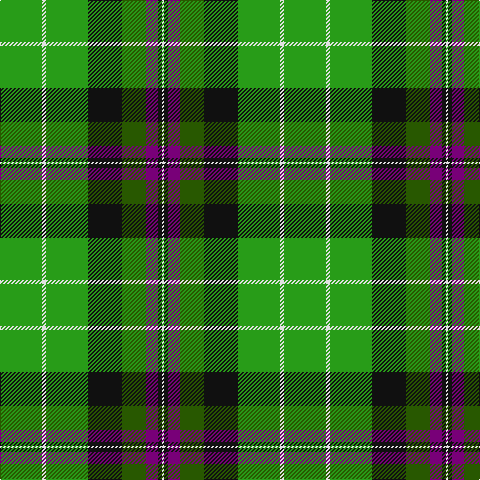

In pattern [GWGKGBKW](/stripes/gwgkgbkw/).

This was sourced from tartans-authority.  It is a [8 stripe tartan](/stripes/stripes8/).

Original link http://www.tartansauthority.com/tartan-ferret/display/6894/

## Thread count
Ga/42 LN4 Ga42 K34 G24 P12 K4 LN/2

## Palette
Each colour and the base-6 reference it is a variant of.

| Colour | Shade | Base |
|---|---|---|
| G | <code style="background-color:#285800;">#285800</code> `oklch(41.0% 0.122 135.8)` <small>#285800</small> | G <code style="background-color:#006100;">#006100</code> |
| Ga | <code style="background-color:#289C18;">#289C18</code> `oklch(60.6% 0.191 141.6)` <small>#289C18</small> | G <code style="background-color:#006100;">#006100</code> |
| K | <code style="background-color:#101010;">#101010</code> `oklch(17.3% 0.000 89.9)` <small>#101010</small> | K <code style="background-color:#000000;">#000000</code> |
| LN | <code style="background-color:#E0E0E0;">#E0E0E0</code> `oklch(90.7% 0.000 89.9)` <small>#E0E0E0</small> | W <code style="background-color:#F7F7F7;">#F7F7F7</code> |
| P | <code style="background-color:#780078;">#780078</code> `oklch(40.2% 0.185 328.4)` <small>#780078</small> | B <code style="background-color:#2A418A;">#2A418A</code> |

# Sample pattern

## Nearest tartans

The nearest existing variants by ΔTartan distance.

1. [Carrick, hunting](/setts/s8/g13p1g1p1g3db5k4ly2~x2/) — ΔT 1.26
1. [Bute Heather, Glencallum (Fashion)](/setts/s11/ly13db2g38db13g8db8g17db2g17db4w11/) — ΔT 1.29
1. [Kilkenny](/setts/s7/m5dg27o2g25ly7dg3m3~x2/) — ΔT 1.33
1. [Hibernian Football Club (2004)](/setts/s14/k2dp6dg12k17g21w2g21w2g21k17dg12dp6k2w1~x2/) — ΔT 1.35
1. [Pinder, Nigel (Personal)](/setts/s7/g12k4g12w1b6w1ly4~x4/) — ΔT 1.39
1. [Hibernian Football Club](/setts/s8/g22w2g22k18dg12dp6k2w1~x2/) — ΔT 1.39
1. [John Telfar, Dunbar hunting](/setts/s7/g5k2g28k10o26db4g4~x2/) — ΔT 1.40
1. [Herbage](/setts/s5/g25k8y10r1y3~x4/) — ΔT 1.45
1. [Leinster Ancestry](/setts/s9/k4dg33k18lo10g19lo3dg15k1ly3~x2/) — ΔT 1.47
1. [Brandon, Manitoba](/setts/s6/y83k35w3g35k3ly10/) — ΔT 1.49

## Neighbour map

Every grey dot is one of 14299 variants placed by the first two principal components of the ΔTartan feature space (44% of its variance). Red is this tartan; blue dots are its nearest — click one to open its page.

<svg viewBox="0 0 640 380" role="img" style="max-width:100%;height:auto;border:1px solid #e0e0e0;border-radius:4px;display:block" xmlns="http://www.w3.org/2000/svg"><image href="/nn/cloud.v1.png" width="640" height="380"/><a href="/setts/s8/g13p1g1p1g3db5k4ly2~x2/"><circle cx="260.2" cy="159.0" r="4" fill="#3465a4"><title>Carrick, hunting</title></circle></a><a href="/setts/s11/ly13db2g38db13g8db8g17db2g17db4w11/"><circle cx="286.6" cy="152.0" r="4" fill="#3465a4"><title>Bute Heather, Glencallum (Fashion)</title></circle></a><a href="/setts/s7/m5dg27o2g25ly7dg3m3~x2/"><circle cx="202.7" cy="165.0" r="4" fill="#3465a4"><title>Kilkenny</title></circle></a><a href="/setts/s14/k2dp6dg12k17g21w2g21w2g21k17dg12dp6k2w1~x2/"><circle cx="187.0" cy="137.7" r="4" fill="#3465a4"><title>Hibernian Football Club (2004)</title></circle></a><a href="/setts/s7/g12k4g12w1b6w1ly4~x4/"><circle cx="276.8" cy="195.9" r="4" fill="#3465a4"><title>Pinder, Nigel (Personal)</title></circle></a><a href="/setts/s8/g22w2g22k18dg12dp6k2w1~x2/"><circle cx="271.6" cy="175.6" r="4" fill="#3465a4"><title>Hibernian Football Club</title></circle></a><a href="/setts/s7/g5k2g28k10o26db4g4~x2/"><circle cx="253.5" cy="190.9" r="4" fill="#3465a4"><title>John Telfar, Dunbar hunting</title></circle></a><a href="/setts/s5/g25k8y10r1y3~x4/"><circle cx="301.9" cy="181.5" r="4" fill="#3465a4"><title>Herbage</title></circle></a><a href="/setts/s9/k4dg33k18lo10g19lo3dg15k1ly3~x2/"><circle cx="248.2" cy="146.7" r="4" fill="#3465a4"><title>Leinster Ancestry</title></circle></a><a href="/setts/s6/y83k35w3g35k3ly10/"><circle cx="249.9" cy="133.5" r="4" fill="#3465a4"><title>Brandon, Manitoba</title></circle></a><circle cx="236.0" cy="160.2" r="5" fill="#c00000"/></svg>

ID: /setts/s8/g21w2g21k17dg12dp6k2w1~x2/
