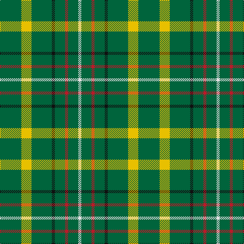

In pattern [GYGKGRGW](/patterns/gygkgrgw/).

This was sourced from tartans-authority.  It is a [8 stripes tartan](/stripes/stripes8/).

Original link http://www.tartansauthority.com/tartan-ferret/display/7417/

## Thread count
G/42 Y20 G40 K6 G20 R6 G20 LN/6

## Palette
Each colour and its ΔE from the base-6 reference it is a variant of.

| Colour | Shade | Base | ΔE (OKLab) |
|---|---|---|---|
| G | <code style="background-color:#00643C;">#00643C</code> `#00643C` | G <code style="background-color:#006100;">#006100</code> | 0.05 |
| K | <code style="background-color:#101010;">#101010</code> `#101010` | K <code style="background-color:#000000;">#000000</code> | 0.17 |
| LN | <code style="background-color:#E0E0E0;">#E0E0E0</code> `#E0E0E0` | W <code style="background-color:#F7F7F7;">#F7F7F7</code> | 0.07 |
| R | <code style="background-color:#BC1828;">#BC1828</code> `#BC1828` | R <code style="background-color:#CC0000;">#CC0000</code> | 0.04 |
| Y | <code style="background-color:#E8C000;">#E8C000</code> `#E8C000` | Y <code style="background-color:#F2BF00;">#F2BF00</code> | 0.02 |

# Sample pattern

## Nearest tartans

The nearest existing variants by ΔTartan distance.

1. [MacStumer Htg](/setts/s9/k3g14k8g8r3g4y3g24w3x2~g006c3c-k101010-r880000-we0e0e0-yd09800/) — ΔT 1.16
1. [McGrane (2014)](/setts/s12/g13ga7g13ga2g13ga2g13ga2w3y4w3g4x2~g408060-ga603800-wfcfcfc-yfccc00/) — ΔT 1.66
1. [McGrane (2014)](/setts/s12/g13b7g13b2g13b2g13b2w3y4w3g4x2~b4c3428-g408060-wf8f4d0-ye0a126/) — ΔT 1.76
1. [Justus hunting](/setts/s7/b1g4r1g1y1g4b1x12~b304080-g008000-rc00000-yf0c000/) — ΔT 1.79
1. [Meath County Crest (Fashion)](/setts/s6/y21g28b24g72w16g20~b2c2c80-g006818-we0e0e0-ybc8c00/) — ΔT 1.89
1. [Sir Billi](/setts/s10/g12w5k11g42k3g42k11w5g12r8x2~g285800-k101010-rc80000-wf4f8c8/) — ΔT 1.97
1. [Justus Hunting (Personal)](/setts/s7/b1g4r1g1y1g4b1x12~b1c0070-g285800-r880000-yd09800/) — ΔT 1.98
1. [Ayrton, Laoch](/setts/s10/r1g6y1g6b1g1b1g1b2r1x4~b304080-g008000-rc00000-yf0c000/) — ΔT 1.98
1. [Arkansas](/setts/s7/g3w1g12r6g3k3g2x4~g006818-k101010-rc8002c-wfcfcfc/) — ΔT 1.98
1. [MacStumer Hunting](/setts/s9/k3g14k8g8r3g4y3g24w3x2~g003820-k101010-r880000-wffffff-yd09800/) — ΔT 1.99

## Neighbour map

Every grey dot is one of 15726 variants placed by the first two principal components of the ΔTartan feature space (44% of its variance). Red is this tartan; blue dots are its nearest — click one to open its page.

<svg viewBox="0 0 640 380" role="img" style="max-width:100%;height:auto;border:1px solid #e0e0e0;border-radius:4px;display:block" xmlns="http://www.w3.org/2000/svg"><image href="/nn/cloud.v1.png" width="640" height="380"/><a href="/setts/s9/k3g14k8g8r3g4y3g24w3x2~g006c3c-k101010-r880000-we0e0e0-yd09800/"><circle cx="370.2" cy="203.3" r="4" fill="#3465a4"><title>MacStumer Htg</title></circle></a><a href="/setts/s12/g13ga7g13ga2g13ga2g13ga2w3y4w3g4x2~g408060-ga603800-wfcfcfc-yfccc00/"><circle cx="361.6" cy="220.5" r="4" fill="#3465a4"><title>McGrane (2014)</title></circle></a><a href="/setts/s12/g13b7g13b2g13b2g13b2w3y4w3g4x2~b4c3428-g408060-wf8f4d0-ye0a126/"><circle cx="370.9" cy="225.0" r="4" fill="#3465a4"><title>McGrane (2014)</title></circle></a><a href="/setts/s7/b1g4r1g1y1g4b1x12~b304080-g008000-rc00000-yf0c000/"><circle cx="343.3" cy="264.3" r="4" fill="#3465a4"><title>Justus hunting</title></circle></a><a href="/setts/s6/y21g28b24g72w16g20~b2c2c80-g006818-we0e0e0-ybc8c00/"><circle cx="305.4" cy="270.5" r="4" fill="#3465a4"><title>Meath County Crest (Fashion)</title></circle></a><a href="/setts/s10/g12w5k11g42k3g42k11w5g12r8x2~g285800-k101010-rc80000-wf4f8c8/"><circle cx="404.5" cy="187.0" r="4" fill="#3465a4"><title>Sir Billi</title></circle></a><a href="/setts/s7/b1g4r1g1y1g4b1x12~b1c0070-g285800-r880000-yd09800/"><circle cx="358.4" cy="270.3" r="4" fill="#3465a4"><title>Justus Hunting (Personal)</title></circle></a><a href="/setts/s10/r1g6y1g6b1g1b1g1b2r1x4~b304080-g008000-rc00000-yf0c000/"><circle cx="353.6" cy="217.0" r="4" fill="#3465a4"><title>Ayrton, Laoch</title></circle></a><a href="/setts/s7/g3w1g12r6g3k3g2x4~g006818-k101010-rc8002c-wfcfcfc/"><circle cx="365.6" cy="210.6" r="4" fill="#3465a4"><title>Arkansas</title></circle></a><a href="/setts/s9/k3g14k8g8r3g4y3g24w3x2~g003820-k101010-r880000-wffffff-yd09800/"><circle cx="375.6" cy="207.5" r="4" fill="#3465a4"><title>MacStumer Hunting</title></circle></a><circle cx="382.1" cy="226.9" r="5" fill="#c00000"/></svg>

ID: /setts/s8/g21y10g20k3g10r3g10w3x2~g00643c-k101010-rbc1828-we0e0e0-ye8c000/
