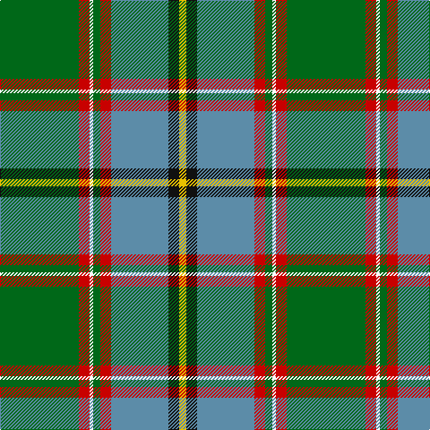

This page is one **sett** — a single exact thread-count. It belongs to the [tartan](/tartans/g22r3w1g2r3b16k3y2/)
(the same proportion at any scale), whose colour order is pattern [GRWGRBKY](/stripes/grwgrbky/).

Sourced from tartans-authority.  It is a [8 stripe tartan](/stripes/stripes8/).

Original link http://www.tartansauthority.com/tartan-ferret/display/2297/

## Also known as

This cloth is also recorded under:

- Stirling University #2
- Stirling, University of Corporate Univ

## Thread count
G/88 R12 W4 G8 R12 B64 K12 Y/8

## Palette
Each colour and the base-6 reference it is a variant of.

| Colour | Shade | Base |
|---|---|---|
| B | <code style="background-color:#5C8CA8;">#5C8CA8</code> `oklch(61.7% 0.067 235.0)` <small>#5C8CA8</small> | B <code style="background-color:#2A418A;">#2A418A</code> |
| G | <code style="background-color:#006818;">#006818</code> `oklch(45.0% 0.142 145.0)` <small>#006818</small> | G <code style="background-color:#006100;">#006100</code> |
| K | <code style="background-color:#101010;">#101010</code> `oklch(17.3% 0.000 89.9)` <small>#101010</small> | K <code style="background-color:#000000;">#000000</code> |
| R | <code style="background-color:#C80000;">#C80000</code> `oklch(52.3% 0.215 29.2)` <small>#C80000</small> | R <code style="background-color:#CC0000;">#CC0000</code> |
| W | <code style="background-color:#FCFCFC;">#FCFCFC</code> `oklch(99.1% 0.000 89.9)` <small>#FCFCFC</small> | W <code style="background-color:#F7F7F7;">#F7F7F7</code> |
| Y | <code style="background-color:#E8C000;">#E8C000</code> `oklch(81.9% 0.168 93.7)` <small>#E8C000</small> | Y <code style="background-color:#F2BF00;">#F2BF00</code> |

# Sample pattern

## Nearest tartans

The nearest existing variants by ΔTartan distance, with this tartan at the top so the swatches line up against it.

ΔTartan

Tartan

Sett

—

<a href="/ttd/edit/#slug=g22r3w1g2r3t16k3ly2~x4">Stirling University (Corporate)</a> <a class="nn-out" href="/setts/s8/g22r3w1g2r3t16k3ly2~x4/" title="open its dictionary page">↗</a>

0.16

<a href="/ttd/edit/#slug=g22r3k1g2r3t16k3ly2~x4">Stirling, University of Corporate Univ Tartan Tartan Number: 2297. Earliest known date: 1994 This is the accepted University design. See products available Copyright © Blair Urquhart, Comrie, 2015</a> <a class="nn-out" href="/setts/s8/g22r3k1g2r3t16k3ly2~x4/" title="open its dictionary page">↗</a>

0.84

<a href="/ttd/edit/#slug=db16w3db1ly4g24r1g3r4g3r1t8~x2">Currie</a> <a class="nn-out" href="/setts/s11/db16w3db1ly4g24r1g3r4g3r1t8~x2/" title="open its dictionary page">↗</a>

1.02

<a href="/ttd/edit/#slug=lo9dg18t9r1w1db1~x4">COG USA, THE</a> <a class="nn-out" href="/setts/s6/lo9dg18t9r1w1db1~x4/" title="open its dictionary page">↗</a>

1.10

<a href="/ttd/edit/#slug=r3db6ly2db15g12dg39w3~x2">Wagland (Name)</a> <a class="nn-out" href="/setts/s7/r3db6ly2db15g12dg39w3~x2/" title="open its dictionary page">↗</a>

1.13

<a href="/ttd/edit/#slug=g4r3g24k1w7k1g24ly3~x2">Layton, Mervin</a> <a class="nn-out" href="/setts/s8/g4r3g24k1w7k1g24ly3~x2/" title="open its dictionary page">↗</a>

1.16

<a href="/ttd/edit/#slug=lo2t14k1g11k2w2g2k1~x4">Mission</a> <a class="nn-out" href="/setts/s8/lo2t14k1g11k2w2g2k1~x4/" title="open its dictionary page">↗</a>

1.18

<a href="/ttd/edit/#slug=r3w6r2g32db36k2db4ly2~x2">Canadian Centennial</a> <a class="nn-out" href="/setts/s8/r3w6r2g32db36k2db4ly2~x2/" title="open its dictionary page">↗</a>

1.19

<a href="/ttd/edit/#slug=db30r2db4w1o11g4ly2g22~x2">Yorkland</a> <a class="nn-out" href="/setts/s8/db30r2db4w1o11g4ly2g22~x2/" title="open its dictionary page">↗</a>

1.20

<a href="/ttd/edit/#slug=ly4o2k2o42k13g25o6k2r4k2~x2">Dinwiddie Clan Tartan Tartan Number: 3212. Earliest known date: 2001 The registered tartan of the Dinwiddie Clan. Dinwiddies are normally associated with the Maxwells, but Lord Lyon stated, in 1988, that Dinwiddies were a sept of no other clan. See products available Copyright © Blair Urquhart, Comrie, 2015</a> <a class="nn-out" href="/setts/s10/ly4o2k2o42k13g25o6k2r4k2~x2/" title="open its dictionary page">↗</a>

1.21

<a href="/ttd/edit/#slug=ly3dg5k2dg5w1dg17dt4r1dt22w2~x2">McAvoy (Personal)</a> <a class="nn-out" href="/setts/s10/ly3dg5k2dg5w1dg17dt4r1dt22w2~x2/" title="open its dictionary page">↗</a>

## Neighbour map

Every grey dot is one of 14299 variants placed by the first two principal components of the ΔTartan feature space (44% of its variance). Red is this tartan; blue dots are its nearest — click one to open its page.

<svg viewBox="0 0 640 380" role="img" style="max-width:100%;height:auto;border:1px solid #e0e0e0;border-radius:4px;display:block" xmlns="http://www.w3.org/2000/svg"><image href="/nn/cloud.v1.png" width="640" height="380"/><a href="/setts/s8/g22r3k1g2r3t16k3ly2~x4/"><circle cx="250.4" cy="124.7" r="4" fill="#3465a4"><title>Stirling, University of Corporate Univ Tartan Tartan Number: 2297. Earliest known date: 1994 This is the accepted University design. See products available Copyright © Blair Urquhart, Comrie, 2015</title></circle></a><a href="/setts/s11/db16w3db1ly4g24r1g3r4g3r1t8~x2/"><circle cx="217.5" cy="104.0" r="4" fill="#3465a4"><title>Currie</title></circle></a><a href="/setts/s6/lo9dg18t9r1w1db1~x4/"><circle cx="231.6" cy="147.6" r="4" fill="#3465a4"><title>COG USA, THE</title></circle></a><a href="/setts/s7/r3db6ly2db15g12dg39w3~x2/"><circle cx="271.9" cy="154.2" r="4" fill="#3465a4"><title>Wagland (Name)</title></circle></a><a href="/setts/s8/g4r3g24k1w7k1g24ly3~x2/"><circle cx="219.1" cy="120.7" r="4" fill="#3465a4"><title>Layton, Mervin</title></circle></a><a href="/setts/s8/lo2t14k1g11k2w2g2k1~x4/"><circle cx="181.7" cy="136.8" r="4" fill="#3465a4"><title>Mission</title></circle></a><a href="/setts/s8/r3w6r2g32db36k2db4ly2~x2/"><circle cx="243.3" cy="120.5" r="4" fill="#3465a4"><title>Canadian Centennial</title></circle></a><a href="/setts/s8/db30r2db4w1o11g4ly2g22~x2/"><circle cx="276.5" cy="130.5" r="4" fill="#3465a4"><title>Yorkland</title></circle></a><a href="/setts/s10/ly4o2k2o42k13g25o6k2r4k2~x2/"><circle cx="267.2" cy="115.2" r="4" fill="#3465a4"><title>Dinwiddie Clan Tartan Tartan Number: 3212. Earliest known date: 2001 The registered tartan of the Dinwiddie Clan. Dinwiddies are normally associated with the Maxwells, but Lord Lyon stated, in 1988, that Dinwiddies were a sept of no other clan. See products available Copyright © Blair Urquhart, Comrie, 2015</title></circle></a><a href="/setts/s10/ly3dg5k2dg5w1dg17dt4r1dt22w2~x2/"><circle cx="259.2" cy="128.6" r="4" fill="#3465a4"><title>McAvoy (Personal)</title></circle></a><circle cx="250.5" cy="124.0" r="5" fill="#c00000"/></svg>

ID: /setts/s8/g22r3w1g2r3t16k3ly2~x4/
