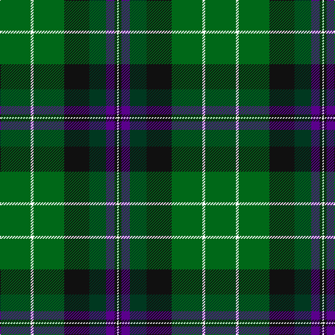

In pattern [GWGKGBKW](/stripes/gwgkgbkw/).

This was sourced from register-of-tartans.  It is a [8 stripe tartan](/stripes/stripes8/).

Original link https://www.tartanregister.gov.uk/tartanDetails.aspx?ref=1701

## Register references

External register numbers recorded for this tartan.

- Scottish Register of Tartans: [1701](https://www.tartanregister.gov.uk/tartanDetails.aspx?ref=1701)
- Scottish Tartans Authority (ITI): 2559
- Scottish Tartans World Register: 2559

## Thread count
G/44 W4 G44 K36 DG24 P12 K4 W/2

## Palette
Each colour and its ΔE from the base-6 reference it is a variant of.

| Colour | Shade | Base | ΔE (OKLab) |
|---|---|---|---|
| DG | <code style="background-color:#003820;">#003820</code> `#003820` | G <code style="background-color:#006100;">#006100</code> | 0.15 |
| G | <code style="background-color:#006818;">#006818</code> `#006818` | G <code style="background-color:#006100;">#006100</code> | 0.02 |
| K | <code style="background-color:#101010;">#101010</code> `#101010` | K <code style="background-color:#000000;">#000000</code> | 0.17 |
| P | <code style="background-color:#5A008C;">#5A008C</code> `#5A008C` | B <code style="background-color:#2A418A;">#2A418A</code> | 0.13 |
| W | <code style="background-color:#FCFCFC;">#FCFCFC</code> `#FCFCFC` | W <code style="background-color:#F7F7F7;">#F7F7F7</code> | 0.01 |

# Sample pattern

## Nearest tartans

The nearest existing variants by ΔTartan distance.

1. [Chiti, Cristiano (Personal)](/setts/s6/dg20dg11lb6r2dp3lb1~x2/) — ΔT 1.08
1. [Leinster Ancestry](/setts/s9/k4dg33k18lo10g19lo3dg15k1ly3~x2/) — ΔT 1.21
1. [Carrick Hunting District Tartan Tartan Number: 721. Earliest known date: 1930 This sample comes from the MacGregor-Hastie collection which forms the basis of the cloth archive of the Scottish Tartans Society. Some of the samples, including this one, were unmarked. One can assume that the sample dates between 1930 and 1950. See products available Copyright © Blair Urquhart, Comrie, 2015](/setts/s8/g13dp1g1dp1g3db5k4ly2~x2/) — ΔT 1.22
1. [Crumlish (2015)](/setts/s9/k44ly2dg27ly2dg16w8dg16w2dg8~x2/) — ΔT 1.26
1. [Leinster Ancestry (Fashion)](/setts/s9/k4dg33k18dy10g19dy3dg15k1lo3~x2/) — ΔT 1.26
1. [Sinclair Hunting (VS)](/setts/s7/r2db16w1k16g30r1g2~x2/) — ΔT 1.27
1. [Sinclair Green (Personal)](/setts/s7/r4db15w2n15g30r2g4~x2/) — ΔT 1.27
1. [Cates Hunting (Clan)](/setts/s9/dg23r7g25ly5dg17k5ly1w1r1~x2/) — ΔT 1.28
1. [City of Guelph](/setts/s8/g28k4g5dr4g5k19db19y2~x2/) — ΔT 1.29
1. [Bomb Disposal](/setts/s10/k28r3ly2r3k13g28w1g3w1g16~x2/) — ΔT 1.31

## Neighbour map

Every grey dot is one of 14299 variants placed by the first two principal components of the ΔTartan feature space (44% of its variance). Red is this tartan; blue dots are its nearest — click one to open its page.

<svg viewBox="0 0 640 380" role="img" style="max-width:100%;height:auto;border:1px solid #e0e0e0;border-radius:4px;display:block" xmlns="http://www.w3.org/2000/svg"><image href="/nn/cloud.v1.png" width="640" height="380"/><a href="/setts/s6/dg20dg11lb6r2dp3lb1~x2/"><circle cx="245.1" cy="169.8" r="4" fill="#3465a4"><title>Chiti, Cristiano (Personal)</title></circle></a><a href="/setts/s9/k4dg33k18lo10g19lo3dg15k1ly3~x2/"><circle cx="248.2" cy="146.7" r="4" fill="#3465a4"><title>Leinster Ancestry</title></circle></a><a href="/setts/s8/g13dp1g1dp1g3db5k4ly2~x2/"><circle cx="289.3" cy="173.1" r="4" fill="#3465a4"><title>Carrick Hunting District Tartan Tartan Number: 721. Earliest known date: 1930 This sample comes from the MacGregor-Hastie collection which forms the basis of the cloth archive of the Scottish Tartans Society. Some of the samples, including this one, were unmarked. One can assume that the sample dates between 1930 and 1950. See products available Copyright © Blair Urquhart, Comrie, 2015</title></circle></a><a href="/setts/s9/k44ly2dg27ly2dg16w8dg16w2dg8~x2/"><circle cx="227.4" cy="152.4" r="4" fill="#3465a4"><title>Crumlish (2015)</title></circle></a><a href="/setts/s9/k4dg33k18dy10g19dy3dg15k1lo3~x2/"><circle cx="269.7" cy="162.1" r="4" fill="#3465a4"><title>Leinster Ancestry (Fashion)</title></circle></a><a href="/setts/s7/r2db16w1k16g30r1g2~x2/"><circle cx="292.4" cy="150.1" r="4" fill="#3465a4"><title>Sinclair Hunting (VS)</title></circle></a><a href="/setts/s7/r4db15w2n15g30r2g4~x2/"><circle cx="255.1" cy="182.9" r="4" fill="#3465a4"><title>Sinclair Green (Personal)</title></circle></a><a href="/setts/s9/dg23r7g25ly5dg17k5ly1w1r1~x2/"><circle cx="248.6" cy="134.4" r="4" fill="#3465a4"><title>Cates Hunting (Clan)</title></circle></a><a href="/setts/s8/g28k4g5dr4g5k19db19y2~x2/"><circle cx="209.4" cy="179.4" r="4" fill="#3465a4"><title>City of Guelph</title></circle></a><a href="/setts/s10/k28r3ly2r3k13g28w1g3w1g16~x2/"><circle cx="303.6" cy="136.8" r="4" fill="#3465a4"><title>Bomb Disposal</title></circle></a><circle cx="271.6" cy="175.6" r="5" fill="#c00000"/></svg>

ID: /setts/s8/g22w2g22k18dg12dp6k2w1~x2/
