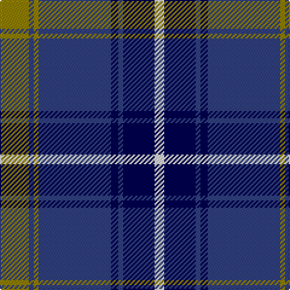

In pattern [GBGBBBBW](/patterns/gbgbbbbw/).

This was sourced from weddslist.  It is a [8 stripes tartan](/stripes/stripes8/).

Original link http://www.weddslist.com/cgi-bin/tartans/pg.pl?source=sts

## Thread count
LG/24 B4 LG4 B60 DB6 B4 DB26 LN/8

## Palette
Each colour and its ΔE from the base-6 reference it is a variant of.

| Colour | Shade | Base | ΔE (OKLab) |
|---|---|---|---|
| B | <code style="background-color:#304080;">#304080</code> `#304080` | B <code style="background-color:#2A418A;">#2A418A</code> | 0.02 |
| DB | <code style="background-color:#000050;">#000050</code> `#000050` | B <code style="background-color:#2A418A;">#2A418A</code> | 0.21 |
| LG | <code style="background-color:#908000;">#908000</code> `#908000` | G <code style="background-color:#006100;">#006100</code> | 0.20 |
| LN | <code style="background-color:#E0E0E0;">#E0E0E0</code> `#E0E0E0` | W <code style="background-color:#F7F7F7;">#F7F7F7</code> | 0.07 |

# Sample pattern

## Nearest tartans

The nearest existing variants by ΔTartan distance.

1. [Highlands School (North Carolina)](/setts/s8/y24b4y4b60ba4b4ba26w8-b1c0070-ba14283c-wc0c0c0-yd09800/) — ΔT 0.72
1. [Hannay Blue (Fashion?)](/setts/s10/k18b8k4b8k4b60k18b8ba28y4-b5c8ca8-ba2c2c80-k101010-ye8c000/) — ΔT 0.77
1. [Highlands School (N. Carolina) Corporate Tartan Tartan Number: 2109. Earliest known date: 1990 Highlands in North Carolina is the home of the Scottish Tartans Society's Museum Extension. The school tartan was designed by Bob Martin who is a 'Fellow of the Society'. Blue and Gold are the school colours. See products available Copyright © Blair Urquhart, Comrie, 2015](/setts/s8/y24b4y4b60ba6b4ba26w8-b2c2c80-ba202060-we0e0e0-ye8c000/) — ΔT 0.86
1. [Rhys (Welsh Name)](/setts/s10/y6b3y3b15ba7y7ba5y17ba46y4-b202060-ba000048-ya08858/) — ΔT 0.87
1. [Scottish Knights Templar Int. (Corp)](/setts/s9/r6b40k12w10k8w6k4r2b4-b2c2c80-k101010-rc80000-wc0c0c0/) — ΔT 1.01
1. [Int. Police Association (Official)](/setts/s7/b14r6b52ba4b4ba52y8-b1c0070-ba5c8ca8-rc80000-ye8c000/) — ΔT 1.04
1. [DeCloud-McMasters (Personal)](/setts/s8/r6b4w4b52k44w6b6w6-b2c2c80-k101010-rc80000-wfcfcfc/) — ΔT 1.10
1. [Dinwiddie Hunting (Name)](/setts/s10/y12b6k6b72k20ya36b12k4g8k6-b2c2c80-g006818-k101010-ye8c000-yaa0a0a0/) — ΔT 1.11
1. [Home (Clan)](/setts/s8/k72r6k6r6k18b72g6b4-b1474b4-g289c18-k101010-rc80000/) — ΔT 1.11
1. [Kinnaird (Australia) (Name)](/setts/s8/r66k8r8k10r8k14b82ra8-b2c2c80-k101010-r888888-rac80000/) — ΔT 1.15

## Neighbour map

Every grey dot is one of 15726 variants placed by the first two principal components of the ΔTartan feature space (44% of its variance). Red is this tartan; blue dots are its nearest — click one to open its page.

<svg viewBox="0 0 640 380" role="img" style="max-width:100%;height:auto;border:1px solid #e0e0e0;border-radius:4px;display:block" xmlns="http://www.w3.org/2000/svg"><image href="/nn/cloud.v1.png" width="640" height="380"/><a href="/setts/s8/y24b4y4b60ba4b4ba26w8-b1c0070-ba14283c-wc0c0c0-yd09800/"><circle cx="269.3" cy="159.1" r="4" fill="#3465a4"><title>Highlands School (North Carolina)</title></circle></a><a href="/setts/s10/k18b8k4b8k4b60k18b8ba28y4-b5c8ca8-ba2c2c80-k101010-ye8c000/"><circle cx="280.9" cy="159.2" r="4" fill="#3465a4"><title>Hannay Blue (Fashion?)</title></circle></a><a href="/setts/s8/y24b4y4b60ba6b4ba26w8-b2c2c80-ba202060-we0e0e0-ye8c000/"><circle cx="256.7" cy="155.1" r="4" fill="#3465a4"><title>Highlands School (N. Carolina) Corporate Tartan Tartan Number: 2109. Earliest known date: 1990 Highlands in North Carolina is the home of the Scottish Tartans Society's Museum Extension. The school tartan was designed by Bob Martin who is a 'Fellow of the Society'. Blue and Gold are the school colours. See products available Copyright © Blair Urquhart, Comrie, 2015</title></circle></a><a href="/setts/s10/y6b3y3b15ba7y7ba5y17ba46y4-b202060-ba000048-ya08858/"><circle cx="281.0" cy="156.5" r="4" fill="#3465a4"><title>Rhys (Welsh Name)</title></circle></a><a href="/setts/s9/r6b40k12w10k8w6k4r2b4-b2c2c80-k101010-rc80000-wc0c0c0/"><circle cx="262.2" cy="144.4" r="4" fill="#3465a4"><title>Scottish Knights Templar Int. (Corp)</title></circle></a><a href="/setts/s7/b14r6b52ba4b4ba52y8-b1c0070-ba5c8ca8-rc80000-ye8c000/"><circle cx="285.0" cy="178.3" r="4" fill="#3465a4"><title>Int. Police Association (Official)</title></circle></a><a href="/setts/s8/r6b4w4b52k44w6b6w6-b2c2c80-k101010-rc80000-wfcfcfc/"><circle cx="259.7" cy="158.0" r="4" fill="#3465a4"><title>DeCloud-McMasters (Personal)</title></circle></a><a href="/setts/s10/y12b6k6b72k20ya36b12k4g8k6-b2c2c80-g006818-k101010-ye8c000-yaa0a0a0/"><circle cx="243.6" cy="128.3" r="4" fill="#3465a4"><title>Dinwiddie Hunting (Name)</title></circle></a><a href="/setts/s8/k72r6k6r6k18b72g6b4-b1474b4-g289c18-k101010-rc80000/"><circle cx="314.6" cy="158.4" r="4" fill="#3465a4"><title>Home (Clan)</title></circle></a><a href="/setts/s8/r66k8r8k10r8k14b82ra8-b2c2c80-k101010-r888888-rac80000/"><circle cx="244.2" cy="179.1" r="4" fill="#3465a4"><title>Kinnaird (Australia) (Name)</title></circle></a><circle cx="276.1" cy="167.9" r="5" fill="#c00000"/></svg>

ID: /setts/s8/g24b4g4b60ba6b4ba26w8-b304080-ba000050-g908000-we0e0e0/
