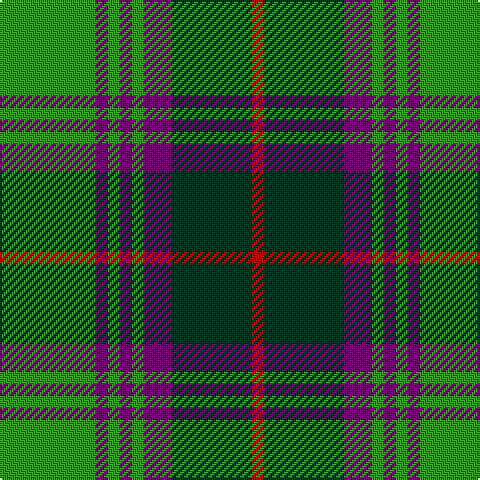

**Bands:** [GBGBGBGR](/stripes/gbgbgbgr/) · **Stripes:** [G DP G DP G DP DG R](/stripes/stripes8/) G DP G DP G DP DG R

This was sourced from house-of-tartan.  It is a [8 band tartan](/bands/bands8/).

Original link http://www.house-of-tartan.scotland.net/house/TartanViewjs.asp?colr=Def&tnam=707

## Thread count
G/48 P6 G6 P6 G6 P14 DG40 R/6

## Palette
Each colour and its ΔE from the base-6 reference it is a variant of.

| Colour | Shade | Base | ΔE (OKLab) |
|---|---|---|---|
| DG | <code style="background-color:#003820;">#003820</code> `#003820` | G <code style="background-color:#006100;">#006100</code> | 0.15 |
| G | <code style="background-color:#289C18;">#289C18</code> `#289C18` | G <code style="background-color:#006100;">#006100</code> | 0.19 |
| P | <code style="background-color:#780078;">#780078</code> `#780078` | B <code style="background-color:#2A418A;">#2A418A</code> | 0.17 |
| R | <code style="background-color:#C80000;">#C80000</code> `#C80000` | R <code style="background-color:#CC0000;">#CC0000</code> | 0.01 |

# Sample pattern

## Nearest tartans

The nearest existing variants by ΔTartan distance.

1. [Crantock](/setts/s8/g24p3g3p3g3p7dg20r3~x2/) — ΔT 0.35
1. [New Mexico, State of (Fashion)](/setts/s8/ly1r1ly2db11g5db1g8r1~x4/) — ΔT 0.99
1. [John Telfar, Dunbar hunting](/setts/s7/g5k2g28k10o26db4g4~x2/) — ΔT 1.02
1. [Brunton (Personal)](/setts/s8/k7r3k27g27ly3g3ly3g3~x2/) — ΔT 1.05
1. [Cork](/setts/s9/g28r12g4db20ly2db3ly2db3g7~x2/) — ΔT 1.07
1. [Casey of West Virginia (Personal)](/setts/s9/g4lo1dt1lo1dt2g9r1dt6w1~x4/) — ΔT 1.10
1. [Cape Breton University](/setts/s10/db4o17db4g4db2g4db4g27db4ly4~x2/) — ΔT 1.11
1. [Tweedside, hunting](/setts/s9/db21g5k5g15w3g5w3g5k3~x2/) — ΔT 1.20
1. [Invertere](/setts/s8/ly5dg14o4db4o27dg3o4ly5~x2/) — ΔT 1.22
1. [Tennessee](/setts/s10/r2db10w1m1g1r1g6m1g10w1~x2/) — ΔT 1.23

## Neighbour map

Every grey dot is one of 14313 variants placed by the first two principal components of the ΔTartan feature space (44% of its variance). Red is this tartan; blue dots are its nearest — click one to open its page.

<svg viewBox="0 0 640 380" role="img" style="max-width:100%;height:auto;border:1px solid #e0e0e0;border-radius:4px;display:block" xmlns="http://www.w3.org/2000/svg"><image href="/nn/cloud.v1.png" width="640" height="380"/><a href="/setts/s8/g24p3g3p3g3p7dg20r3~x2/"><circle cx="220.0" cy="192.0" r="4" fill="#3465a4"><title>Crantock</title></circle></a><a href="/setts/s8/ly1r1ly2db11g5db1g8r1~x4/"><circle cx="225.7" cy="178.5" r="4" fill="#3465a4"><title>New Mexico, State of (Fashion)</title></circle></a><a href="/setts/s7/g5k2g28k10o26db4g4~x2/"><circle cx="253.6" cy="191.0" r="4" fill="#3465a4"><title>John Telfar, Dunbar hunting</title></circle></a><a href="/setts/s8/k7r3k27g27ly3g3ly3g3~x2/"><circle cx="252.2" cy="188.9" r="4" fill="#3465a4"><title>Brunton (Personal)</title></circle></a><a href="/setts/s9/g28r12g4db20ly2db3ly2db3g7~x2/"><circle cx="274.6" cy="177.9" r="4" fill="#3465a4"><title>Cork</title></circle></a><a href="/setts/s9/g4lo1dt1lo1dt2g9r1dt6w1~x4/"><circle cx="240.6" cy="180.4" r="4" fill="#3465a4"><title>Casey of West Virginia (Personal)</title></circle></a><a href="/setts/s10/db4o17db4g4db2g4db4g27db4ly4~x2/"><circle cx="251.7" cy="159.4" r="4" fill="#3465a4"><title>Cape Breton University</title></circle></a><a href="/setts/s9/db21g5k5g15w3g5w3g5k3~x2/"><circle cx="189.0" cy="202.2" r="4" fill="#3465a4"><title>Tweedside, hunting</title></circle></a><a href="/setts/s8/ly5dg14o4db4o27dg3o4ly5~x2/"><circle cx="271.3" cy="189.0" r="4" fill="#3465a4"><title>Invertere</title></circle></a><a href="/setts/s10/r2db10w1m1g1r1g6m1g10w1~x2/"><circle cx="247.5" cy="162.7" r="4" fill="#3465a4"><title>Tennessee</title></circle></a><circle cx="227.6" cy="196.1" r="5" fill="#c00000"/></svg>

ID: /setts/s8/g24dp3g3dp3g3dp7dg20r3~x2/
