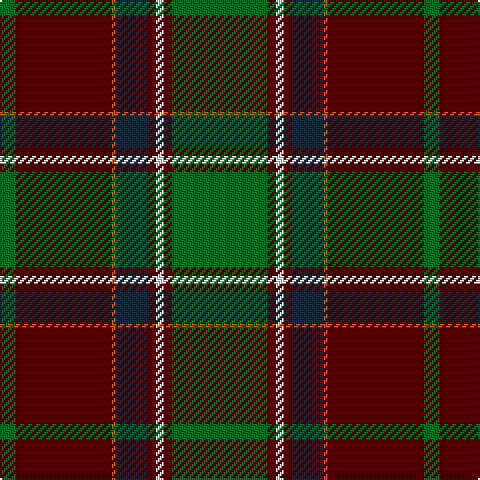

In pattern [GBRBBWBG](/stripes/gbrbbwbg/).

This was sourced from register-of-tartans.  It is a [8 stripe tartan](/stripes/stripes8/).

Original link https://www.tartanregister.gov.uk/tartanDetails.aspx?ref=4591

## Attestations

This cloth appears in 2 source records; the oldest owns this page.

- 01/01/1997 — Wellmont Golf Tournament (register-of-tartans, [record](https://www.tartanregister.gov.uk/tartanDetails.aspx?ref=4591))
- May 1997 — Wellmont Golf Tournament (Corporate) (tartans-authority, [record](http://www.tartansauthority.com/tartan-ferret/display/2472/))

## Register references

External register numbers recorded for this tartan.

- Scottish Register of Tartans: [4591](https://www.tartanregister.gov.uk/tartanDetails.aspx?ref=4591)
- Scottish Tartans Authority (ITI): 2472
- Scottish Tartans World Register: 2472

## Thread count
G/48 DR4 W4 DR4 DN16 DO2 DR48 G/8

## Palette
Each colour and the base-6 reference it is a variant of.

| Colour | Shade | Base |
|---|---|---|
| DG | <code style="background-color:#003820;">#003820</code> `oklch(30.0% 0.070 158.3)` <small>#003820</small> | G <code style="background-color:#006100;">#006100</code> |
| DN | <code style="background-color:#14283C;">#14283C</code> `oklch(27.1% 0.046 249.9)` <small>#14283C</small> | B <code style="background-color:#2A418A;">#2A418A</code> |
| DO | <code style="background-color:#C04C08;">#C04C08</code> `oklch(56.4% 0.163 43.2)` <small>#C04C08</small> | R <code style="background-color:#CC0000;">#CC0000</code> |
| DR | <code style="background-color:#4C0000;">#4C0000</code> `oklch(26.2% 0.107 29.2)` <small>#4C0000</small> | B <code style="background-color:#2A418A;">#2A418A</code> |
| G | <code style="background-color:#006818;">#006818</code> `oklch(45.0% 0.142 145.0)` <small>#006818</small> | G <code style="background-color:#006100;">#006100</code> |
| W | <code style="background-color:#FCFCFC;">#FCFCFC</code> `oklch(99.1% 0.000 89.9)` <small>#FCFCFC</small> | W <code style="background-color:#F7F7F7;">#F7F7F7</code> |

# Sample pattern

## Nearest tartans

The nearest existing variants by ΔTartan distance, with this tartan at the top so the swatches line up against it.

ΔTartan

Tartan

Sett

—

<a href="/ttd/edit/#slug=g24dr2w2dr2dt8o1dr24g4~x2">Wellmont Golf Tournament</a> <a class="nn-out" href="/setts/s8/g24dr2w2dr2dt8o1dr24g4~x2/" title="open its dictionary page">↗</a>

1.20

<a href="/ttd/edit/#slug=k44ly2dg27ly2dg16w8dg16w2dg8~x2">Crumlish (2015)</a> <a class="nn-out" href="/setts/s9/k44ly2dg27ly2dg16w8dg16w2dg8~x2/" title="open its dictionary page">↗</a>

1.21

<a href="/ttd/edit/#slug=w4dt38g6dr2g6dr36lo2dr3~x2">Scotland 2000</a> <a class="nn-out" href="/setts/s8/w4dt38g6dr2g6dr36lo2dr3~x2/" title="open its dictionary page">↗</a>

1.21

<a href="/ttd/edit/#slug=r2y18k2y3k20dy30w2~x2">Bennett, J P. (Personal)</a> <a class="nn-out" href="/setts/s7/r2y18k2y3k20dy30w2~x2/" title="open its dictionary page">↗</a>

1.22

<a href="/ttd/edit/#slug=dg71k4r4db9r4db4r36db4lr4~x2">Rattay</a> <a class="nn-out" href="/setts/s9/dg71k4r4db9r4db4r36db4lr4~x2/" title="open its dictionary page">↗</a>

1.22

<a href="/ttd/edit/#slug=dg71k4r4db9r4db4r36db4lr4">Rattay</a> <a class="nn-out" href="/setts/s9/dg71k4r4db9r4db4r36db4lr4/" title="open its dictionary page">↗</a>

1.25

<a href="/ttd/edit/#slug=g3n5k4n33g12k4w2k18lo3~x2">Smoke Showing (UFES)</a> <a class="nn-out" href="/setts/s9/g3n5k4n33g12k4w2k18lo3~x2/" title="open its dictionary page">↗</a>

1.28

<a href="/ttd/edit/#slug=dg23r7dg25ly5dg17k5ly1w1r1~x2">Cates Hunting</a> <a class="nn-out" href="/setts/s9/dg23r7dg25ly5dg17k5ly1w1r1~x2/" title="open its dictionary page">↗</a>

1.29

<a href="/ttd/edit/#slug=lb4dt38g6dr2g6dr36lo2dr3~x2">Scotland 2000 (Commemorative)</a> <a class="nn-out" href="/setts/s8/lb4dt38g6dr2g6dr36lo2dr3~x2/" title="open its dictionary page">↗</a>

1.29

<a href="/ttd/edit/#slug=k28r3ly2r3k13g28w1g3w1g16~x2">Bomb Disposal</a> <a class="nn-out" href="/setts/s10/k28r3ly2r3k13g28w1g3w1g16~x2/" title="open its dictionary page">↗</a>

1.29

<a href="/ttd/edit/#slug=db6k3r2k3dg31k6dg2k6lo13k2dg2~x2">Rourke-Frew Hunting</a> <a class="nn-out" href="/setts/s11/db6k3r2k3dg31k6dg2k6lo13k2dg2~x2/" title="open its dictionary page">↗</a>

## Neighbour map

Every grey dot is one of 14299 variants placed by the first two principal components of the ΔTartan feature space (44% of its variance). Red is this tartan; blue dots are its nearest — click one to open its page.

<svg viewBox="0 0 640 380" role="img" style="max-width:100%;height:auto;border:1px solid #e0e0e0;border-radius:4px;display:block" xmlns="http://www.w3.org/2000/svg"><image href="/nn/cloud.v1.png" width="640" height="380"/><a href="/setts/s9/k44ly2dg27ly2dg16w8dg16w2dg8~x2/"><circle cx="227.4" cy="152.4" r="4" fill="#3465a4"><title>Crumlish (2015)</title></circle></a><a href="/setts/s8/w4dt38g6dr2g6dr36lo2dr3~x2/"><circle cx="274.6" cy="147.4" r="4" fill="#3465a4"><title>Scotland 2000</title></circle></a><a href="/setts/s7/r2y18k2y3k20dy30w2~x2/"><circle cx="232.2" cy="172.4" r="4" fill="#3465a4"><title>Bennett, J P. (Personal)</title></circle></a><a href="/setts/s9/dg71k4r4db9r4db4r36db4lr4~x2/"><circle cx="320.2" cy="132.4" r="4" fill="#3465a4"><title>Rattay</title></circle></a><a href="/setts/s9/dg71k4r4db9r4db4r36db4lr4/"><circle cx="320.2" cy="132.4" r="4" fill="#3465a4"><title>Rattay</title></circle></a><a href="/setts/s9/g3n5k4n33g12k4w2k18lo3~x2/"><circle cx="240.3" cy="148.3" r="4" fill="#3465a4"><title>Smoke Showing (UFES)</title></circle></a><a href="/setts/s9/dg23r7dg25ly5dg17k5ly1w1r1~x2/"><circle cx="247.1" cy="133.6" r="4" fill="#3465a4"><title>Cates Hunting</title></circle></a><a href="/setts/s8/lb4dt38g6dr2g6dr36lo2dr3~x2/"><circle cx="293.0" cy="157.0" r="4" fill="#3465a4"><title>Scotland 2000 (Commemorative)</title></circle></a><a href="/setts/s10/k28r3ly2r3k13g28w1g3w1g16~x2/"><circle cx="303.6" cy="136.8" r="4" fill="#3465a4"><title>Bomb Disposal</title></circle></a><a href="/setts/s11/db6k3r2k3dg31k6dg2k6lo13k2dg2~x2/"><circle cx="250.4" cy="140.1" r="4" fill="#3465a4"><title>Rourke-Frew Hunting</title></circle></a><circle cx="285.3" cy="147.4" r="5" fill="#c00000"/></svg>

ID: /setts/s8/g24dr2w2dr2dt8o1dr24g4~x2/
