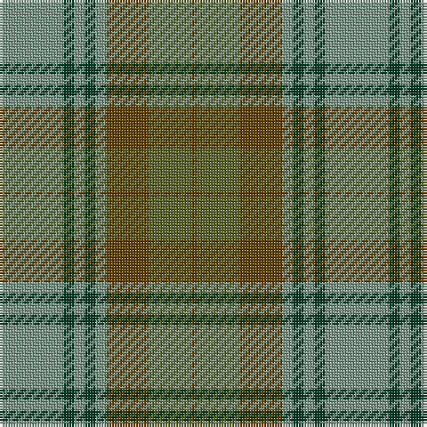

In pattern [GGGGGGGG](/patterns/gggggggg/).

This was sourced from tartans-authority.  It is a [8 stripes tartan](/stripes/stripes8/).

Original link http://www.tartansauthority.com/tartan-ferret/display/136/

## Thread count
LG/24 DG4 LG4 DG4 LG4 T16 G16 T/2

## Palette
Each colour and its ΔE from the base-6 reference it is a variant of.

| Colour | Shade | Base | ΔE (OKLab) |
|---|---|---|---|
| DG | <code style="background-color:#003820;">#003820</code> `#003820` | G <code style="background-color:#006400;">#006400</code> | 0.16 |
| G | <code style="background-color:#5C6428;">#5C6428</code> `#5C6428` | G <code style="background-color:#006400;">#006400</code> | 0.09 |
| LG | <code style="background-color:#789484;">#789484</code> `#789484` | G <code style="background-color:#006400;">#006400</code> | 0.23 |
| T | <code style="background-color:#604000;">#604000</code> `#604000` | G <code style="background-color:#006400;">#006400</code> | 0.14 |

# Sample pattern

## Nearest tartans

The nearest existing variants by ΔTartan distance.

1. [Universal Ancient International Tartan Tartan Number: 136. Earliest known date: Canada This design is different in warp and weft. The display gives the general appearance only. Produced to celebrate American tourism is Scotland. The colours are taken from the flags of the two nations and the Atlantic Ocean that separates them. See products available Copyright © Blair Urquhart, Comrie, 2015](/setts/s8/b24g4b4g4b4ga16gb16ga2-b5c8ca8-g006818-ga604000-gb289c18/) — ΔT 0.95
1. [Universal, Ancient](/setts/s8/b24g4b4g4b4r16ga16r2-b5480b0-g008000-ga30a010-r806050/) — ΔT 1.12
1. [Eastern Western Motor Group, Dalbraith](/setts/s8/g56ga4g8b36ga46b4ga6y8-b202060-g604000-ga006818-ya08858/) — ΔT 1.14
1. [Tupper., Sir Charles..](/setts/s10/b8r14y6r24g30r10b40r10g8r4-b304080-g008000-r806050-yf0c000/) — ΔT 1.23
1. [Strange Of Balcaskie](/setts/s7/g64r14g14r32b64y6r16-b304080-g008000-r806050-yf0c000/) — ΔT 1.23
1. [Dewar (WCWM)](/setts/s6/b4g4b28g20ga28y4-b084848-g604000-ga8c7038-yb8b8b8/) — ΔT 1.34
1. [Moncton, City of](/setts/s9/g16r4b8r4g40ga20r12ga40y4-b2c2c80-g006818-ga885c00-rc80000-ye8c000/) — ΔT 1.36
1. [John Telfar Dunbar/Hunting Tartan Tartan Number: 776. Earliest known date: pre 2003 Check this entry... See products available Copyright © Blair Urquhart, Comrie, 2015](/setts/s7/g10k4g56k20ga52b8g8-b2c2c80-g006818-ga604000-k101010/) — ΔT 1.37
1. [Gammell (Personal)](/setts/s8/b64r6b6r6b6r20g48ra6-b5c8ca8-g006818-rb03000-ra901c38/) — ΔT 1.38
1. [Universal Ancient](/setts/s8/b24g4b4g4b4ga16gb16ga2-b3c82af-g005020-ga503c14-gb309c18/) — ΔT 1.39

## Neighbour map

Every grey dot is one of 15726 variants placed by the first two principal components of the ΔTartan feature space (44% of its variance). Red is this tartan; blue dots are its nearest — click one to open its page.

<svg viewBox="0 0 640 380" role="img" style="max-width:100%;height:auto;border:1px solid #e0e0e0;border-radius:4px;display:block" xmlns="http://www.w3.org/2000/svg"><image href="/nn/cloud.v1.png" width="640" height="380"/><a href="/setts/s8/b24g4b4g4b4ga16gb16ga2-b5c8ca8-g006818-ga604000-gb289c18/"><circle cx="261.5" cy="215.0" r="4" fill="#3465a4"><title>Universal Ancient International Tartan Tartan Number: 136. Earliest known date: Canada This design is different in warp and weft. The display gives the general appearance only. Produced to celebrate American tourism is Scotland. The colours are taken from the flags of the two nations and the Atlantic Ocean that separates them. See products available Copyright © Blair Urquhart, Comrie, 2015</title></circle></a><a href="/setts/s8/b24g4b4g4b4r16ga16r2-b5480b0-g008000-ga30a010-r806050/"><circle cx="286.4" cy="226.0" r="4" fill="#3465a4"><title>Universal, Ancient</title></circle></a><a href="/setts/s8/g56ga4g8b36ga46b4ga6y8-b202060-g604000-ga006818-ya08858/"><circle cx="285.3" cy="210.8" r="4" fill="#3465a4"><title>Eastern Western Motor Group, Dalbraith</title></circle></a><a href="/setts/s10/b8r14y6r24g30r10b40r10g8r4-b304080-g008000-r806050-yf0c000/"><circle cx="238.8" cy="217.9" r="4" fill="#3465a4"><title>Tupper., Sir Charles..</title></circle></a><a href="/setts/s7/g64r14g14r32b64y6r16-b304080-g008000-r806050-yf0c000/"><circle cx="234.7" cy="229.6" r="4" fill="#3465a4"><title>Strange Of Balcaskie</title></circle></a><a href="/setts/s6/b4g4b28g20ga28y4-b084848-g604000-ga8c7038-yb8b8b8/"><circle cx="253.7" cy="264.6" r="4" fill="#3465a4"><title>Dewar (WCWM)</title></circle></a><a href="/setts/s9/g16r4b8r4g40ga20r12ga40y4-b2c2c80-g006818-ga885c00-rc80000-ye8c000/"><circle cx="254.3" cy="202.4" r="4" fill="#3465a4"><title>Moncton, City of</title></circle></a><a href="/setts/s7/g10k4g56k20ga52b8g8-b2c2c80-g006818-ga604000-k101010/"><circle cx="330.0" cy="225.9" r="4" fill="#3465a4"><title>John Telfar Dunbar/Hunting Tartan Tartan Number: 776. Earliest known date: pre 2003 Check this entry... See products available Copyright © Blair Urquhart, Comrie, 2015</title></circle></a><a href="/setts/s8/b64r6b6r6b6r20g48ra6-b5c8ca8-g006818-rb03000-ra901c38/"><circle cx="300.7" cy="196.5" r="4" fill="#3465a4"><title>Gammell (Personal)</title></circle></a><a href="/setts/s8/b24g4b4g4b4ga16gb16ga2-b3c82af-g005020-ga503c14-gb309c18/"><circle cx="250.7" cy="212.8" r="4" fill="#3465a4"><title>Universal Ancient</title></circle></a><circle cx="280.5" cy="219.9" r="5" fill="#c00000"/></svg>

ID: /setts/s8/g24ga4g4ga4g4gb16gc16gb2-g789484-ga003820-gb604000-gc5c6428/
