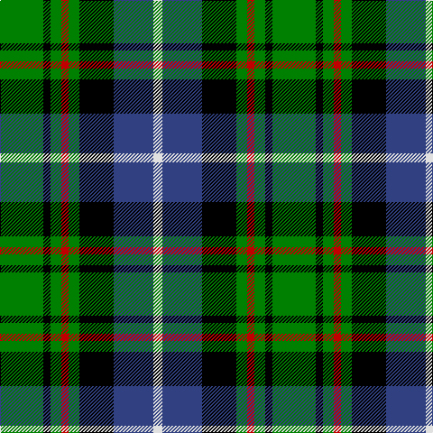

In pattern [GKGRGKBW](/patterns/gkgrgkbw/).

This was sourced from weddslist.  It is a [8 stripes tartan](/stripes/stripes8/).

Original link http://www.weddslist.com/cgi-bin/tartans/pg.pl?source=sts

## Thread count
G/48 K8 G12 R8 G12 K38 B44 LN/10

## Palette
Each colour and its ΔE from the base-6 reference it is a variant of.

| Colour | Shade | Base | ΔE (OKLab) |
|---|---|---|---|
| B | <code style="background-color:#304080;">#304080</code> `#304080` | B <code style="background-color:#2A418A;">#2A418A</code> | 0.02 |
| G | <code style="background-color:#008000;">#008000</code> `#008000` | G <code style="background-color:#006100;">#006100</code> | 0.10 |
| K | <code style="background-color:#000000;">#000000</code> `#000000` | K <code style="background-color:#000000;">#000000</code> | 0.00 |
| LN | <code style="background-color:#E0E0E0;">#E0E0E0</code> `#E0E0E0` | W <code style="background-color:#F7F7F7;">#F7F7F7</code> | 0.07 |
| R | <code style="background-color:#C00000;">#C00000</code> `#C00000` | R <code style="background-color:#CC0000;">#CC0000</code> | 0.03 |

# Sample pattern

## Nearest tartans

The nearest existing variants by ΔTartan distance.

1. [Maitland](/setts/s9/g3b9g3k4g8y2b2y2r2~b00004c-g004c00-k000000-rc80000-yc8c800/) — ΔT 0.80
1. [Junior Chamber International](/setts/s7/r4g16k16b4g3b12y2x2~b304080-g008000-k000000-rc00000-yf0c000/) — ΔT 0.85
1. [MacTaggert](/setts/s7/g9b2g1k6ba6r1ba1x2~b5480b0-ba304080-g008000-k000000-rc00000/) — ΔT 0.85
1. [Disciples of Christ MM (Switzerland)](/setts/s7/k22g21k5g12b12r3w4x2~b2888c4-g006818-k101010-r888888-wfcfcfc/) — ΔT 0.92
1. [Vosko](/setts/s9/b25k12y4k9r6k9y4k12g25x2~b304080-g008000-k000000-rc00000-yf0c000/) — ΔT 0.93
1. [MacDonald, (Flora.. )](/setts/s7/g17y2k14r2b9r2b10x2~b304080-g008000-k000000-rc00000-yf0c000/) — ΔT 0.93
1. [Dyce](/setts/s6/k2y1g6k6b6w1x4~b304080-g008000-k000000-we0e0e0-yf0c000/) — ΔT 0.93
1. [Wellecomme, Bernard (Personal)](/setts/s10/b4g8k8b4y3g21k3w4k3w4x2~b000080-g004c00-k1c1714-we8ccb8-yffff00/) — ΔT 0.95
1. [Norwich No.079](/setts/s10/g18y2k14b5k4b5k14y2g18r5x2~b2888c4-g006818-k000000-rc80000-ye8c000/) — ΔT 1.00
1. [Hogarth, of Firhill](/setts/s7/b4g14y2k14ba14k2ba3x2~b5480b0-ba304080-g008000-k000000-yf0c000/) — ΔT 1.01

## Neighbour map

Every grey dot is one of 15726 variants placed by the first two principal components of the ΔTartan feature space (44% of its variance). Red is this tartan; blue dots are its nearest — click one to open its page.

<svg viewBox="0 0 640 380" role="img" style="max-width:100%;height:auto;border:1px solid #e0e0e0;border-radius:4px;display:block" xmlns="http://www.w3.org/2000/svg"><image href="/nn/cloud.v1.png" width="640" height="380"/><a href="/setts/s9/g3b9g3k4g8y2b2y2r2~b00004c-g004c00-k000000-rc80000-yc8c800/"><circle cx="105.5" cy="220.5" r="4" fill="#3465a4"><title>Maitland</title></circle></a><a href="/setts/s7/r4g16k16b4g3b12y2x2~b304080-g008000-k000000-rc00000-yf0c000/"><circle cx="105.8" cy="200.4" r="4" fill="#3465a4"><title>Junior Chamber International</title></circle></a><a href="/setts/s7/g9b2g1k6ba6r1ba1x2~b5480b0-ba304080-g008000-k000000-rc00000/"><circle cx="141.0" cy="191.4" r="4" fill="#3465a4"><title>MacTaggert</title></circle></a><a href="/setts/s7/k22g21k5g12b12r3w4x2~b2888c4-g006818-k101010-r888888-wfcfcfc/"><circle cx="147.8" cy="217.2" r="4" fill="#3465a4"><title>Disciples of Christ MM (Switzerland)</title></circle></a><a href="/setts/s9/b25k12y4k9r6k9y4k12g25x2~b304080-g008000-k000000-rc00000-yf0c000/"><circle cx="101.9" cy="204.2" r="4" fill="#3465a4"><title>Vosko</title></circle></a><a href="/setts/s7/g17y2k14r2b9r2b10x2~b304080-g008000-k000000-rc00000-yf0c000/"><circle cx="112.9" cy="198.4" r="4" fill="#3465a4"><title>MacDonald, (Flora.. )</title></circle></a><a href="/setts/s6/k2y1g6k6b6w1x4~b304080-g008000-k000000-we0e0e0-yf0c000/"><circle cx="96.8" cy="223.8" r="4" fill="#3465a4"><title>Dyce</title></circle></a><a href="/setts/s10/b4g8k8b4y3g21k3w4k3w4x2~b000080-g004c00-k1c1714-we8ccb8-yffff00/"><circle cx="159.8" cy="179.5" r="4" fill="#3465a4"><title>Wellecomme, Bernard (Personal)</title></circle></a><a href="/setts/s10/g18y2k14b5k4b5k14y2g18r5x2~b2888c4-g006818-k000000-rc80000-ye8c000/"><circle cx="143.1" cy="184.6" r="4" fill="#3465a4"><title>Norwich No.079</title></circle></a><a href="/setts/s7/b4g14y2k14ba14k2ba3x2~b5480b0-ba304080-g008000-k000000-yf0c000/"><circle cx="96.9" cy="204.4" r="4" fill="#3465a4"><title>Hogarth, of Firhill</title></circle></a><circle cx="115.0" cy="203.0" r="5" fill="#c00000"/></svg>

ID: /setts/s8/g24k4g6r4g6k19b22w5x2~b304080-g008000-k000000-rc00000-we0e0e0/
