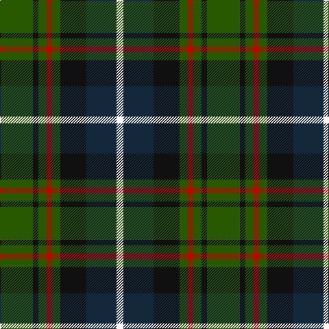

In pattern [GKGRGKBW](/patterns/gkgrgkbw/).

This was sourced from register-of-tartans.  It is a [8 stripes tartan](/stripes/stripes8/).

Original link https://www.tartanregister.gov.uk/tartanDetails.aspx?ref=2744

## Attestations

This cloth appears in 2 source records; the oldest owns this page.

- 01/01/1715 — MacRae Hunting (register-of-tartans, [record](https://www.tartanregister.gov.uk/tartanDetails.aspx?ref=2744))
- 1893 — MacRae Htg - 1893 (Clan) (tartans-authority, [record](http://www.tartansauthority.com/tartan-ferret/display/803/))

## Thread count
G/48 K8 G12 R8 G12 K38 DN44 W/10

## Palette
Each colour and its ΔE from the base-6 reference it is a variant of.

| Colour | Shade | Base | ΔE (OKLab) |
|---|---|---|---|
| DN | <code style="background-color:#14283C;">#14283C</code> `#14283C` | B <code style="background-color:#2A418A;">#2A418A</code> | 0.15 |
| G | <code style="background-color:#285800;">#285800</code> `#285800` | G <code style="background-color:#006100;">#006100</code> | 0.03 |
| K | <code style="background-color:#101010;">#101010</code> `#101010` | K <code style="background-color:#000000;">#000000</code> | 0.17 |
| R | <code style="background-color:#C80000;">#C80000</code> `#C80000` | R <code style="background-color:#CC0000;">#CC0000</code> | 0.01 |
| W | <code style="background-color:#F8F8F8;">#F8F8F8</code> `#F8F8F8` | W <code style="background-color:#F7F7F7;">#F7F7F7</code> | 0.00 |

# Sample pattern

## Nearest tartans

The nearest existing variants by ΔTartan distance.

1. [Vosko Family Tartan Tartan Number: 373. Earliest known date: 1989 Designed for a wedding. See products available Copyright © Blair Urquhart, Comrie, 2015](/setts/s9/b25k12y4k9r6k9y4k12g25~b2c2c80-g006818-k101010-rc80000-ye8c000~x2/) — ΔT 0.90
1. [Scottish Tartan Society](/setts/s9/b20k10y3k7r4k7y3k8g20~b1c0070-g006818-k101010-r880000-yd09800~x2/) — ΔT 0.94
1. [Unidentified No 79](/setts/s6/r5g18y2k14b5k4~b3c82af-g005020-k101010-rdc0000-ye8c000~x2/) — ΔT 1.00
1. [Scottish Odyssey Commemorative Tartan Tartan Number: 4071. Earliest known date: 01/01/2002 The Scottish Odyssey tartan from Lochcarron is a 'celebration of the wonderful experiences to be gained' from a visit to Scotland and some of the most spectacularly contrasting landscapes to be seen in Europe. See products available Copyright © Blair Urquhart, Comrie, 2015](/setts/s7/k7b11k3b11g11ga22b3~b2c4084-g663300-ga008800-k000000~x2/) — ΔT 1.00
1. [Maitland](/setts/s9/g3b8g3k4g9y2b2y2r2~b000052-g11450d-k000000-raa0000-yaaaa00~x2/) — ΔT 1.01
1. [Maitland](/setts/s9/g3b8g3k4g9y2b2y2r2~b000052-g11450d-k000000-raa0000-yaaaa00/) — ΔT 1.01
1. [Mantle (Personal)](/setts/s8/g3b16w2k14g18r3g2r3~b2c2c80-g006818-k101010-r880000-we0e0e0~x2/) — ΔT 1.02
1. [Royal College of Physicians (Corp)](/setts/s6/b18r3k9r3g23y3~b2c2c80-g006818-k101010-rc80000-ye8c000~x2/) — ΔT 1.03
1. [Selkirk (Personal) Original](/setts/s8/b11g2k10ga10y2ga10k10g2~b780078-g789484-ga006818-k101010-yd09800~x2/) — ΔT 1.03
1. [MacLeish](/setts/s8/k18b12k5g4r6g12k2y4~b1c0070-g006818-k101010-rc80000-ybc8c00~x2/) — ΔT 1.03

## Neighbour map

Every grey dot is one of 15726 variants placed by the first two principal components of the ΔTartan feature space (44% of its variance). Red is this tartan; blue dots are its nearest — click one to open its page.

<svg viewBox="0 0 640 380" role="img" style="max-width:100%;height:auto;border:1px solid #e0e0e0;border-radius:4px;display:block" xmlns="http://www.w3.org/2000/svg"><image href="/nn/cloud.v1.png" width="640" height="380"/><a href="/setts/s9/b25k12y4k9r6k9y4k12g25~b2c2c80-g006818-k101010-rc80000-ye8c000~x2/"><circle cx="128.8" cy="212.2" r="4" fill="#3465a4"><title>Vosko Family Tartan Tartan Number: 373. Earliest known date: 1989 Designed for a wedding. See products available Copyright © Blair Urquhart, Comrie, 2015</title></circle></a><a href="/setts/s9/b20k10y3k7r4k7y3k8g20~b1c0070-g006818-k101010-r880000-yd09800~x2/"><circle cx="145.8" cy="213.1" r="4" fill="#3465a4"><title>Scottish Tartan Society</title></circle></a><a href="/setts/s6/r5g18y2k14b5k4~b3c82af-g005020-k101010-rdc0000-ye8c000~x2/"><circle cx="168.0" cy="210.8" r="4" fill="#3465a4"><title>Unidentified No 79</title></circle></a><a href="/setts/s7/k7b11k3b11g11ga22b3~b2c4084-g663300-ga008800-k000000~x2/"><circle cx="124.3" cy="221.1" r="4" fill="#3465a4"><title>Scottish Odyssey Commemorative Tartan Tartan Number: 4071. Earliest known date: 01/01/2002 The Scottish Odyssey tartan from Lochcarron is a 'celebration of the wonderful experiences to be gained' from a visit to Scotland and some of the most spectacularly contrasting landscapes to be seen in Europe. See products available Copyright © Blair Urquhart, Comrie, 2015</title></circle></a><a href="/setts/s9/g3b8g3k4g9y2b2y2r2~b000052-g11450d-k000000-raa0000-yaaaa00~x2/"><circle cx="131.0" cy="226.4" r="4" fill="#3465a4"><title>Maitland</title></circle></a><a href="/setts/s9/g3b8g3k4g9y2b2y2r2~b000052-g11450d-k000000-raa0000-yaaaa00/"><circle cx="131.0" cy="226.4" r="4" fill="#3465a4"><title>Maitland</title></circle></a><a href="/setts/s8/g3b16w2k14g18r3g2r3~b2c2c80-g006818-k101010-r880000-we0e0e0~x2/"><circle cx="171.3" cy="191.2" r="4" fill="#3465a4"><title>Mantle (Personal)</title></circle></a><a href="/setts/s6/b18r3k9r3g23y3~b2c2c80-g006818-k101010-rc80000-ye8c000~x2/"><circle cx="165.6" cy="208.1" r="4" fill="#3465a4"><title>Royal College of Physicians (Corp)</title></circle></a><a href="/setts/s8/b11g2k10ga10y2ga10k10g2~b780078-g789484-ga006818-k101010-yd09800~x2/"><circle cx="116.0" cy="233.2" r="4" fill="#3465a4"><title>Selkirk (Personal) Original</title></circle></a><a href="/setts/s8/k18b12k5g4r6g12k2y4~b1c0070-g006818-k101010-rc80000-ybc8c00~x2/"><circle cx="153.4" cy="206.8" r="4" fill="#3465a4"><title>MacLeish</title></circle></a><circle cx="153.8" cy="217.3" r="5" fill="#c00000"/></svg>

ID: /setts/s8/g24k4g6r4g6k19b22w5~b14283c-g285800-k101010-rc80000-wf8f8f8~x2/
