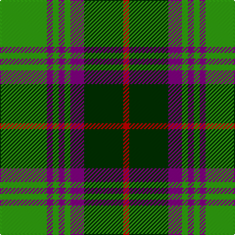

This page is one **sett** — a single exact thread-count. It belongs to the [tartan](/tartans/g24p3g3p3g3p7dg20r3/)
(the same proportion at any scale), whose colour order is pattern [GBGBGBGR](/stripes/gbgbgbgr/).

Sourced from weddslist.  It is a [8 stripe tartan](/stripes/stripes8/).

Original link http://www.weddslist.com/cgi-bin/tartans/pg.pl?source=sts

## Thread count
G/48 P6 G6 P6 G6 P14 DG40 R/6

## Palette

Palette: <strong>custom</strong>
<table><thead><tr><th>Colour</th><th>Threads</th><th>Shade</th><th>Base</th><th>OKLCh</th></tr></thead><tbody><tr><td>G/</td><td style="text-align:right;font-variant-numeric:tabular-nums">48</td><td><code style="background-color:#30A010;">#30A010</code> <small style="color:#888">#30A010</small></td><td>G <code style="background-color:#006100;">#006100</code></td><td><small style="color:#888">oklch(61.9% 0.195 140.5)</small></td></tr><tr><td>P</td><td style="text-align:right;font-variant-numeric:tabular-nums">6</td><td><code style="background-color:#800080;">#800080</code> <small style="color:#888">#800080</small></td><td>B <code style="background-color:#2A418A;">#2A418A</code></td><td><small style="color:#888">oklch(42.1% 0.193 328.4)</small></td></tr><tr><td>G</td><td style="text-align:right;font-variant-numeric:tabular-nums">6</td><td><code style="background-color:#30A010;">#30A010</code> <small style="color:#888">#30A010</small></td><td>G <code style="background-color:#006100;">#006100</code></td><td><small style="color:#888">oklch(61.9% 0.195 140.5)</small></td></tr><tr><td>P</td><td style="text-align:right;font-variant-numeric:tabular-nums">6</td><td><code style="background-color:#800080;">#800080</code> <small style="color:#888">#800080</small></td><td>B <code style="background-color:#2A418A;">#2A418A</code></td><td><small style="color:#888">oklch(42.1% 0.193 328.4)</small></td></tr><tr><td>G</td><td style="text-align:right;font-variant-numeric:tabular-nums">6</td><td><code style="background-color:#30A010;">#30A010</code> <small style="color:#888">#30A010</small></td><td>G <code style="background-color:#006100;">#006100</code></td><td><small style="color:#888">oklch(61.9% 0.195 140.5)</small></td></tr><tr><td>P</td><td style="text-align:right;font-variant-numeric:tabular-nums">14</td><td><code style="background-color:#800080;">#800080</code> <small style="color:#888">#800080</small></td><td>B <code style="background-color:#2A418A;">#2A418A</code></td><td><small style="color:#888">oklch(42.1% 0.193 328.4)</small></td></tr><tr><td>DG</td><td style="text-align:right;font-variant-numeric:tabular-nums">40</td><td><code style="background-color:#003000;">#003000</code> <small style="color:#888">#003000</small></td><td>G <code style="background-color:#006100;">#006100</code></td><td><small style="color:#888">oklch(26.8% 0.091 142.5)</small></td></tr><tr><td>R/</td><td style="text-align:right;font-variant-numeric:tabular-nums">6</td><td><code style="background-color:#C00000;">#C00000</code> <small style="color:#888">#C00000</small></td><td>R <code style="background-color:#CC0000;">#CC0000</code></td><td><small style="color:#888">oklch(50.7% 0.208 29.2)</small></td></tr></tbody></table>

# Sample pattern

## Nearest tartans

The nearest existing variants by ΔTartan distance, with this tartan at the top so the swatches line up against it.

ΔTartan

Tartan

Sett

—

<a href="/ttd/edit/#slug=g24p3g3p3g3p7dg20r3~x2">Crantock</a> <a class="nn-out" href="/setts/s8/g24p3g3p3g3p7dg20r3~x2/" title="open its dictionary page">↗</a>

0.35

<a href="/ttd/edit/#slug=g24dp3g3dp3g3dp7dg20r3~x2">Crantock Trade Tartan Tartan Number: 707. Earliest known date: pre 2003 'Poached by Clan Laird from a Yorkshire mill and marketed as 'Crantock''(sic) (Scottish Tartans Society archives.) See products available Copyright © Blair Urquhart, Comrie, 2015</a> <a class="nn-out" href="/setts/s8/g24dp3g3dp3g3dp7dg20r3~x2/" title="open its dictionary page">↗</a>

1.02

<a href="/ttd/edit/#slug=g5k2g28k10o26db4g4~x2">John Telfar, Dunbar hunting</a> <a class="nn-out" href="/setts/s7/g5k2g28k10o26db4g4~x2/" title="open its dictionary page">↗</a>

1.06

<a href="/ttd/edit/#slug=r1g8db1g5db11ly2r1ly1~x4">New Mexico, State of (Fashion)</a> <a class="nn-out" href="/setts/s8/r1g8db1g5db11ly2r1ly1~x4/" title="open its dictionary page">↗</a>

1.07

<a href="/ttd/edit/#slug=k7r3k27g27ly3g3ly3g3~x2">Brunton (Personal)</a> <a class="nn-out" href="/setts/s8/k7r3k27g27ly3g3ly3g3~x2/" title="open its dictionary page">↗</a>

1.14

<a href="/ttd/edit/#slug=db4o17db4g4db2g4db4g27db4ly4~x2">Cape Breton University</a> <a class="nn-out" href="/setts/s10/db4o17db4g4db2g4db4g27db4ly4~x2/" title="open its dictionary page">↗</a>

1.15

<a href="/ttd/edit/#slug=g4lo1dt1lo1dt2g9r1dt6w1~x4">Casey of West Virginia (Personal)</a> <a class="nn-out" href="/setts/s9/g4lo1dt1lo1dt2g9r1dt6w1~x4/" title="open its dictionary page">↗</a>

1.18

<a href="/ttd/edit/#slug=lo12dg4lo24k9lo8dg36r4">Harmer (Corporate)</a> <a class="nn-out" href="/setts/s7/lo12dg4lo24k9lo8dg36r4/" title="open its dictionary page">↗</a>

1.18

<a href="/ttd/edit/#slug=k4dg5k2o21g8k2~x2">MacDuck</a> <a class="nn-out" href="/setts/s6/k4dg5k2o21g8k2~x2/" title="open its dictionary page">↗</a>

1.20

<a href="/ttd/edit/#slug=db21g5k5g15w3g5w3g5k3~x2">Tweedside, hunting</a> <a class="nn-out" href="/setts/s9/db21g5k5g15w3g5w3g5k3~x2/" title="open its dictionary page">↗</a>

1.21

<a href="/ttd/edit/#slug=g5k2g17ly2k5ly2r5k17g2ly4~x2">Antrim</a> <a class="nn-out" href="/setts/s10/g5k2g17ly2k5ly2r5k17g2ly4~x2/" title="open its dictionary page">↗</a>

## Neighbour map

Every grey dot is one of 14359 variants placed by the first two principal components of the ΔTartan feature space (44% of its variance). Red is this tartan; blue dots are its nearest — click one to open its page.

<svg viewBox="0 0 640 380" role="img" style="max-width:100%;height:auto;border:1px solid #e0e0e0;border-radius:4px;display:block" xmlns="http://www.w3.org/2000/svg"><image href="/nn/cloud.v1.png" width="640" height="380"/><a href="/setts/s8/g24dp3g3dp3g3dp7dg20r3~x2/"><circle cx="227.1" cy="196.9" r="4" fill="#3465a4"><title>Crantock Trade Tartan Tartan Number: 707. Earliest known date: pre 2003 'Poached by Clan Laird from a Yorkshire mill and marketed as 'Crantock''(sic) (Scottish Tartans Society archives.) See products available Copyright © Blair Urquhart, Comrie, 2015</title></circle></a><a href="/setts/s7/g5k2g28k10o26db4g4~x2/"><circle cx="253.1" cy="191.6" r="4" fill="#3465a4"><title>John Telfar, Dunbar hunting</title></circle></a><a href="/setts/s8/r1g8db1g5db11ly2r1ly1~x4/"><circle cx="225.0" cy="179.2" r="4" fill="#3465a4"><title>New Mexico, State of (Fashion)</title></circle></a><a href="/setts/s8/k7r3k27g27ly3g3ly3g3~x2/"><circle cx="251.8" cy="189.6" r="4" fill="#3465a4"><title>Brunton (Personal)</title></circle></a><a href="/setts/s10/db4o17db4g4db2g4db4g27db4ly4~x2/"><circle cx="250.9" cy="159.9" r="4" fill="#3465a4"><title>Cape Breton University</title></circle></a><a href="/setts/s9/g4lo1dt1lo1dt2g9r1dt6w1~x4/"><circle cx="240.1" cy="181.1" r="4" fill="#3465a4"><title>Casey of West Virginia (Personal)</title></circle></a><a href="/setts/s7/lo12dg4lo24k9lo8dg36r4/"><circle cx="238.1" cy="208.3" r="4" fill="#3465a4"><title>Harmer (Corporate)</title></circle></a><a href="/setts/s6/k4dg5k2o21g8k2~x2/"><circle cx="244.6" cy="195.7" r="4" fill="#3465a4"><title>MacDuck</title></circle></a><a href="/setts/s9/db21g5k5g15w3g5w3g5k3~x2/"><circle cx="188.6" cy="203.2" r="4" fill="#3465a4"><title>Tweedside, hunting</title></circle></a><a href="/setts/s10/g5k2g17ly2k5ly2r5k17g2ly4~x2/"><circle cx="169.6" cy="178.4" r="4" fill="#3465a4"><title>Antrim</title></circle></a><circle cx="219.4" cy="192.8" r="5" fill="#c00000"/></svg>

ID: /setts/s8/g24p3g3p3g3p7dg20r3~x2/
