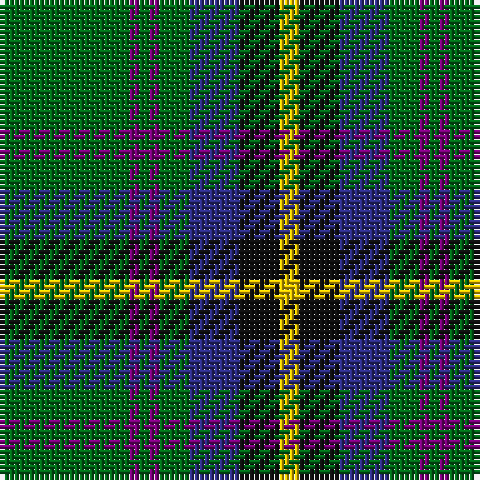

In pattern [GBGBGBKY](/patterns/gbgbgbky/).

This was sourced from house-of-tartan.  It is a [8 stripes tartan](/stripes/stripes8/).

Original link http://www.house-of-tartan.scotland.net/house/TartanViewjs.asp?colr=Def&tnam=721

## Thread count
G/26 P2 G2 P2 G6 DB10 K8 Y/4

## Palette
Each colour and its ΔE from the base-6 reference it is a variant of.

| Colour | Shade | Base | ΔE (OKLab) |
|---|---|---|---|
| DB | <code style="background-color:#2C2C80;">#2C2C80</code> `#2C2C80` | B <code style="background-color:#2C4084;">#2C4084</code> | 0.05 |
| G | <code style="background-color:#006818;">#006818</code> `#006818` | G <code style="background-color:#006400;">#006400</code> | 0.02 |
| K | <code style="background-color:#101010;">#101010</code> `#101010` | K <code style="background-color:#000000;">#000000</code> | 0.17 |
| P | <code style="background-color:#780078;">#780078</code> `#780078` | B <code style="background-color:#2C4084;">#2C4084</code> | 0.16 |
| Y | <code style="background-color:#E8C000;">#E8C000</code> `#E8C000` | Y <code style="background-color:#E8C000;">#E8C000</code> | 0.00 |

# Sample pattern

## Nearest tartans

The nearest existing variants by ΔTartan distance.

1. [Henderson/MacKendrick](/setts/s9/w4b24g16b4g64k4g16k24y4-b2c2c80-g006818-k101010-we0e0e0-ye8c000/) — ΔT 0.73
1. [MacKendrick](/setts/s9/w2b12g8b2g32k2g8k12y2-b2c2c80-g006818-k101010-we0e0e0-ye8c000/) — ΔT 0.73
1. [Asheville Firefighters, The](/setts/s6/k17g48y4r10b12g4-b202060-g006818-k101010-rc80000-ye8c000/) — ΔT 0.82
1. [Carrick Htg (Clan)](/setts/s8/g52b4g4b4g12ba20k16y8-b440044-ba1474b4-g408060-k101010-ye8c000/) — ΔT 0.87
1. [Wardrope (Personal)](/setts/s9/r3g32k4g4k11b3k7r4w3-b2c2c80-g006818-k101010-r880000-we8ccb8/) — ΔT 0.89
1. [Carrick Hunting (Personal)](/setts/s8/g52b4g4b4g12ba20k16y8-b780078-ba1474b4-g408060-k101010-ye8c000/) — ΔT 0.98
1. [Hydesville Tower (Corporate)](/setts/s7/g60b12r4b4y4b30w4-b202060-g285800-rc80000-we0e0e0-yfccc00/) — ΔT 1.00
1. [Fraser Gathering Hunting Trade Tartan Tartan Number: 2363. Earliest known date: 1997 Unknown until House of Edgar published their own Old and Rare. See products available Copyright © Blair Urquhart, Comrie, 2015](/setts/s9/r4b24g4ga22g8b10ga4g48w4-b202060-g003820-ga289c18-rc80000-we0e0e0/) — ΔT 1.03
1. [Casey of West Virginia (Personal)](/setts/s9/g16y4b4y4b8g36r4b24w4-b14283c-g007800-rc80000-wf8f8f8-yc88c00/) — ΔT 1.04
1. [Carrick, hunting](/setts/s8/g26b2g2b2g6ba10k8y4-b800080-ba304080-g008000-k000000-yf0c000/) — ΔT 1.06

## Neighbour map

Every grey dot is one of 15726 variants placed by the first two principal components of the ΔTartan feature space (44% of its variance). Red is this tartan; blue dots are its nearest — click one to open its page.

<svg viewBox="0 0 640 380" role="img" style="max-width:100%;height:auto;border:1px solid #e0e0e0;border-radius:4px;display:block" xmlns="http://www.w3.org/2000/svg"><image href="/nn/cloud.v1.png" width="640" height="380"/><a href="/setts/s9/w4b24g16b4g64k4g16k24y4-b2c2c80-g006818-k101010-we0e0e0-ye8c000/"><circle cx="323.2" cy="162.1" r="4" fill="#3465a4"><title>Henderson/MacKendrick</title></circle></a><a href="/setts/s9/w2b12g8b2g32k2g8k12y2-b2c2c80-g006818-k101010-we0e0e0-ye8c000/"><circle cx="323.2" cy="162.1" r="4" fill="#3465a4"><title>MacKendrick</title></circle></a><a href="/setts/s6/k17g48y4r10b12g4-b202060-g006818-k101010-rc80000-ye8c000/"><circle cx="275.8" cy="187.0" r="4" fill="#3465a4"><title>Asheville Firefighters, The</title></circle></a><a href="/setts/s8/g52b4g4b4g12ba20k16y8-b440044-ba1474b4-g408060-k101010-ye8c000/"><circle cx="287.2" cy="167.9" r="4" fill="#3465a4"><title>Carrick Htg (Clan)</title></circle></a><a href="/setts/s9/r3g32k4g4k11b3k7r4w3-b2c2c80-g006818-k101010-r880000-we8ccb8/"><circle cx="264.7" cy="164.8" r="4" fill="#3465a4"><title>Wardrope (Personal)</title></circle></a><a href="/setts/s8/g52b4g4b4g12ba20k16y8-b780078-ba1474b4-g408060-k101010-ye8c000/"><circle cx="289.8" cy="168.2" r="4" fill="#3465a4"><title>Carrick Hunting (Personal)</title></circle></a><a href="/setts/s7/g60b12r4b4y4b30w4-b202060-g285800-rc80000-we0e0e0-yfccc00/"><circle cx="303.3" cy="161.0" r="4" fill="#3465a4"><title>Hydesville Tower (Corporate)</title></circle></a><a href="/setts/s9/r4b24g4ga22g8b10ga4g48w4-b202060-g003820-ga289c18-rc80000-we0e0e0/"><circle cx="232.8" cy="170.4" r="4" fill="#3465a4"><title>Fraser Gathering Hunting Trade Tartan Tartan Number: 2363. Earliest known date: 1997 Unknown until House of Edgar published their own Old and Rare. See products available Copyright © Blair Urquhart, Comrie, 2015</title></circle></a><a href="/setts/s9/g16y4b4y4b8g36r4b24w4-b14283c-g007800-rc80000-wf8f8f8-yc88c00/"><circle cx="237.1" cy="178.1" r="4" fill="#3465a4"><title>Casey of West Virginia (Personal)</title></circle></a><a href="/setts/s8/g26b2g2b2g6ba10k8y4-b800080-ba304080-g008000-k000000-yf0c000/"><circle cx="256.7" cy="158.1" r="4" fill="#3465a4"><title>Carrick, hunting</title></circle></a><circle cx="285.7" cy="170.0" r="5" fill="#c00000"/></svg>

ID: /setts/s8/g26b2g2b2g6ba10k8y4-b780078-ba2c2c80-g006818-k101010-ye8c000/
