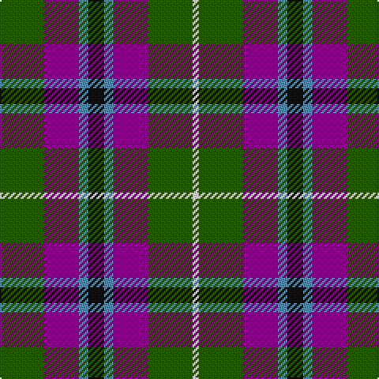

In pattern [GBBKBBGW](/patterns/gbbkbbgw/).

This was sourced from register-of-tartans.  It is a [8 stripes tartan](/stripes/stripes8/).

Original link https://www.tartanregister.gov.uk/tartanDetails.aspx?ref=4757

## Thread count
G/28 P22 B6 K10 B6 P22 G28 W/4

## Palette
Each colour and its ΔE from the base-6 reference it is a variant of.

| Colour | Shade | Base | ΔE (OKLab) |
|---|---|---|---|
| B | <code style="background-color:#5C8CA8;">#5C8CA8</code> `#5C8CA8` | B <code style="background-color:#2A418A;">#2A418A</code> | 0.23 |
| DG | <code style="background-color:#003820;">#003820</code> `#003820` | G <code style="background-color:#006100;">#006100</code> | 0.15 |
| DP | <code style="background-color:#440044;">#440044</code> `#440044` | B <code style="background-color:#2A418A;">#2A418A</code> | 0.18 |
| G | <code style="background-color:#285800;">#285800</code> `#285800` | G <code style="background-color:#006100;">#006100</code> | 0.03 |
| K | <code style="background-color:#101010;">#101010</code> `#101010` | K <code style="background-color:#000000;">#000000</code> | 0.17 |
| LG | <code style="background-color:#789484;">#789484</code> `#789484` | G <code style="background-color:#006100;">#006100</code> | 0.24 |
| P | <code style="background-color:#780078;">#780078</code> `#780078` | B <code style="background-color:#2A418A;">#2A418A</code> | 0.17 |
| W | <code style="background-color:#FCFCFC;">#FCFCFC</code> `#FCFCFC` | W <code style="background-color:#F7F7F7;">#F7F7F7</code> | 0.01 |

# Sample pattern

## Nearest tartans

The nearest existing variants by ΔTartan distance.

1. [Wilson's No.124](/setts/s8/g28b22ga6k10ga6b22g28y4-b780078-g006818-ga789484-k101010-yd8b000/) — ΔT 0.38
1. [Wilson's No.176](/setts/s8/k16b6g26ba24y4ba24g26b6-b5c8ca8-ba440044-g006818-k101010-ye8c000/) — ΔT 0.87
1. [Wilson's No.183](/setts/s10/g4r4g24b24ba4k8ba4b24g24r4-b440044-ba2888c4-g006818-k101010-rc80000/) — ΔT 1.04
1. [Williamson/Smart (Personal)](/setts/s8/b20r6b20ra6k42g40k30ra6-b38409c-g006818-k101010-r888888-rac8002c/) — ΔT 1.04
1. [Brodie Hunting Clan Tartan Tartan Number: 1334. Earliest known date: 1891 The Hunting Brodie first appears in Whyte's first edition of 1891, published by W. and A.K. Johnston, at which time it seems to have been a recent design. D.W. Stewart remarks in his book, 'Old And Rare..'(1893), "of late a green tartan has been sold as undress or hunting Brodie..." See products available Copyright © Blair Urquhart, Comrie, 2015](/setts/s7/r4b16g16k16y2k16r4-b2c2c80-g006818-k101010-rc80000-ye8c000/) — ΔT 1.05
1. [Brodie Hunting](/setts/s7/r8b32g32k32y4k32r8-b5c8ca8-g006818-k101010-rc80000-yd09800/) — ΔT 1.06
1. [Commonwealth](/setts/s10/b24y8r24w12k8y24b40r8b12r8-b14283c-k101010-rc80000-wc0c0c0-ya08858/) — ΔT 1.09
1. [MacDuff, hunting](/setts/s8/r16ra2r16g16k16b16r16ra4-b304080-g008000-k000000-r806050-rac00000/) — ΔT 1.11
1. [Lindley-Highfield (Name)](/setts/s7/g56b24w8ga16g8r16b8-b780078-g003820-ga289c18-re87878-we0e0e0/) — ΔT 1.12
1. [Hebrides #8](/setts/s8/b14r6g14r2g14r6b14ba2-b2c2c80-ba5c8ca8-g006818-rc80000/) — ΔT 1.14

## Neighbour map

Every grey dot is one of 15726 variants placed by the first two principal components of the ΔTartan feature space (44% of its variance). Red is this tartan; blue dots are its nearest — click one to open its page.

<svg viewBox="0 0 640 380" role="img" style="max-width:100%;height:auto;border:1px solid #e0e0e0;border-radius:4px;display:block" xmlns="http://www.w3.org/2000/svg"><image href="/nn/cloud.v1.png" width="640" height="380"/><a href="/setts/s8/g28b22ga6k10ga6b22g28y4-b780078-g006818-ga789484-k101010-yd8b000/"><circle cx="182.6" cy="218.6" r="4" fill="#3465a4"><title>Wilson's No.124</title></circle></a><a href="/setts/s8/k16b6g26ba24y4ba24g26b6-b5c8ca8-ba440044-g006818-k101010-ye8c000/"><circle cx="147.6" cy="230.9" r="4" fill="#3465a4"><title>Wilson's No.176</title></circle></a><a href="/setts/s10/g4r4g24b24ba4k8ba4b24g24r4-b440044-ba2888c4-g006818-k101010-rc80000/"><circle cx="188.5" cy="205.0" r="4" fill="#3465a4"><title>Wilson's No.183</title></circle></a><a href="/setts/s8/b20r6b20ra6k42g40k30ra6-b38409c-g006818-k101010-r888888-rac8002c/"><circle cx="169.5" cy="220.8" r="4" fill="#3465a4"><title>Williamson/Smart (Personal)</title></circle></a><a href="/setts/s7/r4b16g16k16y2k16r4-b2c2c80-g006818-k101010-rc80000-ye8c000/"><circle cx="168.7" cy="224.9" r="4" fill="#3465a4"><title>Brodie Hunting Clan Tartan Tartan Number: 1334. Earliest known date: 1891 The Hunting Brodie first appears in Whyte's first edition of 1891, published by W. and A.K. Johnston, at which time it seems to have been a recent design. D.W. Stewart remarks in his book, 'Old And Rare..'(1893), &quot;of late a green tartan has been sold as undress or hunting Brodie...&quot; See products available Copyright © Blair Urquhart, Comrie, 2015</title></circle></a><a href="/setts/s7/r8b32g32k32y4k32r8-b5c8ca8-g006818-k101010-rc80000-yd09800/"><circle cx="152.9" cy="216.7" r="4" fill="#3465a4"><title>Brodie Hunting</title></circle></a><a href="/setts/s10/b24y8r24w12k8y24b40r8b12r8-b14283c-k101010-rc80000-wc0c0c0-ya08858/"><circle cx="148.1" cy="209.5" r="4" fill="#3465a4"><title>Commonwealth</title></circle></a><a href="/setts/s8/r16ra2r16g16k16b16r16ra4-b304080-g008000-k000000-r806050-rac00000/"><circle cx="154.2" cy="229.5" r="4" fill="#3465a4"><title>MacDuff, hunting</title></circle></a><a href="/setts/s7/g56b24w8ga16g8r16b8-b780078-g003820-ga289c18-re87878-we0e0e0/"><circle cx="182.9" cy="193.6" r="4" fill="#3465a4"><title>Lindley-Highfield (Name)</title></circle></a><a href="/setts/s8/b14r6g14r2g14r6b14ba2-b2c2c80-ba5c8ca8-g006818-rc80000/"><circle cx="191.5" cy="244.0" r="4" fill="#3465a4"><title>Hebrides #8</title></circle></a><circle cx="181.1" cy="216.9" r="5" fill="#c00000"/></svg>

ID: /setts/s8/g28b22ba6k10ba6b22g28w4-b780078-ba5c8ca8-g285800-k101010-wfcfcfc/
