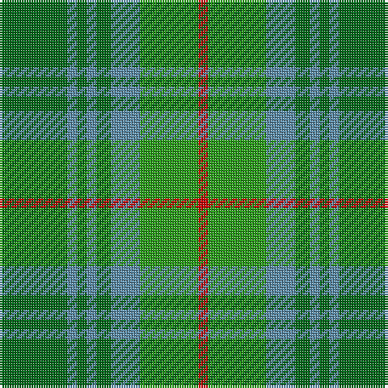

In pattern [GBGBGBGR](/patterns/gbgbgbgr/).

This was sourced from register-of-tartans.  It is a [8 stripes tartan](/stripes/stripes8/).

Original link https://www.tartanregister.gov.uk/tartanDetails.aspx?ref=795

## Attestations

This cloth appears in 2 source records; the oldest owns this page.

- 01/01/1842 — Cranston (register-of-tartans, [record](https://www.tartanregister.gov.uk/tartanDetails.aspx?ref=795))
- 1842 — Cranston (Clan) (tartans-authority, [record](http://www.tartansauthority.com/tartan-ferret/display/706/))

## Thread count
G/28 B4 G4 B4 G6 B12 Ga24 R/4

## Palette
Each colour and its ΔE from the base-6 reference it is a variant of.

| Colour | Shade | Base | ΔE (OKLab) |
|---|---|---|---|
| B | <code style="background-color:#5C8CA8;">#5C8CA8</code> `#5C8CA8` | B <code style="background-color:#2C4084;">#2C4084</code> | 0.23 |
| G | <code style="background-color:#006818;">#006818</code> `#006818` | G <code style="background-color:#006400;">#006400</code> | 0.02 |
| Ga | <code style="background-color:#289C18;">#289C18</code> `#289C18` | G <code style="background-color:#006400;">#006400</code> | 0.18 |
| R | <code style="background-color:#C80000;">#C80000</code> `#C80000` | R <code style="background-color:#C80000;">#C80000</code> | 0.00 |

# Sample pattern

## Nearest tartans

The nearest existing variants by ΔTartan distance.

1. [Daks, Tartan-Loden](/setts/s8/b6r14g4ra4g28r4g4b6-b304080-g008000-r806050-rac00000/) — ΔT 1.25
1. [Universal Ancient International Tartan Tartan Number: 136. Earliest known date: Canada This design is different in warp and weft. The display gives the general appearance only. Produced to celebrate American tourism is Scotland. The colours are taken from the flags of the two nations and the Atlantic Ocean that separates them. See products available Copyright © Blair Urquhart, Comrie, 2015](/setts/s8/b24g4b4g4b4ga16gb16ga2-b5c8ca8-g006818-ga604000-gb289c18/) — ΔT 1.42
1. [Cranstoun](/setts/s8/g28b2g2b2g6b12ga24r4-b304080-g30a010-ga008000-rc00000/) — ΔT 1.49
1. [Harkness Htg (Name)](/setts/s10/g40b8w8b64g24y8g16r8g12b24-b0c585c-g006818-rc80000-we0e0e0-ya8a834/) — ΔT 1.52
1. [Daks (Loden)](/setts/s8/b6g14ga4gb4ga28g4ga4b6-b2c2c80-g604000-ga006818-gb808080/) — ΔT 1.54
1. [Keogh Hunting (Name)](/setts/s13/g44ga4g4ga4g4ga32gb32gc4gb32ga32g32gb4g4-g006818-ga003820-gb289c18-gc285800/) — ΔT 1.56
1. [City of Vancouver (Commemorative)](/setts/s6/g8y4g48w24ga48r4-g006818-ga408060-r880000-wc0c0c0-yd09800/) — ΔT 1.65
1. [MacKinnon, hunting](/setts/s7/g4r32g32ra4g32r32w4-g008000-r806050-rac00000-we0e0e0/) — ΔT 1.69
1. [Universal, Ancient](/setts/s8/b24g4b4g4b4r16ga16r2-b5480b0-g008000-ga30a010-r806050/) — ΔT 1.70
1. [Ancient Universal (Fashion?)](/setts/s8/g24ga4g4ga4g4gb16gc16gb2-g789484-ga003820-gb604000-gc5c6428/) — ΔT 1.73

## Neighbour map

Every grey dot is one of 15726 variants placed by the first two principal components of the ΔTartan feature space (44% of its variance). Red is this tartan; blue dots are its nearest — click one to open its page.

<svg viewBox="0 0 640 380" role="img" style="max-width:100%;height:auto;border:1px solid #e0e0e0;border-radius:4px;display:block" xmlns="http://www.w3.org/2000/svg"><image href="/nn/cloud.v1.png" width="640" height="380"/><a href="/setts/s8/b6r14g4ra4g28r4g4b6-b304080-g008000-r806050-rac00000/"><circle cx="302.3" cy="232.7" r="4" fill="#3465a4"><title>Daks, Tartan-Loden</title></circle></a><a href="/setts/s8/b24g4b4g4b4ga16gb16ga2-b5c8ca8-g006818-ga604000-gb289c18/"><circle cx="261.5" cy="215.0" r="4" fill="#3465a4"><title>Universal Ancient International Tartan Tartan Number: 136. Earliest known date: Canada This design is different in warp and weft. The display gives the general appearance only. Produced to celebrate American tourism is Scotland. The colours are taken from the flags of the two nations and the Atlantic Ocean that separates them. See products available Copyright © Blair Urquhart, Comrie, 2015</title></circle></a><a href="/setts/s8/g28b2g2b2g6b12ga24r4-b304080-g30a010-ga008000-rc00000/"><circle cx="277.2" cy="197.4" r="4" fill="#3465a4"><title>Cranstoun</title></circle></a><a href="/setts/s10/g40b8w8b64g24y8g16r8g12b24-b0c585c-g006818-rc80000-we0e0e0-ya8a834/"><circle cx="279.6" cy="222.8" r="4" fill="#3465a4"><title>Harkness Htg (Name)</title></circle></a><a href="/setts/s8/b6g14ga4gb4ga28g4ga4b6-b2c2c80-g604000-ga006818-gb808080/"><circle cx="326.4" cy="247.3" r="4" fill="#3465a4"><title>Daks (Loden)</title></circle></a><a href="/setts/s13/g44ga4g4ga4g4ga32gb32gc4gb32ga32g32gb4g4-g006818-ga003820-gb289c18-gc285800/"><circle cx="253.0" cy="213.5" r="4" fill="#3465a4"><title>Keogh Hunting (Name)</title></circle></a><a href="/setts/s6/g8y4g48w24ga48r4-g006818-ga408060-r880000-wc0c0c0-yd09800/"><circle cx="242.7" cy="208.5" r="4" fill="#3465a4"><title>City of Vancouver (Commemorative)</title></circle></a><a href="/setts/s7/g4r32g32ra4g32r32w4-g008000-r806050-rac00000-we0e0e0/"><circle cx="333.8" cy="261.1" r="4" fill="#3465a4"><title>MacKinnon, hunting</title></circle></a><a href="/setts/s8/b24g4b4g4b4r16ga16r2-b5480b0-g008000-ga30a010-r806050/"><circle cx="286.4" cy="226.0" r="4" fill="#3465a4"><title>Universal, Ancient</title></circle></a><a href="/setts/s8/g24ga4g4ga4g4gb16gc16gb2-g789484-ga003820-gb604000-gc5c6428/"><circle cx="280.5" cy="219.9" r="4" fill="#3465a4"><title>Ancient Universal (Fashion?)</title></circle></a><circle cx="267.3" cy="243.1" r="5" fill="#c00000"/></svg>

ID: /setts/s8/g28b4g4b4g6b12ga24r4-b5c8ca8-g006818-ga289c18-rc80000/
