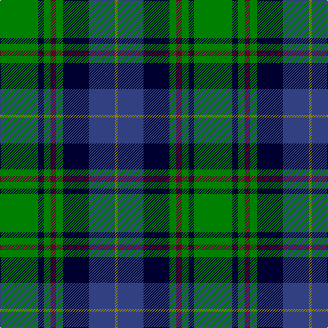

This page is one **sett** — a single exact thread-count. It belongs to the [tartan](/tartans/g28k4g5dr4g5k19db19y2/)
(the same proportion at any scale), whose colour order is pattern [GBKGBGKG](/stripes/gbkgbgkg/).

Sourced from weddslist.  It is a [8 stripe tartan](/stripes/stripes8/).

Original link http://www.weddslist.com/cgi-bin/tartans/pg.pl?source=sts

## Thread count
G/56 DB8 G10 DR8 G10 DB38 B38 LG/4

## Palette

Palette: <strong>custom</strong>
<table><thead><tr><th>Colour</th><th>Threads</th><th>Shade</th><th>Base</th><th>OKLCh</th></tr></thead><tbody><tr><td>G/</td><td style="text-align:right;font-variant-numeric:tabular-nums">56</td><td><code style="background-color:#008000;">#008000</code> <small style="color:#888">#008000</small></td><td>G <code style="background-color:#006100;">#006100</code></td><td><small style="color:#888">oklch(52.0% 0.177 142.5)</small></td></tr><tr><td>DB</td><td style="text-align:right;font-variant-numeric:tabular-nums">8</td><td><code style="background-color:#000030;">#000030</code> <small style="color:#888">#000030</small></td><td>K <code style="background-color:#000000;">#000000</code></td><td><small style="color:#888">oklch(14.0% 0.097 264.1)</small></td></tr><tr><td>G</td><td style="text-align:right;font-variant-numeric:tabular-nums">10</td><td><code style="background-color:#008000;">#008000</code> <small style="color:#888">#008000</small></td><td>G <code style="background-color:#006100;">#006100</code></td><td><small style="color:#888">oklch(52.0% 0.177 142.5)</small></td></tr><tr><td>DR</td><td style="text-align:right;font-variant-numeric:tabular-nums">8</td><td><code style="background-color:#600030;">#600030</code> <small style="color:#888">#600030</small></td><td>B <code style="background-color:#2A418A;">#2A418A</code></td><td><small style="color:#888">oklch(31.7% 0.129 359.5)</small></td></tr><tr><td>G</td><td style="text-align:right;font-variant-numeric:tabular-nums">10</td><td><code style="background-color:#008000;">#008000</code> <small style="color:#888">#008000</small></td><td>G <code style="background-color:#006100;">#006100</code></td><td><small style="color:#888">oklch(52.0% 0.177 142.5)</small></td></tr><tr><td>DB</td><td style="text-align:right;font-variant-numeric:tabular-nums">38</td><td><code style="background-color:#000030;">#000030</code> <small style="color:#888">#000030</small></td><td>K <code style="background-color:#000000;">#000000</code></td><td><small style="color:#888">oklch(14.0% 0.097 264.1)</small></td></tr><tr><td>B</td><td style="text-align:right;font-variant-numeric:tabular-nums">38</td><td><code style="background-color:#304080;">#304080</code> <small style="color:#888">#304080</small></td><td>B <code style="background-color:#2A418A;">#2A418A</code></td><td><small style="color:#888">oklch(39.4% 0.109 270.2)</small></td></tr><tr><td>LG/</td><td style="text-align:right;font-variant-numeric:tabular-nums">4</td><td><code style="background-color:#908000;">#908000</code> <small style="color:#888">#908000</small></td><td>G <code style="background-color:#006100;">#006100</code></td><td><small style="color:#888">oklch(59.6% 0.124 100.6)</small></td></tr></tbody></table>

# Sample pattern

## Nearest tartans

The nearest existing variants by ΔTartan distance, with this tartan at the top so the swatches line up against it.

ΔTartan

Tartan

Sett

—

<a href="/ttd/edit/#slug=g28k4g5dr4g5k19db19y2~x2">City of Guelph</a> <a class="nn-out" href="/setts/s8/g28k4g5dr4g5k19db19y2~x2/" title="open its dictionary page">↗</a>

0.72

<a href="/ttd/edit/#slug=db3r2db22k11g24lp2g3~x2">MacThomas</a> <a class="nn-out" href="/setts/s7/db3r2db22k11g24lp2g3~x2/" title="open its dictionary page">↗</a>

0.83

<a href="/ttd/edit/#slug=g3db12w1k12g13r2g2~x2">Paterson (Personal)</a> <a class="nn-out" href="/setts/s7/g3db12w1k12g13r2g2~x2/" title="open its dictionary page">↗</a>

0.84

<a href="/ttd/edit/#slug=g5db24g7k10g24ly2db2ly2r2~x2">Maitland Chief</a> <a class="nn-out" href="/setts/s9/g5db24g7k10g24ly2db2ly2r2~x2/" title="open its dictionary page">↗</a>

0.86

<a href="/ttd/edit/#slug=k3r1ly1db11g13db5r1ly1~x2">Snodgrass</a> <a class="nn-out" href="/setts/s8/k3r1ly1db11g13db5r1ly1~x2/" title="open its dictionary page">↗</a>

0.89

<a href="/ttd/edit/#slug=dg24k5dg6r6dg6k20b20w2~x2">Dunfermline Bank of Scotland (Corp)</a> <a class="nn-out" href="/setts/s8/dg24k5dg6r6dg6k20b20w2~x2/" title="open its dictionary page">↗</a>

0.93

<a href="/ttd/edit/#slug=dg2k1dg12r4dg3db9lb2~x4">Lee (Personal)</a> <a class="nn-out" href="/setts/s7/dg2k1dg12r4dg3db9lb2~x4/" title="open its dictionary page">↗</a>

0.94

<a href="/ttd/edit/#slug=db10ly3db30ly5k8g16r4g16r2~x2">MacMillan, hunting</a> <a class="nn-out" href="/setts/s9/db10ly3db30ly5k8g16r4g16r2~x2/" title="open its dictionary page">↗</a>

0.95

<a href="/ttd/edit/#slug=r5k2db19g4k19g28k2ly5~x2">Tait #1</a> <a class="nn-out" href="/setts/s8/r5k2db19g4k19g28k2ly5~x2/" title="open its dictionary page">↗</a>

0.96

<a href="/ttd/edit/#slug=g12k1g2r1g2k10db10lo1~x4">Guelph, City Of</a> <a class="nn-out" href="/setts/s8/g12k1g2r1g2k10db10lo1~x4/" title="open its dictionary page">↗</a>

0.99

<a href="/ttd/edit/#slug=db32k12db12g6r6g18k2ly3~x2">Gillies</a> <a class="nn-out" href="/setts/s8/db32k12db12g6r6g18k2ly3~x2/" title="open its dictionary page">↗</a>

## Neighbour map

Every grey dot is one of 14299 variants placed by the first two principal components of the ΔTartan feature space (44% of its variance). Red is this tartan; blue dots are its nearest — click one to open its page.

<svg viewBox="0 0 640 380" role="img" style="max-width:100%;height:auto;border:1px solid #e0e0e0;border-radius:4px;display:block" xmlns="http://www.w3.org/2000/svg"><image href="/nn/cloud.v1.png" width="640" height="380"/><a href="/setts/s7/db3r2db22k11g24lp2g3~x2/"><circle cx="195.3" cy="176.2" r="4" fill="#3465a4"><title>MacThomas</title></circle></a><a href="/setts/s7/g3db12w1k12g13r2g2~x2/"><circle cx="200.8" cy="194.5" r="4" fill="#3465a4"><title>Paterson (Personal)</title></circle></a><a href="/setts/s9/g5db24g7k10g24ly2db2ly2r2~x2/"><circle cx="241.8" cy="173.1" r="4" fill="#3465a4"><title>Maitland Chief</title></circle></a><a href="/setts/s8/k3r1ly1db11g13db5r1ly1~x2/"><circle cx="222.0" cy="161.1" r="4" fill="#3465a4"><title>Snodgrass</title></circle></a><a href="/setts/s8/dg24k5dg6r6dg6k20b20w2~x2/"><circle cx="182.1" cy="193.7" r="4" fill="#3465a4"><title>Dunfermline Bank of Scotland (Corp)</title></circle></a><a href="/setts/s7/dg2k1dg12r4dg3db9lb2~x4/"><circle cx="248.5" cy="194.8" r="4" fill="#3465a4"><title>Lee (Personal)</title></circle></a><a href="/setts/s9/db10ly3db30ly5k8g16r4g16r2~x2/"><circle cx="188.9" cy="161.6" r="4" fill="#3465a4"><title>MacMillan, hunting</title></circle></a><a href="/setts/s8/r5k2db19g4k19g28k2ly5~x2/"><circle cx="184.4" cy="172.1" r="4" fill="#3465a4"><title>Tait #1</title></circle></a><a href="/setts/s8/g12k1g2r1g2k10db10lo1~x4/"><circle cx="220.1" cy="187.8" r="4" fill="#3465a4"><title>Guelph, City Of</title></circle></a><a href="/setts/s8/db32k12db12g6r6g18k2ly3~x2/"><circle cx="222.0" cy="167.9" r="4" fill="#3465a4"><title>Gillies</title></circle></a><circle cx="209.4" cy="179.4" r="5" fill="#c00000"/></svg>

ID: /setts/s8/g28k4g5dr4g5k19db19y2~x2/
