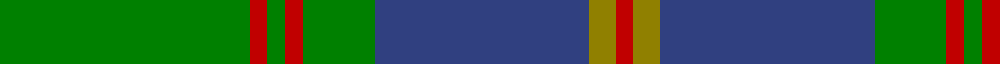
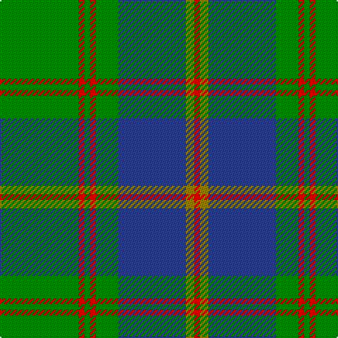

In pattern [GRGRGBGR](/patterns/grgrgbgr/).

This was sourced from weddslist.  It is a [8 stripes tartan](/stripes/stripes8/).

Original link http://www.weddslist.com/cgi-bin/tartans/pg.pl?source=sts

## Thread count
G/56 R4 G4 R4 G16 B48 LG6 R/4

## Palette
Each colour and its ΔE from the base-6 reference it is a variant of.

| Colour | Shade | Base | ΔE (OKLab) |
|---|---|---|---|
| B | <code style="background-color:#304080;">#304080</code> `#304080` | B <code style="background-color:#2A418A;">#2A418A</code> | 0.02 |
| G | <code style="background-color:#008000;">#008000</code> `#008000` | G <code style="background-color:#006100;">#006100</code> | 0.10 |
| LG | <code style="background-color:#908000;">#908000</code> `#908000` | G <code style="background-color:#006100;">#006100</code> | 0.20 |
| R | <code style="background-color:#C00000;">#C00000</code> `#C00000` | R <code style="background-color:#CC0000;">#CC0000</code> | 0.03 |

# Sample pattern

## Nearest tartans

The nearest existing variants by ΔTartan distance.

1. [US Marine Corps](/setts/s8/g40r3g4r3g12b32y4r3~b2c2c80-g006818-rc80000-yd09800~x2/) — ΔT 0.73
1. [Leatherneck U.S.Marine Corps Corporate Tartan Tartan Number: 975. Earliest known date: 1986 Designed by Madam Leask and the Scottish Tartans Society Accredited in 1981. See products available Copyright © Blair Urquhart, Comrie, 2015](/setts/s8/g28r2g2r2g8b24y3r2~b2c2c80-g006818-rc80000-ye8c000~x2/) — ΔT 0.87
1. [U.S. Marine Corps (Military?)](/setts/s8/g40r3g4r3g12b32y4r3~b2c2c80-g005810-rc80000-ye8c000~x2/) — ΔT 0.96
1. [Harley (Leslie), Robert](/setts/s8/g2k3y1k3g2b8g16k1~b202060-g006818-k101010-ye8c000~x4/) — ΔT 1.05
1. [MacAuliffe/McAucliffe](/setts/s8/g38w2g6b24r6b2r3b2~b2c4084-g005020-rc87814-we0e0e0~x2/) — ΔT 1.08
1. [Shaw (Clan 1)](/setts/s6/g24k2b3k2b8r2~b2c2c80-g006818-k101010-rc80000~x2/) — ΔT 1.09
1. [Cork](/setts/s9/g28r12g4b20y2b3y2b3g7~b304080-g008000-rc00000-yf0c000~x2/) — ΔT 1.15
1. [St Andrews Links](/setts/s7/b16g4b3g3y2g24r2~b14283c-g006818-r880000-yd09800~x2/) — ΔT 1.19
1. [Fort William (District?)](/setts/s11/g17b2ga2b2k21b2k3g30k2b2k4~b5c8ca8-g006818-ga5c6428-k101010~x2/) — ΔT 1.21
1. [Armagh Irish County Tartan Tartan Number: 2276. Earliest known date: 1996 One of a series of Irish District tartans designed by Polly Wittering of the House of Edgar, with colours reminiscent of the Country with soft warm colours dominating. See products available Copyright © Blair Urquhart, Comrie, 2015](/setts/s9/g4y2g17ga2r4ga2g3ga11g2~g407c40-ga043828-ra81830-ybcac20~x2/) — ΔT 1.22

## Neighbour map

Every grey dot is one of 15726 variants placed by the first two principal components of the ΔTartan feature space (44% of its variance). Red is this tartan; blue dots are its nearest — click one to open its page.

<svg viewBox="0 0 640 380" role="img" style="max-width:100%;height:auto;border:1px solid #e0e0e0;border-radius:4px;display:block" xmlns="http://www.w3.org/2000/svg"><image href="/nn/cloud.v1.png" width="640" height="380"/><a href="/setts/s8/g40r3g4r3g12b32y4r3~b2c2c80-g006818-rc80000-yd09800~x2/"><circle cx="341.4" cy="186.2" r="4" fill="#3465a4"><title>US Marine Corps</title></circle></a><a href="/setts/s8/g28r2g2r2g8b24y3r2~b2c2c80-g006818-rc80000-ye8c000~x2/"><circle cx="327.9" cy="178.4" r="4" fill="#3465a4"><title>Leatherneck U.S.Marine Corps Corporate Tartan Tartan Number: 975. Earliest known date: 1986 Designed by Madam Leask and the Scottish Tartans Society Accredited in 1981. See products available Copyright © Blair Urquhart, Comrie, 2015</title></circle></a><a href="/setts/s8/g40r3g4r3g12b32y4r3~b2c2c80-g005810-rc80000-ye8c000~x2/"><circle cx="340.1" cy="186.1" r="4" fill="#3465a4"><title>U.S. Marine Corps (Military?)</title></circle></a><a href="/setts/s8/g2k3y1k3g2b8g16k1~b202060-g006818-k101010-ye8c000~x4/"><circle cx="335.1" cy="185.5" r="4" fill="#3465a4"><title>Harley (Leslie), Robert</title></circle></a><a href="/setts/s8/g38w2g6b24r6b2r3b2~b2c4084-g005020-rc87814-we0e0e0~x2/"><circle cx="362.0" cy="174.1" r="4" fill="#3465a4"><title>MacAuliffe/McAucliffe</title></circle></a><a href="/setts/s6/g24k2b3k2b8r2~b2c2c80-g006818-k101010-rc80000~x2/"><circle cx="367.2" cy="205.2" r="4" fill="#3465a4"><title>Shaw (Clan 1)</title></circle></a><a href="/setts/s9/g28r12g4b20y2b3y2b3g7~b304080-g008000-rc00000-yf0c000~x2/"><circle cx="272.0" cy="175.9" r="4" fill="#3465a4"><title>Cork</title></circle></a><a href="/setts/s7/b16g4b3g3y2g24r2~b14283c-g006818-r880000-yd09800~x2/"><circle cx="381.6" cy="215.6" r="4" fill="#3465a4"><title>St Andrews Links</title></circle></a><a href="/setts/s11/g17b2ga2b2k21b2k3g30k2b2k4~b5c8ca8-g006818-ga5c6428-k101010~x2/"><circle cx="337.2" cy="166.9" r="4" fill="#3465a4"><title>Fort William (District?)</title></circle></a><a href="/setts/s9/g4y2g17ga2r4ga2g3ga11g2~g407c40-ga043828-ra81830-ybcac20~x2/"><circle cx="334.1" cy="216.3" r="4" fill="#3465a4"><title>Armagh Irish County Tartan Tartan Number: 2276. Earliest known date: 1996 One of a series of Irish District tartans designed by Polly Wittering of the House of Edgar, with colours reminiscent of the Country with soft warm colours dominating. See products available Copyright © Blair Urquhart, Comrie, 2015</title></circle></a><circle cx="338.9" cy="183.2" r="5" fill="#c00000"/></svg>

ID: /setts/s8/g28r2g2r2g8b24ga3r2~b304080-g008000-ga908000-rc00000~x2/
