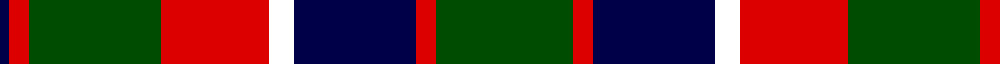

In pattern [BRGRWBRG](/patterns/brgrwbrg/).

This was sourced from register-of-tartans.  It is a [8 stripes tartan](/stripes/stripes8/).

Original link https://www.tartanregister.gov.uk/tartanDetails.aspx?ref=11166

## Thread count
DB/4 R8 G54 R44 W10 DB50 R8 G/56

## Palette
Each colour and its ΔE from the base-6 reference it is a variant of.

| Colour | Shade | Base | ΔE (OKLab) |
|---|---|---|---|
| DB | <code style="background-color:#000048;">#000048</code> `#000048` | B <code style="background-color:#2A418A;">#2A418A</code> | 0.22 |
| G | <code style="background-color:#004C00;">#004C00</code> `#004C00` | G <code style="background-color:#006100;">#006100</code> | 0.07 |
| R | <code style="background-color:#DC0000;">#DC0000</code> `#DC0000` | R <code style="background-color:#CC0000;">#CC0000</code> | 0.03 |
| W | <code style="background-color:#FFFFFF;">#FFFFFF</code> `#FFFFFF` | W <code style="background-color:#F7F7F7;">#F7F7F7</code> | 0.02 |

# Sample pattern

## Nearest tartans

The nearest existing variants by ΔTartan distance.

1. [Ardmore (Fashion)](/setts/s8/k21r2k8w2r16b6k2b8x2~b5c5c5c-k101010-ra07c58-we0e0e0/) — ΔT 0.73
1. [Strummer, Joe (Commemorative)](/setts/s7/k3g3y6k12y1r2g2x4~g604000-k101010-r888888-ybc8c00/) — ΔT 0.79
1. [Westwood MacStone (Fashion)](/setts/s10/w2k13y13r2y13k13w2k6y6r1x2~k101010-r800028-we0e0e0-ya08858/) — ΔT 0.92
1. [Dickie](/setts/s8/g8r2g12k6g3b6r24k4x2~b00008c-g146400-k000000-rc82800/) — ΔT 0.95
1. [Kerry County, Crest Range](/setts/s10/r14b5g25b5w2g11b7w5g6r5x2~b080848-g005020-rc87814-we0e0e0/) — ΔT 0.99
1. [New Glasgow (Canada)](/setts/s8/g28r4b25w5r22g27r4b2x2~b440044-g285800-rc80000-wfcfcfc/) — ΔT 0.99
1. [Bro-Leon](/setts/s9/b4k22y2k2g7y2k2y17k4x2~b2c2c80-g408060-k101010-ybc8c00/) — ΔT 1.01
1. [Cavan County Crest (Fashion)](/setts/s10/y32b10k52b10w5k24b16w10k11y15~b2c2c80-k101010-we0e0e0-yd87c00/) — ΔT 1.01
1. [Blackstock Hunting](/setts/s7/k2r7k6g12y1g1k2x4~g006818-k101010-rc80000-ye8c000/) — ΔT 1.04
1. [MacNett](/setts/s9/k1b1g16r16k12b8g16b1k1x2~b2c2c80-g347400-k101010-rc80000/) — ΔT 1.05

## Neighbour map

Every grey dot is one of 15726 variants placed by the first two principal components of the ΔTartan feature space (44% of its variance). Red is this tartan; blue dots are its nearest — click one to open its page.

<svg viewBox="0 0 640 380" role="img" style="max-width:100%;height:auto;border:1px solid #e0e0e0;border-radius:4px;display:block" xmlns="http://www.w3.org/2000/svg"><image href="/nn/cloud.v1.png" width="640" height="380"/><a href="/setts/s8/k21r2k8w2r16b6k2b8x2~b5c5c5c-k101010-ra07c58-we0e0e0/"><circle cx="237.1" cy="198.1" r="4" fill="#3465a4"><title>Ardmore (Fashion)</title></circle></a><a href="/setts/s7/k3g3y6k12y1r2g2x4~g604000-k101010-r888888-ybc8c00/"><circle cx="262.6" cy="195.2" r="4" fill="#3465a4"><title>Strummer, Joe (Commemorative)</title></circle></a><a href="/setts/s10/w2k13y13r2y13k13w2k6y6r1x2~k101010-r800028-we0e0e0-ya08858/"><circle cx="228.9" cy="182.0" r="4" fill="#3465a4"><title>Westwood MacStone (Fashion)</title></circle></a><a href="/setts/s8/g8r2g12k6g3b6r24k4x2~b00008c-g146400-k000000-rc82800/"><circle cx="198.6" cy="182.2" r="4" fill="#3465a4"><title>Dickie</title></circle></a><a href="/setts/s10/r14b5g25b5w2g11b7w5g6r5x2~b080848-g005020-rc87814-we0e0e0/"><circle cx="223.0" cy="184.7" r="4" fill="#3465a4"><title>Kerry County, Crest Range</title></circle></a><a href="/setts/s8/g28r4b25w5r22g27r4b2x2~b440044-g285800-rc80000-wfcfcfc/"><circle cx="248.3" cy="189.4" r="4" fill="#3465a4"><title>New Glasgow (Canada)</title></circle></a><a href="/setts/s9/b4k22y2k2g7y2k2y17k4x2~b2c2c80-g408060-k101010-ybc8c00/"><circle cx="246.5" cy="170.6" r="4" fill="#3465a4"><title>Bro-Leon</title></circle></a><a href="/setts/s10/y32b10k52b10w5k24b16w10k11y15~b2c2c80-k101010-we0e0e0-yd87c00/"><circle cx="195.4" cy="185.1" r="4" fill="#3465a4"><title>Cavan County Crest (Fashion)</title></circle></a><a href="/setts/s7/k2r7k6g12y1g1k2x4~g006818-k101010-rc80000-ye8c000/"><circle cx="227.2" cy="195.1" r="4" fill="#3465a4"><title>Blackstock Hunting</title></circle></a><a href="/setts/s9/k1b1g16r16k12b8g16b1k1x2~b2c2c80-g347400-k101010-rc80000/"><circle cx="234.0" cy="176.1" r="4" fill="#3465a4"><title>MacNett</title></circle></a><circle cx="226.0" cy="187.3" r="5" fill="#c00000"/></svg>

ID: /setts/s8/g28r4b25w5r22g27r4b2x2~b000048-g004c00-rdc0000-wffffff/
