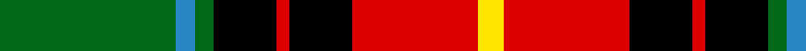

In pattern [GBGKRKRY](/stripes/gbgkrkry/).

This was sourced from register-of-tartans.  It is a [8 stripe tartan](/stripes/stripes8/).

Original link https://www.tartanregister.gov.uk/tartanDetails.aspx?ref=11389

## Register references

External register numbers recorded for this tartan.

- Scottish Register of Tartans: [11389](https://www.tartanregister.gov.uk/tartanDetails.aspx?ref=11389)

## Thread count
G/56 B6 G6 K20 R4 K20 R40 Y/8

## Palette
Each colour and the base-6 reference it is a variant of.

| Colour | Shade | Base |
|---|---|---|
| B | <code style="background-color:#2888C4;">#2888C4</code> `oklch(60.1% 0.125 241.5)` <small>#2888C4</small> | B <code style="background-color:#2A418A;">#2A418A</code> |
| G | <code style="background-color:#006818;">#006818</code> `oklch(45.0% 0.142 145.0)` <small>#006818</small> | G <code style="background-color:#006100;">#006100</code> |
| K | <code style="background-color:#000000;">#000000</code> `oklch(0.0% 0.000 0.0)` <small>#000000</small> | K <code style="background-color:#000000;">#000000</code> |
| R | <code style="background-color:#DC0000;">#DC0000</code> `oklch(56.2% 0.230 29.2)` <small>#DC0000</small> | R <code style="background-color:#CC0000;">#CC0000</code> |
| Y | <code style="background-color:#FFE600;">#FFE600</code> `oklch(91.7% 0.192 101.4)` <small>#FFE600</small> | Y <code style="background-color:#F2BF00;">#F2BF00</code> |

# Sample pattern

## Nearest tartans

The nearest existing variants by ΔTartan distance, with this tartan at the top so the swatches line up against it.

ΔTartan

Tartan

Sett

—

<a href="/ttd/edit/#slug=g28t3g3k10r2k10r20ly4~x2">Garvock (2015)</a> <a class="nn-out" href="/setts/s8/g28t3g3k10r2k10r20ly4~x2/" title="open its dictionary page">↗</a>

0.82

<a href="/ttd/edit/#slug=k10ly2g11r11w1r1w1k9~x2">Unnamed No 5</a> <a class="nn-out" href="/setts/s8/k10ly2g11r11w1r1w1k9~x2/" title="open its dictionary page">↗</a>

0.87

<a href="/ttd/edit/#slug=ly4k1r16k16w3r1k16g16k1ly4~x2">MacLamroc</a> <a class="nn-out" href="/setts/s10/ly4k1r16k16w3r1k16g16k1ly4~x2/" title="open its dictionary page">↗</a>

0.90

<a href="/ttd/edit/#slug=r24lb2ly3dg16k16lb2ly3">MacLachlan W</a> <a class="nn-out" href="/setts/s7/r24lb2ly3dg16k16lb2ly3/" title="open its dictionary page">↗</a>

0.92

<a href="/ttd/edit/#slug=r24lr2ly3dg16k16lr2ly3~x2">MacLachlan W</a> <a class="nn-out" href="/setts/s7/r24lr2ly3dg16k16lr2ly3~x2/" title="open its dictionary page">↗</a>

0.92

<a href="/ttd/edit/#slug=r24lr2ly3dg16k16lr2ly3">MacLachlan W</a> <a class="nn-out" href="/setts/s7/r24lr2ly3dg16k16lr2ly3/" title="open its dictionary page">↗</a>

0.93

<a href="/ttd/edit/#slug=k9r4k1r4g15r4k1~x2">Logan, Dark</a> <a class="nn-out" href="/setts/s7/k9r4k1r4g15r4k1~x2/" title="open its dictionary page">↗</a>

0.94

<a href="/ttd/edit/#slug=k10ly2dg11r11w1r1w1k9~x2">Unidentified No 5</a> <a class="nn-out" href="/setts/s8/k10ly2dg11r11w1r1w1k9~x2/" title="open its dictionary page">↗</a>

1.00

<a href="/ttd/edit/#slug=w2k1g16k12r12k1w2~x2">Prince Edward Island</a> <a class="nn-out" href="/setts/s7/w2k1g16k12r12k1w2~x2/" title="open its dictionary page">↗</a>

1.01

<a href="/ttd/edit/#slug=k44lo9k3lo8lo16lo15lo6k7~x2">Longford County Crest (Fashion)</a> <a class="nn-out" href="/setts/s8/k44lo9k3lo8lo16lo15lo6k7~x2/" title="open its dictionary page">↗</a>

1.01

<a href="/ttd/edit/#slug=k3g2k21w11g1y21g2y3~x2">Dalveen (Fashion)</a> <a class="nn-out" href="/setts/s8/k3g2k21w11g1y21g2y3~x2/" title="open its dictionary page">↗</a>

## Neighbour map

Every grey dot is one of 14299 variants placed by the first two principal components of the ΔTartan feature space (44% of its variance). Red is this tartan; blue dots are its nearest — click one to open its page.

<svg viewBox="0 0 640 380" role="img" style="max-width:100%;height:auto;border:1px solid #e0e0e0;border-radius:4px;display:block" xmlns="http://www.w3.org/2000/svg"><image href="/nn/cloud.v1.png" width="640" height="380"/><a href="/setts/s8/k10ly2g11r11w1r1w1k9~x2/"><circle cx="156.1" cy="165.6" r="4" fill="#3465a4"><title>Unnamed No 5</title></circle></a><a href="/setts/s10/ly4k1r16k16w3r1k16g16k1ly4~x2/"><circle cx="173.0" cy="135.2" r="4" fill="#3465a4"><title>MacLamroc</title></circle></a><a href="/setts/s7/r24lb2ly3dg16k16lb2ly3/"><circle cx="140.1" cy="149.7" r="4" fill="#3465a4"><title>MacLachlan W</title></circle></a><a href="/setts/s7/r24lr2ly3dg16k16lr2ly3~x2/"><circle cx="155.8" cy="160.9" r="4" fill="#3465a4"><title>MacLachlan W</title></circle></a><a href="/setts/s7/r24lr2ly3dg16k16lr2ly3/"><circle cx="155.8" cy="160.9" r="4" fill="#3465a4"><title>MacLachlan W</title></circle></a><a href="/setts/s7/k9r4k1r4g15r4k1~x2/"><circle cx="189.7" cy="172.6" r="4" fill="#3465a4"><title>Logan, Dark</title></circle></a><a href="/setts/s8/k10ly2dg11r11w1r1w1k9~x2/"><circle cx="174.2" cy="169.9" r="4" fill="#3465a4"><title>Unidentified No 5</title></circle></a><a href="/setts/s7/w2k1g16k12r12k1w2~x2/"><circle cx="171.8" cy="161.6" r="4" fill="#3465a4"><title>Prince Edward Island</title></circle></a><a href="/setts/s8/k44lo9k3lo8lo16lo15lo6k7~x2/"><circle cx="212.7" cy="165.8" r="4" fill="#3465a4"><title>Longford County Crest (Fashion)</title></circle></a><a href="/setts/s8/k3g2k21w11g1y21g2y3~x2/"><circle cx="198.4" cy="130.7" r="4" fill="#3465a4"><title>Dalveen (Fashion)</title></circle></a><circle cx="164.1" cy="148.9" r="5" fill="#c00000"/></svg>

ID: /setts/s8/g28t3g3k10r2k10r20ly4~x2/
