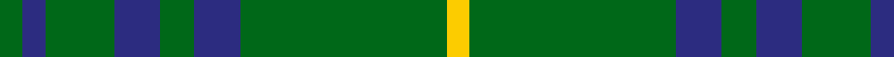
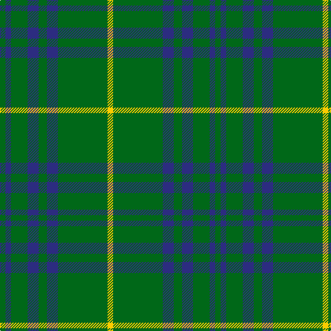

In pattern [GBGBGBGY](/patterns/gbgbgbgy/).

This was sourced from tartans-authority.  It is a [8 stripes tartan](/stripes/stripes8/).

Original link http://www.tartansauthority.com/tartan-ferret/display/8571/

## Thread count
G/8 DB8 G24 DB16 G12 DB16 G72 Y/8

## Palette
Each colour and its ΔE from the base-6 reference it is a variant of.

| Colour | Shade | Base | ΔE (OKLab) |
|---|---|---|---|
| DB | <code style="background-color:#2C2C80;">#2C2C80</code> `#2C2C80` | B <code style="background-color:#2A418A;">#2A418A</code> | 0.06 |
| G | <code style="background-color:#006818;">#006818</code> `#006818` | G <code style="background-color:#006100;">#006100</code> | 0.02 |
| Y | <code style="background-color:#FCCC00;">#FCCC00</code> `#FCCC00` | Y <code style="background-color:#F2BF00;">#F2BF00</code> | 0.04 |

# Sample pattern

## Nearest tartans

The nearest existing variants by ΔTartan distance.

1. [MacArthur-Fox (Personal)](/setts/s8/k8g3k4g20r3g20k4g3x2~g006818-k101010-r880000/) — ΔT 1.08
1. [Leeds, University of (Dance)](/setts/s8/g34r4g4r4g4r12g20w5x2~g006818-ra00048-we0e0e0/) — ΔT 1.12
1. [Green Watch](/setts/s7/g10r1g1r1y2g1r1x4~g004c00-ra0783c-yb0b0b0/) — ΔT 1.15
1. [Northcroft (Personal)](/setts/s7/g24r4g3k14g5r2g10x2~g006818-k101010-rc80000/) — ΔT 1.23
1. [MacArthur (Highland Society)](/setts/s6/g18y2g18k4g2k15x2~g006818-k101010-yd8b000/) — ΔT 1.46
1. [McCall, F W (Personal)](/setts/s9/g6b2r1g15r3b1g15ga6r1x2~b441800-g003c14-ga289c18-r9c68a4/) — ΔT 1.46
1. [Glenlivet](/setts/s8/g18r6g75b6g13ga35g12b6~b0000ff-g228b22-ga604000-rff0000/) — ΔT 1.46
1. [Glenlivet Check (Corporate)](/setts/s8/g18r6g75b6g13y35g12b6~b3850c8-g003820-r880000-ya08858/) — ΔT 1.47
1. [Ayrton Laoch Family Tartan Tartan Number: 1330. Earliest known date: 1982 The weaving and wearing of this tartan is 'Restricted'. This is not a legal definition and is applied by the Scottish Tartans Society irrespective of Design Patent or Copyright, in the spirit of a gentlemans agreement. Interested parties should contact the person listed under 'Source:' in this document. See products available Copyright © Blair Urquhart, Comrie, 2015](/setts/s10/r1g6y1g6b1g1b1g1b2r1x4~b2c2c80-g006818-rc80000-ye8c000/) — ΔT 1.47
1. [Peterhead (Personal)](/setts/s5/g9b1g2k4g2x4~b487088-g407058-k101010/) — ΔT 1.47

## Neighbour map

Every grey dot is one of 15726 variants placed by the first two principal components of the ΔTartan feature space (44% of its variance). Red is this tartan; blue dots are its nearest — click one to open its page.

<svg viewBox="0 0 640 380" role="img" style="max-width:100%;height:auto;border:1px solid #e0e0e0;border-radius:4px;display:block" xmlns="http://www.w3.org/2000/svg"><image href="/nn/cloud.v1.png" width="640" height="380"/><a href="/setts/s8/k8g3k4g20r3g20k4g3x2~g006818-k101010-r880000/"><circle cx="434.1" cy="261.6" r="4" fill="#3465a4"><title>MacArthur-Fox (Personal)</title></circle></a><a href="/setts/s8/g34r4g4r4g4r12g20w5x2~g006818-ra00048-we0e0e0/"><circle cx="429.0" cy="228.6" r="4" fill="#3465a4"><title>Leeds, University of (Dance)</title></circle></a><a href="/setts/s7/g10r1g1r1y2g1r1x4~g004c00-ra0783c-yb0b0b0/"><circle cx="457.6" cy="214.7" r="4" fill="#3465a4"><title>Green Watch</title></circle></a><a href="/setts/s7/g24r4g3k14g5r2g10x2~g006818-k101010-rc80000/"><circle cx="416.1" cy="239.4" r="4" fill="#3465a4"><title>Northcroft (Personal)</title></circle></a><a href="/setts/s6/g18y2g18k4g2k15x2~g006818-k101010-yd8b000/"><circle cx="384.1" cy="265.1" r="4" fill="#3465a4"><title>MacArthur (Highland Society)</title></circle></a><a href="/setts/s9/g6b2r1g15r3b1g15ga6r1x2~b441800-g003c14-ga289c18-r9c68a4/"><circle cx="451.3" cy="203.3" r="4" fill="#3465a4"><title>McCall, F W (Personal)</title></circle></a><a href="/setts/s8/g18r6g75b6g13ga35g12b6~b0000ff-g228b22-ga604000-rff0000/"><circle cx="417.6" cy="198.5" r="4" fill="#3465a4"><title>Glenlivet</title></circle></a><a href="/setts/s8/g18r6g75b6g13y35g12b6~b3850c8-g003820-r880000-ya08858/"><circle cx="422.2" cy="200.6" r="4" fill="#3465a4"><title>Glenlivet Check (Corporate)</title></circle></a><a href="/setts/s10/r1g6y1g6b1g1b1g1b2r1x4~b2c2c80-g006818-rc80000-ye8c000/"><circle cx="356.4" cy="218.3" r="4" fill="#3465a4"><title>Ayrton Laoch Family Tartan Tartan Number: 1330. Earliest known date: 1982 The weaving and wearing of this tartan is 'Restricted'. This is not a legal definition and is applied by the Scottish Tartans Society irrespective of Design Patent or Copyright, in the spirit of a gentlemans agreement. Interested parties should contact the person listed under 'Source:' in this document. See products available Copyright © Blair Urquhart, Comrie, 2015</title></circle></a><a href="/setts/s5/g9b1g2k4g2x4~b487088-g407058-k101010/"><circle cx="460.0" cy="273.8" r="4" fill="#3465a4"><title>Peterhead (Personal)</title></circle></a><circle cx="437.3" cy="234.6" r="5" fill="#c00000"/></svg>

ID: /setts/s8/g2b2g6b4g3b4g18y2x4~b2c2c80-g006818-yfccc00/
