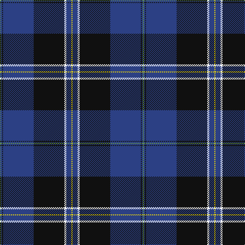

In pattern [GBKBKWBY](/patterns/gbkbkwby/).

This was sourced from register-of-tartans.  It is a [8 stripes tartan](/stripes/stripes8/).

Original link https://www.tartanregister.gov.uk/tartanDetails.aspx?ref=10728

## Thread count
LG/2 B2 K2 B60 K60 W4 B10 Y/2

## Palette
Each colour and its ΔE from the base-6 reference it is a variant of.

| Colour | Shade | Base | ΔE (OKLab) |
|---|---|---|---|
| B | <code style="background-color:#2C4084;">#2C4084</code> `#2C4084` | B <code style="background-color:#2C4084;">#2C4084</code> | 0.00 |
| K | <code style="background-color:#101010;">#101010</code> `#101010` | K <code style="background-color:#000000;">#000000</code> | 0.17 |
| LG | <code style="background-color:#649848;">#649848</code> `#649848` | G <code style="background-color:#006400;">#006400</code> | 0.19 |
| W | <code style="background-color:#FFFFFF;">#FFFFFF</code> `#FFFFFF` | W <code style="background-color:#F4F4F0;">#F4F4F0</code> | 0.03 |
| Y | <code style="background-color:#FFE600;">#FFE600</code> `#FFE600` | Y <code style="background-color:#E8C000;">#E8C000</code> | 0.10 |

# Sample pattern

## Nearest tartans

The nearest existing variants by ΔTartan distance.

1. [Hill (Name)](/setts/s9/w6b4y2b4y2b62k56r4k4-b2c2c80-k101010-rc80000-we0e0e0-ye8c000/) — ΔT 0.60
1. [Fuller of Hopewell (Personal)](/setts/s7/k4w4k72b80w4r4y4-b2c2c80-k101010-rc80050-wf8f8f8-yec8048/) — ΔT 0.94
1. [Dunlop](/setts/s8/k6r2k60w2b56r2b2w6-b2c2c80-k101010-rc80000-we0e0e0/) — ΔT 0.98
1. [Nocken (Personal)](/setts/s9/w6k12wa4k12b4k4b64k4ba2-b202060-ba5c5c5c-k101010-w98c8e8-wae8ccb8/) — ΔT 1.00
1. [MacLaurin of Brioch Clan Tartan Tartan Number: 344. Earliest known date: 1856 This sett was approved by the Chief and accepted by the A.G.M. of the Clan MacLaren Society as Dress MacLaren in 1981. The sett has been designed by changing the blue ground of the usual MacLaren sett to white and then centering a blue stripe on the white ground. This illustration is based on a kilt belonging to the designer, Mr I.G.Campbell MacLaren. See products available Copyright © Blair Urquhart, Comrie, 2015](/setts/s7/b72k20g6r6g12k2y4-b2c2c80-g006818-k101010-rc80000-ye8c000/) — ΔT 1.00
1. [Binder Wedding (Personal)](/setts/s8/g2b2k2b60k60w4b10y2-b3850c8-g289c18-k101010-we0e0e0-ydc943c/) — ΔT 1.01
1. [Grahame Laurie Band (Corporate)](/setts/s7/k8y2b6y2k36ba84w7-b780078-ba2c2c80-k101010-we0e0e0-yfccc00/) — ΔT 1.05
1. [Hope-Weir / Weir](/setts/s8/k16y2k2b56k24g4k2ba4-b304080-ba5480b0-g008000-k000000-yf0c000/) — ΔT 1.07
1. [Hope-Weir/Weir](/setts/s8/k16y2k2b56k24g4k2ba4-b2c4084-ba3c82af-g005020-k101010-ye8c000/) — ΔT 1.08
1. [MacBeth (Fashion)](/setts/s8/b84k12y4k6y4g20r14k4-b1c0070-g006818-k101010-r880000-yd09800/) — ΔT 1.09

## Neighbour map

Every grey dot is one of 15726 variants placed by the first two principal components of the ΔTartan feature space (44% of its variance). Red is this tartan; blue dots are its nearest — click one to open its page.

<svg viewBox="0 0 640 380" role="img" style="max-width:100%;height:auto;border:1px solid #e0e0e0;border-radius:4px;display:block" xmlns="http://www.w3.org/2000/svg"><image href="/nn/cloud.v1.png" width="640" height="380"/><a href="/setts/s9/w6b4y2b4y2b62k56r4k4-b2c2c80-k101010-rc80000-we0e0e0-ye8c000/"><circle cx="332.2" cy="109.8" r="4" fill="#3465a4"><title>Hill (Name)</title></circle></a><a href="/setts/s7/k4w4k72b80w4r4y4-b2c2c80-k101010-rc80050-wf8f8f8-yec8048/"><circle cx="308.5" cy="140.8" r="4" fill="#3465a4"><title>Fuller of Hopewell (Personal)</title></circle></a><a href="/setts/s8/k6r2k60w2b56r2b2w6-b2c2c80-k101010-rc80000-we0e0e0/"><circle cx="354.6" cy="135.5" r="4" fill="#3465a4"><title>Dunlop</title></circle></a><a href="/setts/s9/w6k12wa4k12b4k4b64k4ba2-b202060-ba5c5c5c-k101010-w98c8e8-wae8ccb8/"><circle cx="401.9" cy="115.4" r="4" fill="#3465a4"><title>Nocken (Personal)</title></circle></a><a href="/setts/s7/b72k20g6r6g12k2y4-b2c2c80-g006818-k101010-rc80000-ye8c000/"><circle cx="381.0" cy="126.7" r="4" fill="#3465a4"><title>MacLaurin of Brioch Clan Tartan Tartan Number: 344. Earliest known date: 1856 This sett was approved by the Chief and accepted by the A.G.M. of the Clan MacLaren Society as Dress MacLaren in 1981. The sett has been designed by changing the blue ground of the usual MacLaren sett to white and then centering a blue stripe on the white ground. This illustration is based on a kilt belonging to the designer, Mr I.G.Campbell MacLaren. See products available Copyright © Blair Urquhart, Comrie, 2015</title></circle></a><a href="/setts/s8/g2b2k2b60k60w4b10y2-b3850c8-g289c18-k101010-we0e0e0-ydc943c/"><circle cx="334.8" cy="114.3" r="4" fill="#3465a4"><title>Binder Wedding (Personal)</title></circle></a><a href="/setts/s7/k8y2b6y2k36ba84w7-b780078-ba2c2c80-k101010-we0e0e0-yfccc00/"><circle cx="382.2" cy="114.4" r="4" fill="#3465a4"><title>Grahame Laurie Band (Corporate)</title></circle></a><a href="/setts/s8/k16y2k2b56k24g4k2ba4-b304080-ba5480b0-g008000-k000000-yf0c000/"><circle cx="315.2" cy="123.1" r="4" fill="#3465a4"><title>Hope-Weir / Weir</title></circle></a><a href="/setts/s8/k16y2k2b56k24g4k2ba4-b2c4084-ba3c82af-g005020-k101010-ye8c000/"><circle cx="365.3" cy="143.3" r="4" fill="#3465a4"><title>Hope-Weir/Weir</title></circle></a><a href="/setts/s8/b84k12y4k6y4g20r14k4-b1c0070-g006818-k101010-r880000-yd09800/"><circle cx="338.1" cy="135.3" r="4" fill="#3465a4"><title>MacBeth (Fashion)</title></circle></a><circle cx="353.2" cy="123.2" r="5" fill="#c00000"/></svg>

ID: /setts/s8/g2b2k2b60k60w4b10y2-b2c4084-g649848-k101010-wffffff-yffe600/
