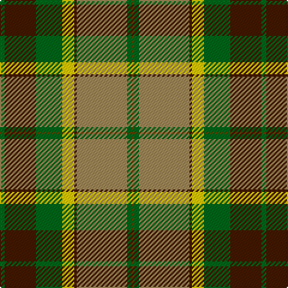

**Bands:** [GGYBYGBG](/stripes/ggybygbg/) · **Stripes:** [DY G LO DO LY G DO G](/stripes/stripes8/) DY G LO DO LY G DO G

This was sourced from tartans-authority.  It is a [8 band tartan](/bands/bands8/).

Original link http://www.tartansauthority.com/tartan-ferret/display/2540/

## Thread count
G/4 DR26 G22 Y10 DR2 LT42 G4 T/2

## Palette
Each colour and its ΔE from the base-6 reference it is a variant of.

| Colour | Shade | Base | ΔE (OKLab) |
|---|---|---|---|
| DR | <code style="background-color:#441800;">#441800</code> `#441800` | B <code style="background-color:#2A418A;">#2A418A</code> | 0.23 |
| G | <code style="background-color:#006818;">#006818</code> `#006818` | G <code style="background-color:#006100;">#006100</code> | 0.02 |
| LT | <code style="background-color:#A08858;">#A08858</code> `#A08858` | Y <code style="background-color:#F2BF00;">#F2BF00</code> | 0.21 |
| T | <code style="background-color:#604000;">#604000</code> `#604000` | G <code style="background-color:#006100;">#006100</code> | 0.14 |
| Y | <code style="background-color:#FCCC00;">#FCCC00</code> `#FCCC00` | Y <code style="background-color:#F2BF00;">#F2BF00</code> | 0.04 |

# Sample pattern

## Nearest tartans

The nearest existing variants by ΔTartan distance.

1. [St Lawrence Trade](/setts/s8/dg2dr13dg11ly5dr1o21dg2o1~x2/) — ΔT 0.68
1. [Botherston (Name)](/setts/s8/r2lo24r2lo3r2g24k8ly2~x2/) — ΔT 1.08
1. [Stuart / Stewart, Riding Cloak](/setts/s11/w1db4o8r4w1r4w1r4g16db2w1~x2/) — ΔT 1.12
1. [Golden Wedding (Fashion)](/setts/s8/r8lo44k32w2o52k7o7w3/) — ΔT 1.19
1. [Regalia](/setts/s7/dg1dy7dg7o2dy1ly15w1~x4/) — ΔT 1.27
1. [Hamilton of Brandon (Fashion)](/setts/s6/lo16k7w1g7k1ly3~x4/) — ΔT 1.27
1. [Buccleuch (Fashion)](/setts/s8/lo15k1lo2k1lo2k10y14w2~x2/) — ΔT 1.28
1. [Dinwoodie (Name)](/setts/s10/dy12o2k2o42k13g25o6k2r4k10~x2/) — ΔT 1.29
1. [Windsor](/setts/s10/r4n12k18n4y22lb1y2lb2y3lb2~x4/) — ΔT 1.32
1. [Leaf Peeper](/setts/s9/k2w1dg25dy11r12w1ly12k1w2~x2/) — ΔT 1.33

## Neighbour map

Every grey dot is one of 14299 variants placed by the first two principal components of the ΔTartan feature space (44% of its variance). Red is this tartan; blue dots are its nearest — click one to open its page.

<svg viewBox="0 0 640 380" role="img" style="max-width:100%;height:auto;border:1px solid #e0e0e0;border-radius:4px;display:block" xmlns="http://www.w3.org/2000/svg"><image href="/nn/cloud.v1.png" width="640" height="380"/><a href="/setts/s8/dg2dr13dg11ly5dr1o21dg2o1~x2/"><circle cx="208.2" cy="140.5" r="4" fill="#3465a4"><title>St Lawrence Trade</title></circle></a><a href="/setts/s8/r2lo24r2lo3r2g24k8ly2~x2/"><circle cx="226.9" cy="162.0" r="4" fill="#3465a4"><title>Botherston (Name)</title></circle></a><a href="/setts/s11/w1db4o8r4w1r4w1r4g16db2w1~x2/"><circle cx="178.3" cy="133.6" r="4" fill="#3465a4"><title>Stuart / Stewart, Riding Cloak</title></circle></a><a href="/setts/s8/r8lo44k32w2o52k7o7w3/"><circle cx="208.4" cy="123.7" r="4" fill="#3465a4"><title>Golden Wedding (Fashion)</title></circle></a><a href="/setts/s7/dg1dy7dg7o2dy1ly15w1~x4/"><circle cx="211.3" cy="144.5" r="4" fill="#3465a4"><title>Regalia</title></circle></a><a href="/setts/s6/lo16k7w1g7k1ly3~x4/"><circle cx="216.0" cy="162.8" r="4" fill="#3465a4"><title>Hamilton of Brandon (Fashion)</title></circle></a><a href="/setts/s8/lo15k1lo2k1lo2k10y14w2~x2/"><circle cx="230.3" cy="168.9" r="4" fill="#3465a4"><title>Buccleuch (Fashion)</title></circle></a><a href="/setts/s10/dy12o2k2o42k13g25o6k2r4k10~x2/"><circle cx="229.1" cy="135.8" r="4" fill="#3465a4"><title>Dinwoodie (Name)</title></circle></a><a href="/setts/s10/r4n12k18n4y22lb1y2lb2y3lb2~x4/"><circle cx="215.0" cy="132.9" r="4" fill="#3465a4"><title>Windsor</title></circle></a><a href="/setts/s9/k2w1dg25dy11r12w1ly12k1w2~x2/"><circle cx="167.3" cy="96.4" r="4" fill="#3465a4"><title>Leaf Peeper</title></circle></a><circle cx="210.7" cy="142.6" r="5" fill="#c00000"/></svg>

ID: /setts/s8/g2do13g11ly5do1lo21g2dy1~x2/
