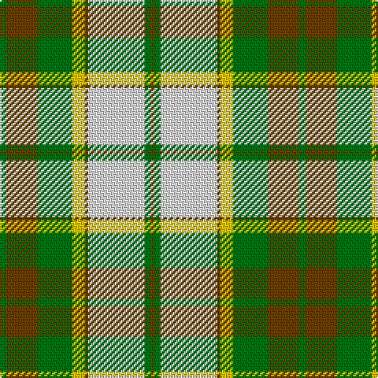

This page is one **sett** — a single exact thread-count. It belongs to the [tartan](/tartans/g2dy10g11ly4dy1w18g2dy1/)
(the same proportion at any scale), whose colour order is pattern [GGGYGWGG](/stripes/gggygwgg/).

Sourced from register-of-tartans.  It is a [8 stripe tartan](/stripes/stripes8/).

Original link https://www.tartanregister.gov.uk/tartanDetails.aspx?ref=148

3 attestations — the source records this cloth was collapsed from (oldest owns this page)

<ul>
<li>01/01/1975 — Aviemore Check (register-of-tartans, <a href="https://www.tartanregister.gov.uk/tartanDetails.aspx?ref=148">record</a>)</li>
<li>1975 — Aviemore Check (Fashion) (tartans-authority, <a href="http://www.tartansauthority.com/tartan-ferret/display/912/">record</a>)</li>
<li>undated — Aviemore Check District Tartan Tartan Number: 912. Earliest known date: 1975 1976 See products available Copyright © Blair Urquhart, Comrie, 2015 (house-of-tartan, <a href="http://www.house-of-tartan.scotland.net/house/TartanViewjs.asp?colr=Def&tnam=912">record</a>)</li>
</ul>

## Register references

External register numbers recorded for this tartan.

- Scottish Register of Tartans: [148](https://www.tartanregister.gov.uk/tartanDetails.aspx?ref=148)
- Scottish Tartans Authority (ITI): 912
- Scottish Tartans World Register: 912

## Thread count
G/4 T20 G22 Y8 T2 LN36 G4 T/2

## Palette

Palette: <strong>Tartan Register</strong>
<table><thead><tr><th>Colour</th><th>Threads</th><th>Shade</th><th>Base</th><th>OKLCh</th></tr></thead><tbody><tr><td>G/</td><td style="text-align:right;font-variant-numeric:tabular-nums">4</td><td><code style="background-color:#006818;">#006818</code> <small style="color:#888">#006818</small></td><td>G <code style="background-color:#006100;">#006100</code></td><td><small style="color:#888">oklch(45.0% 0.142 145.0)</small></td></tr><tr><td>T</td><td style="text-align:right;font-variant-numeric:tabular-nums">20</td><td><code style="background-color:#604000;">#604000</code> <small style="color:#888">#604000</small></td><td>G <code style="background-color:#006100;">#006100</code></td><td><small style="color:#888">oklch(39.8% 0.083 76.8)</small></td></tr><tr><td>G</td><td style="text-align:right;font-variant-numeric:tabular-nums">22</td><td><code style="background-color:#006818;">#006818</code> <small style="color:#888">#006818</small></td><td>G <code style="background-color:#006100;">#006100</code></td><td><small style="color:#888">oklch(45.0% 0.142 145.0)</small></td></tr><tr><td>Y</td><td style="text-align:right;font-variant-numeric:tabular-nums">8</td><td><code style="background-color:#E8C000;">#E8C000</code> <small style="color:#888">#E8C000</small></td><td>Y <code style="background-color:#F2BF00;">#F2BF00</code></td><td><small style="color:#888">oklch(81.9% 0.168 93.7)</small></td></tr><tr><td>T</td><td style="text-align:right;font-variant-numeric:tabular-nums">2</td><td><code style="background-color:#604000;">#604000</code> <small style="color:#888">#604000</small></td><td>G <code style="background-color:#006100;">#006100</code></td><td><small style="color:#888">oklch(39.8% 0.083 76.8)</small></td></tr><tr><td>LN</td><td style="text-align:right;font-variant-numeric:tabular-nums">36</td><td><code style="background-color:#E0E0E0;">#E0E0E0</code> <small style="color:#888">#E0E0E0</small></td><td>W <code style="background-color:#F7F7F7;">#F7F7F7</code></td><td><small style="color:#888">oklch(90.7% 0.000 89.9)</small></td></tr><tr><td>G</td><td style="text-align:right;font-variant-numeric:tabular-nums">4</td><td><code style="background-color:#006818;">#006818</code> <small style="color:#888">#006818</small></td><td>G <code style="background-color:#006100;">#006100</code></td><td><small style="color:#888">oklch(45.0% 0.142 145.0)</small></td></tr><tr><td>T/</td><td style="text-align:right;font-variant-numeric:tabular-nums">2</td><td><code style="background-color:#604000;">#604000</code> <small style="color:#888">#604000</small></td><td>G <code style="background-color:#006100;">#006100</code></td><td><small style="color:#888">oklch(39.8% 0.083 76.8)</small></td></tr></tbody></table>

# Sample pattern

## Nearest tartans

The nearest existing variants by ΔTartan distance, with this tartan at the top so the swatches line up against it.

ΔTartan

Tartan

Sett

—

<a href="/ttd/edit/#slug=g2dy10g11ly4dy1w18g2dy1~x2">Aviemore Check</a> <a class="nn-out" href="/setts/s8/g2dy10g11ly4dy1w18g2dy1~x2/" title="open its dictionary page">↗</a>

0.72

<a href="/ttd/edit/#slug=g2o10g11ly4o1w18g2o1~x2">Aviemore, Check</a> <a class="nn-out" href="/setts/s8/g2o10g11ly4o1w18g2o1~x2/" title="open its dictionary page">↗</a>

0.88

<a href="/ttd/edit/#slug=g3r12g12o5r1w25g2r1~x2">Dogwood</a> <a class="nn-out" href="/setts/s8/g3r12g12o5r1w25g2r1~x2/" title="open its dictionary page">↗</a>

0.97

<a href="/ttd/edit/#slug=g22r2g4r2g4r18w24r1lo3~x2">Prince Edward Island, Dress</a> <a class="nn-out" href="/setts/s9/g22r2g4r2g4r18w24r1lo3~x2/" title="open its dictionary page">↗</a>

0.99

<a href="/ttd/edit/#slug=g3r12g12lo5r1w25g2r1~x2">Dogwood Trade Tartan Tartan Number: 913. Earliest known date: 1968 The registered tartan of the Dinwiddie Clan. Dinwiddies are normally associated with the Maxwells, but Lord Lyon stated, in 1988, that Dinwiddies were a sept of no other clan. See products available Copyright © Blair Urquhart, Comrie, 2015</a> <a class="nn-out" href="/setts/s8/g3r12g12lo5r1w25g2r1~x2/" title="open its dictionary page">↗</a>

1.06

<a href="/ttd/edit/#slug=g2do8g8lo3do1w12g2do1~x2">National Trust</a> <a class="nn-out" href="/setts/s8/g2do8g8lo3do1w12g2do1~x2/" title="open its dictionary page">↗</a>

1.07

<a href="/ttd/edit/#slug=dg4do10dg10o6do1w26dg2do1~x4">Dogwood</a> <a class="nn-out" href="/setts/s8/dg4do10dg10o6do1w26dg2do1~x4/" title="open its dictionary page">↗</a>

1.20

<a href="/ttd/edit/#slug=dg4dy3dg21dy2w14o22dy3o4~x2">Bannock Bane M.406</a> <a class="nn-out" href="/setts/s8/dg4dy3dg21dy2w14o22dy3o4~x2/" title="open its dictionary page">↗</a>

1.25

<a href="/ttd/edit/#slug=dg4dr14dg14o6dr1w30dg2dr1~x2">British Columbia #2</a> <a class="nn-out" href="/setts/s8/dg4dr14dg14o6dr1w30dg2dr1~x2/" title="open its dictionary page">↗</a>

1.27

<a href="/ttd/edit/#slug=db4w2db1w18dg18g18ly3g4~x2">Gigha, Green (Dance)</a> <a class="nn-out" href="/setts/s8/db4w2db1w18dg18g18ly3g4~x2/" title="open its dictionary page">↗</a>

1.30

<a href="/ttd/edit/#slug=r20k2r2k2r2k8g24db2g3~x2">Mostyn</a> <a class="nn-out" href="/setts/s9/r20k2r2k2r2k8g24db2g3~x2/" title="open its dictionary page">↗</a>

## Neighbour map

Every grey dot is one of 14299 variants placed by the first two principal components of the ΔTartan feature space (44% of its variance). Red is this tartan; blue dots are its nearest — click one to open its page.

<svg viewBox="0 0 640 380" role="img" style="max-width:100%;height:auto;border:1px solid #e0e0e0;border-radius:4px;display:block" xmlns="http://www.w3.org/2000/svg"><image href="/nn/cloud.v1.png" width="640" height="380"/><a href="/setts/s8/g2o10g11ly4o1w18g2o1~x2/"><circle cx="201.6" cy="152.2" r="4" fill="#3465a4"><title>Aviemore, Check</title></circle></a><a href="/setts/s8/g3r12g12o5r1w25g2r1~x2/"><circle cx="222.9" cy="124.9" r="4" fill="#3465a4"><title>Dogwood</title></circle></a><a href="/setts/s9/g22r2g4r2g4r18w24r1lo3~x2/"><circle cx="214.3" cy="126.9" r="4" fill="#3465a4"><title>Prince Edward Island, Dress</title></circle></a><a href="/setts/s8/g3r12g12lo5r1w25g2r1~x2/"><circle cx="223.1" cy="124.7" r="4" fill="#3465a4"><title>Dogwood Trade Tartan Tartan Number: 913. Earliest known date: 1968 The registered tartan of the Dinwiddie Clan. Dinwiddies are normally associated with the Maxwells, but Lord Lyon stated, in 1988, that Dinwiddies were a sept of no other clan. See products available Copyright © Blair Urquhart, Comrie, 2015</title></circle></a><a href="/setts/s8/g2do8g8lo3do1w12g2do1~x2/"><circle cx="145.1" cy="169.5" r="4" fill="#3465a4"><title>National Trust</title></circle></a><a href="/setts/s8/dg4do10dg10o6do1w26dg2do1~x4/"><circle cx="217.7" cy="118.1" r="4" fill="#3465a4"><title>Dogwood</title></circle></a><a href="/setts/s8/dg4dy3dg21dy2w14o22dy3o4~x2/"><circle cx="181.0" cy="178.6" r="4" fill="#3465a4"><title>Bannock Bane M.406</title></circle></a><a href="/setts/s8/dg4dr14dg14o6dr1w30dg2dr1~x2/"><circle cx="215.5" cy="111.0" r="4" fill="#3465a4"><title>British Columbia #2</title></circle></a><a href="/setts/s8/db4w2db1w18dg18g18ly3g4~x2/"><circle cx="136.7" cy="140.3" r="4" fill="#3465a4"><title>Gigha, Green (Dance)</title></circle></a><a href="/setts/s9/r20k2r2k2r2k8g24db2g3~x2/"><circle cx="223.8" cy="148.8" r="4" fill="#3465a4"><title>Mostyn</title></circle></a><circle cx="188.0" cy="146.7" r="5" fill="#c00000"/></svg>

ID: /setts/s8/g2dy10g11ly4dy1w18g2dy1~x2/
