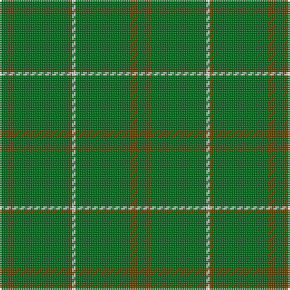

In pattern [GGGGWGGG](/stripes/ggggwggg/).

This was sourced from house-of-tartan.  It is a [8 stripe tartan](/stripes/stripes8/).

Original link http://www.house-of-tartan.scotland.net/house/TartanViewjs.asp?colr=Def&tnam=909

## Thread count
G/4 T4 G30 T2 LN2 G30 T4 G/4

## Palette
Each colour and the base-6 reference it is a variant of.

| Colour | Shade | Base |
|---|---|---|
| G | <code style="background-color:#006818;">#006818</code> `oklch(45.0% 0.142 145.0)` <small>#006818</small> | G <code style="background-color:#006100;">#006100</code> |
| LN | <code style="background-color:#E0E0E0;">#E0E0E0</code> `oklch(90.7% 0.000 89.9)` <small>#E0E0E0</small> | W <code style="background-color:#F7F7F7;">#F7F7F7</code> |
| T | <code style="background-color:#604000;">#604000</code> `oklch(39.8% 0.083 76.8)` <small>#604000</small> | G <code style="background-color:#006100;">#006100</code> |

# Sample pattern

## Nearest tartans

The nearest existing variants by ΔTartan distance.

1. [Bannockbane, hunting](/setts/s8/g2o2g15o1w1g15o2g2~x2/) — ΔT 1.02
1. [Pearson Family Tartan Tartan Number: 1734. Earliest known date: 1951 Nothing See products available Copyright © Blair Urquhart, Comrie, 2015](/setts/s5/lo3g14dy1g14lo3~x4/) — ΔT 1.59
1. [Walters (Personal)](/setts/s10/g2dp2g20g2g2g1~x4/) — ΔT 2.07
1. [Kenmore Hunting](/setts/s7/r2g19g2g2g19g2lo2~x2/) — ΔT 2.10
1. [Pearson](/setts/s5/o3g14o1g14o3~x4/) — ΔT 2.15
1. [Bannockbane Hunting](/setts/s8/dg2dy2dg15dy1w1dg15dy2dg2~x2/) — ΔT 2.24
1. [Walters (Personal)](/setts/s6/g2dp2g20g2g2dp1~x4/) — ΔT 2.31
1. [Braveheart Htg (Fashion)](/setts/s10/g3db2g40db1g2db1g9r4g3r2~x4/) — ΔT 2.35
1. [Owen Welsh Name Tartan Tartan Number: 5750. Earliest known date: 2002 The tartan for this Welsh surname and its variations, Bowen, Ifan, is actually woven in Wales at the Cambrian Woollen Mill, weaving on the same site since 1830. This tartan differs from many traditional patterns in that the warp and weft differ, giving the finished worsted wool cloth more of a predominant stripe, vertically noticeable in the finished Kilt, or Cilt in Wales. See products available Copyright © Blair Urquhart, Comrie, 2015](/setts/s10/g3dt1g2r1g3db3g2db2g18dt2~x2/) — ΔT 2.52
1. [New South Wales](/setts/s14/g3lo1g3r1g14dg2g3dg1g3g1g2g1g2g2~x4/) — ΔT 2.55

## Neighbour map

Every grey dot is one of 14299 variants placed by the first two principal components of the ΔTartan feature space (44% of its variance). Red is this tartan; blue dots are its nearest — click one to open its page.

<svg viewBox="0 0 640 380" role="img" style="max-width:100%;height:auto;border:1px solid #e0e0e0;border-radius:4px;display:block" xmlns="http://www.w3.org/2000/svg"><image href="/nn/cloud.v1.png" width="640" height="380"/><a href="/setts/s8/g2o2g15o1w1g15o2g2~x2/"><circle cx="626.0" cy="249.1" r="4" fill="#3465a4"><title>Bannockbane, hunting</title></circle></a><a href="/setts/s5/lo3g14dy1g14lo3~x4/"><circle cx="609.2" cy="298.2" r="4" fill="#3465a4"><title>Pearson Family Tartan Tartan Number: 1734. Earliest known date: 1951 Nothing See products available Copyright © Blair Urquhart, Comrie, 2015</title></circle></a><a href="/setts/s10/g2dp2g20g2g2g1~x4/"><circle cx="626.0" cy="219.1" r="4" fill="#3465a4"><title>Walters (Personal)</title></circle></a><a href="/setts/s7/r2g19g2g2g19g2lo2~x2/"><circle cx="626.0" cy="276.2" r="4" fill="#3465a4"><title>Kenmore Hunting</title></circle></a><a href="/setts/s5/o3g14o1g14o3~x4/"><circle cx="626.0" cy="316.7" r="4" fill="#3465a4"><title>Pearson</title></circle></a><a href="/setts/s8/dg2dy2dg15dy1w1dg15dy2dg2~x2/"><circle cx="626.0" cy="241.7" r="4" fill="#3465a4"><title>Bannockbane Hunting</title></circle></a><a href="/setts/s6/g2dp2g20g2g2dp1~x4/"><circle cx="626.0" cy="226.1" r="4" fill="#3465a4"><title>Walters (Personal)</title></circle></a><a href="/setts/s10/g3db2g40db1g2db1g9r4g3r2~x4/"><circle cx="626.0" cy="171.3" r="4" fill="#3465a4"><title>Braveheart Htg (Fashion)</title></circle></a><a href="/setts/s10/g3dt1g2r1g3db3g2db2g18dt2~x2/"><circle cx="536.7" cy="193.3" r="4" fill="#3465a4"><title>Owen Welsh Name Tartan Tartan Number: 5750. Earliest known date: 2002 The tartan for this Welsh surname and its variations, Bowen, Ifan, is actually woven in Wales at the Cambrian Woollen Mill, weaving on the same site since 1830. This tartan differs from many traditional patterns in that the warp and weft differ, giving the finished worsted wool cloth more of a predominant stripe, vertically noticeable in the finished Kilt, or Cilt in Wales. See products available Copyright © Blair Urquhart, Comrie, 2015</title></circle></a><a href="/setts/s14/g3lo1g3r1g14dg2g3dg1g3g1g2g1g2g2~x4/"><circle cx="554.0" cy="209.3" r="4" fill="#3465a4"><title>New South Wales</title></circle></a><circle cx="626.0" cy="258.6" r="5" fill="#c00000"/></svg>

ID: /setts/s8/g2dy2g15dy1w1g15dy2g2~x2/
