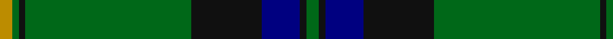
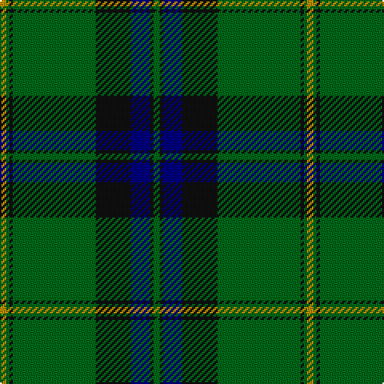

In pattern [GKBKGKGY](/patterns/gkbkgkgy/).

This was sourced from register-of-tartans.  It is a [8 stripes tartan](/stripes/stripes8/).

Original link https://www.tartanregister.gov.uk/tartanDetails.aspx?ref=11645

## Thread count
DY/4 G2 K2 G52 K22 DB12 K2 G/4

## Palette
Each colour and its ΔE from the base-6 reference it is a variant of.

| Colour | Shade | Base | ΔE (OKLab) |
|---|---|---|---|
| DB | <code style="background-color:#000080;">#000080</code> `#000080` | B <code style="background-color:#2A418A;">#2A418A</code> | 0.14 |
| DY | <code style="background-color:#BC8C00;">#BC8C00</code> `#BC8C00` | Y <code style="background-color:#F2BF00;">#F2BF00</code> | 0.16 |
| G | <code style="background-color:#006818;">#006818</code> `#006818` | G <code style="background-color:#006100;">#006100</code> | 0.02 |
| K | <code style="background-color:#101010;">#101010</code> `#101010` | K <code style="background-color:#000000;">#000000</code> | 0.17 |

# Sample pattern

## Nearest tartans

The nearest existing variants by ΔTartan distance.

1. [Grand Lodge of Scotland (Corporate)](/setts/s10/b1k2b1k6b1k1g1k6g21y1x2~b2c2c80-g006818-k101010-ye8c000/) — ΔT 0.77
1. [Celtic (New) Corporate Sport Tartan Tartan Number: 2232. Earliest known date: 1842 Should have a white line (?). See products available Copyright © Blair Urquhart, Comrie, 2015](/setts/s8/g44k2g2k2g3k12b10r3x2~b2c2c80-g006818-k101010-rc80000/) — ΔT 0.77
1. [Williams, Jodi (Personal)](/setts/s7/r2b20ra2g3ra4g35ra1x2~b00004c-g006818-r888888-rac80000/) — ΔT 0.88
1. [Smeaton Hunting (Name)](/setts/s10/k6g4w3g44k32g3k3y3k2g3x2~g006818-k101010-wc0c0c0-yd09800/) — ΔT 0.92
1. [Harley (Leslie), Robert](/setts/s8/g2k3y1k3g2b8g16k1x4~b202060-g006818-k101010-ye8c000/) — ΔT 1.01
1. [Moran (Name)](/setts/s6/g55k17r9k11y2k4x2~g006818-k101010-rc8002c-ye8c000/) — ΔT 1.10
1. [Fort William District Tartan Tartan Number: 699. Earliest known date: 1819 The pattern books of the old firm of weavers, Wilson's of Bannockburn, provide a reliable early source for this tartan. Wilson's were in business with a monopoly to supply tartan to the regiments in the second half of the 18th century before this pattern was recorded. See products available Copyright © Blair Urquhart, Comrie, 2015](/setts/s11/g17b2ga2b2k21b2k3g30k2b2k4x2~b5c8ca8-g006818-ga289c18-k101010/) — ΔT 1.15
1. [Fort William (District?)](/setts/s11/g17b2ga2b2k21b2k3g30k2b2k4x2~b5c8ca8-g006818-ga5c6428-k101010/) — ΔT 1.15
1. [Dropkick Murphys](/setts/s9/k6g55ga6k85ga4k4g12k2w5~g006818-ga289c18-k101010-we0e0e0/) — ΔT 1.16
1. [Johnston Clan Tartan Tartan Number: 1063. Earliest known date: 1842 A powerful Border Clan who pursued a deadly feud with the Maxwells. Their stronghold was Lochwood Tower, near Beattock, which was burned down by the Maxwells in 1593. The tartan was first published in the Vestiarium Scoticum in 1842. Before that time Border tartans were generally un-named. More likely the tartan came from the Aberdeenshire Johnstons, whose family seat is at Caskieben, Blackburn. (Ref: The Setts.. No. 82. D.C.Stewart.) See products available Copyright © Blair Urquhart, Comrie, 2015](/setts/s8/y3g2k1g30b24k2b2k2x2~b2c2c80-g006818-k101010-ye8c000/) — ΔT 1.23

## Neighbour map

Every grey dot is one of 15726 variants placed by the first two principal components of the ΔTartan feature space (44% of its variance). Red is this tartan; blue dots are its nearest — click one to open its page.

<svg viewBox="0 0 640 380" role="img" style="max-width:100%;height:auto;border:1px solid #e0e0e0;border-radius:4px;display:block" xmlns="http://www.w3.org/2000/svg"><image href="/nn/cloud.v1.png" width="640" height="380"/><a href="/setts/s10/b1k2b1k6b1k1g1k6g21y1x2~b2c2c80-g006818-k101010-ye8c000/"><circle cx="363.0" cy="145.0" r="4" fill="#3465a4"><title>Grand Lodge of Scotland (Corporate)</title></circle></a><a href="/setts/s8/g44k2g2k2g3k12b10r3x2~b2c2c80-g006818-k101010-rc80000/"><circle cx="417.4" cy="161.7" r="4" fill="#3465a4"><title>Celtic (New) Corporate Sport Tartan Tartan Number: 2232. Earliest known date: 1842 Should have a white line (?). See products available Copyright © Blair Urquhart, Comrie, 2015</title></circle></a><a href="/setts/s7/r2b20ra2g3ra4g35ra1x2~b00004c-g006818-r888888-rac80000/"><circle cx="373.8" cy="144.2" r="4" fill="#3465a4"><title>Williams, Jodi (Personal)</title></circle></a><a href="/setts/s10/k6g4w3g44k32g3k3y3k2g3x2~g006818-k101010-wc0c0c0-yd09800/"><circle cx="357.6" cy="144.3" r="4" fill="#3465a4"><title>Smeaton Hunting (Name)</title></circle></a><a href="/setts/s8/g2k3y1k3g2b8g16k1x4~b202060-g006818-k101010-ye8c000/"><circle cx="335.1" cy="185.5" r="4" fill="#3465a4"><title>Harley (Leslie), Robert</title></circle></a><a href="/setts/s6/g55k17r9k11y2k4x2~g006818-k101010-rc8002c-ye8c000/"><circle cx="367.5" cy="170.7" r="4" fill="#3465a4"><title>Moran (Name)</title></circle></a><a href="/setts/s11/g17b2ga2b2k21b2k3g30k2b2k4x2~b5c8ca8-g006818-ga289c18-k101010/"><circle cx="333.4" cy="165.6" r="4" fill="#3465a4"><title>Fort William District Tartan Tartan Number: 699. Earliest known date: 1819 The pattern books of the old firm of weavers, Wilson's of Bannockburn, provide a reliable early source for this tartan. Wilson's were in business with a monopoly to supply tartan to the regiments in the second half of the 18th century before this pattern was recorded. See products available Copyright © Blair Urquhart, Comrie, 2015</title></circle></a><a href="/setts/s11/g17b2ga2b2k21b2k3g30k2b2k4x2~b5c8ca8-g006818-ga5c6428-k101010/"><circle cx="337.2" cy="166.9" r="4" fill="#3465a4"><title>Fort William (District?)</title></circle></a><a href="/setts/s9/k6g55ga6k85ga4k4g12k2w5~g006818-ga289c18-k101010-we0e0e0/"><circle cx="382.0" cy="123.0" r="4" fill="#3465a4"><title>Dropkick Murphys</title></circle></a><a href="/setts/s8/y3g2k1g30b24k2b2k2x2~b2c2c80-g006818-k101010-ye8c000/"><circle cx="345.7" cy="144.2" r="4" fill="#3465a4"><title>Johnston Clan Tartan Tartan Number: 1063. Earliest known date: 1842 A powerful Border Clan who pursued a deadly feud with the Maxwells. Their stronghold was Lochwood Tower, near Beattock, which was burned down by the Maxwells in 1593. The tartan was first published in the Vestiarium Scoticum in 1842. Before that time Border tartans were generally un-named. More likely the tartan came from the Aberdeenshire Johnstons, whose family seat is at Caskieben, Blackburn. (Ref: The Setts.. No. 82. D.C.Stewart.) See products available Copyright © Blair Urquhart, Comrie, 2015</title></circle></a><circle cx="377.7" cy="154.7" r="5" fill="#c00000"/></svg>

ID: /setts/s8/g2k1b6k11g26k1g1y2x2~b000080-g006818-k101010-ybc8c00/
