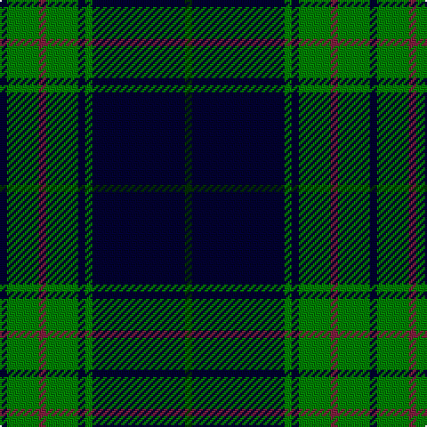

In pattern [GKGKGRGK](/patterns/gkgkgrgk/).

This was sourced from weddslist.  It is a [8 stripes tartan](/stripes/stripes8/).

Original link http://www.weddslist.com/cgi-bin/tartans/pg.pl?source=sts

## Thread count
DB/4 G18 DR4 G18 DB4 G4 DB52 DG/4

## Palette
Each colour and its ΔE from the base-6 reference it is a variant of.

| Colour | Shade | Base | ΔE (OKLab) |
|---|---|---|---|
| DB | <code style="background-color:#000030;">#000030</code> `#000030` | K <code style="background-color:#000000;">#000000</code> | 0.17 |
| DG | <code style="background-color:#003000;">#003000</code> `#003000` | G <code style="background-color:#006100;">#006100</code> | 0.17 |
| DR | <code style="background-color:#802040;">#802040</code> `#802040` | R <code style="background-color:#CC0000;">#CC0000</code> | 0.17 |
| G | <code style="background-color:#008000;">#008000</code> `#008000` | G <code style="background-color:#006100;">#006100</code> | 0.10 |

# Sample pattern

## Nearest tartans

The nearest existing variants by ΔTartan distance.

1. [St Andrews Links](/setts/s7/b26g4b3g3y2g24r2x2~b000050-g008000-rc00000-yf0c000/) — ΔT 1.05
1. [New Golf Club](/setts/s9/g4k4g23k11r2k2r2k20w4x2~g004010-k000030-rc00000-we0e0e0/) — ΔT 1.10
1. [Childers](/setts/s10/k4g13k4ga8k44ga8k4g13k4w3x2~g006818-ga408060-k101010-we0e0e0/) — ΔT 1.16
1. [MacIntyre L](/setts/s6/g4b12r3b12g32w4~b000064-g004c00-rc80000-wd0d0d0/) — ΔT 1.22
1. [Glen Esk](/setts/s8/g10r1g1r2g8b10g1y1x4~b0000b4-g004800-r9c0030-yfcc800/) — ΔT 1.22
1. [Greenways Marketing Intl (Corporate)](/setts/s7/b24g3b3g3y2g18r2x2~b1c0070-g006818-r880000-yd09800/) — ΔT 1.29
1. [Frederiction Police Force](/setts/s8/r6k55b8g6b10g6b6g4x2~b2c2c80-g289c18-k101010-rc80000/) — ΔT 1.29
1. [Tennessee State American District Tartan Tartan Number: 3067. Earliest known date: 1999 Official state tartan recorded at the Grandfather Mountain Highland Games, 1999. This ties in with the tartan displayed on the Tennessee Highland Game website. Colour choice explained as follows: Green for Agriculture; Blue for the Smoky Mountains; Purple for the State Flower the Iris; Red for Sacrifices of Veterans and Pioneers of the Volunteer State; White to symbolize the 3 Grand Divisions of the State of Tennessee. See products available Copyright © Blair Urquhart, Comrie, 2015](/setts/s10/r2b12w1b1g1r1g7b1g12w1x4~b1c0070-g006818-rc80000-we0e0e0/) — ΔT 1.30
1. [Leatherneck](/setts/s8/g40r3g4r3g12b32y4r3x2~b1c0070-g006818-r880000-yd09800/) — ΔT 1.30
1. [Kells Irish Pubs (Corporate)](/setts/s12/k17r2k3g2k3g2k24b8g4b4g3b8x2~b1474b4-g006818-k101010-r888888/) — ΔT 1.30

## Neighbour map

Every grey dot is one of 15726 variants placed by the first two principal components of the ΔTartan feature space (44% of its variance). Red is this tartan; blue dots are its nearest — click one to open its page.

<svg viewBox="0 0 640 380" role="img" style="max-width:100%;height:auto;border:1px solid #e0e0e0;border-radius:4px;display:block" xmlns="http://www.w3.org/2000/svg"><image href="/nn/cloud.v1.png" width="640" height="380"/><a href="/setts/s7/b26g4b3g3y2g24r2x2~b000050-g008000-rc00000-yf0c000/"><circle cx="284.9" cy="183.3" r="4" fill="#3465a4"><title>St Andrews Links</title></circle></a><a href="/setts/s9/g4k4g23k11r2k2r2k20w4x2~g004010-k000030-rc00000-we0e0e0/"><circle cx="284.7" cy="192.4" r="4" fill="#3465a4"><title>New Golf Club</title></circle></a><a href="/setts/s10/k4g13k4ga8k44ga8k4g13k4w3x2~g006818-ga408060-k101010-we0e0e0/"><circle cx="326.5" cy="170.0" r="4" fill="#3465a4"><title>Childers</title></circle></a><a href="/setts/s6/g4b12r3b12g32w4~b000064-g004c00-rc80000-wd0d0d0/"><circle cx="298.0" cy="217.8" r="4" fill="#3465a4"><title>MacIntyre L</title></circle></a><a href="/setts/s8/g10r1g1r2g8b10g1y1x4~b0000b4-g004800-r9c0030-yfcc800/"><circle cx="321.6" cy="206.8" r="4" fill="#3465a4"><title>Glen Esk</title></circle></a><a href="/setts/s7/b24g3b3g3y2g18r2x2~b1c0070-g006818-r880000-yd09800/"><circle cx="309.1" cy="195.4" r="4" fill="#3465a4"><title>Greenways Marketing Intl (Corporate)</title></circle></a><a href="/setts/s8/r6k55b8g6b10g6b6g4x2~b2c2c80-g289c18-k101010-rc80000/"><circle cx="318.8" cy="168.1" r="4" fill="#3465a4"><title>Frederiction Police Force</title></circle></a><a href="/setts/s10/r2b12w1b1g1r1g7b1g12w1x4~b1c0070-g006818-rc80000-we0e0e0/"><circle cx="283.0" cy="166.3" r="4" fill="#3465a4"><title>Tennessee State American District Tartan Tartan Number: 3067. Earliest known date: 1999 Official state tartan recorded at the Grandfather Mountain Highland Games, 1999. This ties in with the tartan displayed on the Tennessee Highland Game website. Colour choice explained as follows: Green for Agriculture; Blue for the Smoky Mountains; Purple for the State Flower the Iris; Red for Sacrifices of Veterans and Pioneers of the Volunteer State; White to symbolize the 3 Grand Divisions of the State of Tennessee. See products available Copyright © Blair Urquhart, Comrie, 2015</title></circle></a><a href="/setts/s8/g40r3g4r3g12b32y4r3x2~b1c0070-g006818-r880000-yd09800/"><circle cx="328.5" cy="183.6" r="4" fill="#3465a4"><title>Leatherneck</title></circle></a><a href="/setts/s12/k17r2k3g2k3g2k24b8g4b4g3b8x2~b1474b4-g006818-k101010-r888888/"><circle cx="321.9" cy="179.0" r="4" fill="#3465a4"><title>Kells Irish Pubs (Corporate)</title></circle></a><circle cx="321.7" cy="180.4" r="5" fill="#c00000"/></svg>

ID: /setts/s8/g2k26ga2k2ga9r2ga9k2x2~g003000-ga008000-k000030-r802040/
