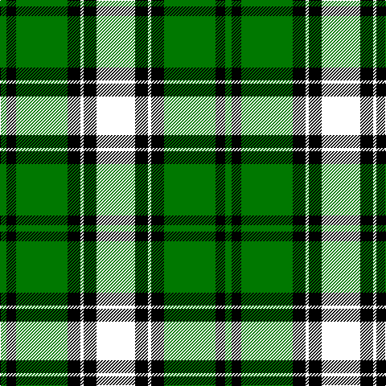

In pattern [GKGKKKKK](/patterns/gkgkkkkk/).

This was sourced from tartans-authority.  It is a [8 stripes tartan](/stripes/stripes8/).

Original link http://www.tartansauthority.com/tartan-ferret/display/4149/

## Thread count
Ga/8 K12 G64 K16 Y4 K16 A20 R/8

## Palette
Each colour and its ΔE from the base-6 reference it is a variant of.

| Colour | Shade | Base | ΔE (OKLab) |
|---|---|---|---|
| G | <code style="background-color:#007800;">#007800</code> `#007800` | G <code style="background-color:#006100;">#006100</code> | 0.07 |
| Ga | <code style="background-color:#007800;">#007800</code> `#007800` | G <code style="background-color:#006100;">#006100</code> | 0.07 |
| K | <code style="background-color:#000000;">#000000</code> `#000000` | K <code style="background-color:#000000;">#000000</code> | 0.00 |

# Sample pattern

## Nearest tartans

The nearest existing variants by ΔTartan distance.

1. [Cornish Htg (District)](/setts/s7/w5k26y2g24b8k4r3~b00008c-g004c00-k000000-rc80000-we0e0e0-y9c9c00~x2/) — ΔT 1.27
1. [Cornish, hunting](/setts/s7/w5k26y2g24ka7k3r3~g003000-k000000-ka000030-rc00000-we0e0e0-yf0c000~x2/) — ΔT 1.31
1. [Webster](/setts/s10/g32r3ga12b3y3b3k24k24w2k4~b3474fc-g007800-ga503c28-k000000-rb00000-wc8c8c8-ydcbc00~x2/) — ΔT 1.37
1. [Abercrombie](/setts/s9/k12r1g14w1g14k14r1b8k2~b304080-g008000-k000000-rc00000-we0e0e0~x2/) — ΔT 1.43
1. [Princess Diana](/setts/s12/k14r2k2r2k2g18r2g18w1b12ba1r8~b00008c-ba788cb4-g007800-k000000-r8c0000-wc8c8c8~x2/) — ΔT 1.45
1. [Cornish Hunting](/setts/s12/k26y2g24b8k4r3k4b8g24y2k26w5~b00008c-g004c00-k000000-rc80000-we0e0e0-y9c9c00~x2/) — ΔT 1.48
1. [Celtic F.C.](/setts/s14/g6ga3g24k2g4k16r5g2w4g2ga21g2k2y3~g003000-ga008000-k000000-r906030-we0e0e0-yf0c000~x2/) — ΔT 1.50
1. [Jones, The](/setts/s7/r3w2g10ga37k12b21w2~b000050-g505020-ga004010-k000000-rc00000-we0e0e0~x2/) — ΔT 1.54
1. [PMMC](/setts/s7/r3k11g29k28ga19y2b1~b0000ff-g005020-ga289c18-k101010-rff0000-yffe600~x2/) — ΔT 1.56
1. [Stephenson](/setts/s11/k6g20b2r5b2k20y3ba20g26r3ba5~b5480b0-ba304080-g008000-k000000-rc00000-yf0c000~x2/) — ΔT 1.57

## Neighbour map

Every grey dot is one of 15726 variants placed by the first two principal components of the ΔTartan feature space (44% of its variance). Red is this tartan; blue dots are its nearest — click one to open its page.

<svg viewBox="0 0 640 380" role="img" style="max-width:100%;height:auto;border:1px solid #e0e0e0;border-radius:4px;display:block" xmlns="http://www.w3.org/2000/svg"><image href="/nn/cloud.v1.png" width="640" height="380"/><a href="/setts/s7/w5k26y2g24b8k4r3~b00008c-g004c00-k000000-rc80000-we0e0e0-y9c9c00~x2/"><circle cx="162.0" cy="155.2" r="4" fill="#3465a4"><title>Cornish Htg (District)</title></circle></a><a href="/setts/s7/w5k26y2g24ka7k3r3~g003000-k000000-ka000030-rc00000-we0e0e0-yf0c000~x2/"><circle cx="172.1" cy="155.1" r="4" fill="#3465a4"><title>Cornish, hunting</title></circle></a><a href="/setts/s10/g32r3ga12b3y3b3k24k24w2k4~b3474fc-g007800-ga503c28-k000000-rb00000-wc8c8c8-ydcbc00~x2/"><circle cx="173.4" cy="112.5" r="4" fill="#3465a4"><title>Webster</title></circle></a><a href="/setts/s9/k12r1g14w1g14k14r1b8k2~b304080-g008000-k000000-rc00000-we0e0e0~x2/"><circle cx="184.3" cy="171.7" r="4" fill="#3465a4"><title>Abercrombie</title></circle></a><a href="/setts/s12/k14r2k2r2k2g18r2g18w1b12ba1r8~b00008c-ba788cb4-g007800-k000000-r8c0000-wc8c8c8~x2/"><circle cx="172.7" cy="116.0" r="4" fill="#3465a4"><title>Princess Diana</title></circle></a><a href="/setts/s12/k26y2g24b8k4r3k4b8g24y2k26w5~b00008c-g004c00-k000000-rc80000-we0e0e0-y9c9c00~x2/"><circle cx="174.5" cy="143.0" r="4" fill="#3465a4"><title>Cornish Hunting</title></circle></a><a href="/setts/s14/g6ga3g24k2g4k16r5g2w4g2ga21g2k2y3~g003000-ga008000-k000000-r906030-we0e0e0-yf0c000~x2/"><circle cx="151.4" cy="119.1" r="4" fill="#3465a4"><title>Celtic F.C.</title></circle></a><a href="/setts/s7/r3w2g10ga37k12b21w2~b000050-g505020-ga004010-k000000-rc00000-we0e0e0~x2/"><circle cx="195.7" cy="149.7" r="4" fill="#3465a4"><title>Jones, The</title></circle></a><a href="/setts/s7/r3k11g29k28ga19y2b1~b0000ff-g005020-ga289c18-k101010-rff0000-yffe600~x2/"><circle cx="209.6" cy="139.0" r="4" fill="#3465a4"><title>PMMC</title></circle></a><a href="/setts/s11/k6g20b2r5b2k20y3ba20g26r3ba5~b5480b0-ba304080-g008000-k000000-rc00000-yf0c000~x2/"><circle cx="136.6" cy="135.7" r="4" fill="#3465a4"><title>Stephenson</title></circle></a><circle cx="178.0" cy="145.8" r="5" fill="#c00000"/></svg>

ID: /setts/s8/g2k3g16k4k1k4k5k2~g007800-k000000~x4/
