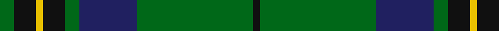
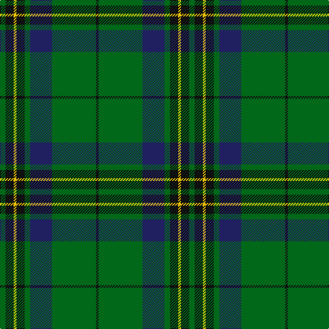

**Bands:** [GKYKGBGK](/stripes/gkykgbgk/) · **Stripes:** [G K LY K G DB G K](/stripes/stripes8/) G K LY K G DB G K

This was sourced from tartans-authority.  It is a [8 band tartan](/bands/bands8/).

Original link http://www.tartansauthority.com/tartan-ferret/display/10986/

## Thread count
G/8 K12 Y4 K12 G8 DB32 G64 K/4

## Palette
Each colour and its ΔE from the base-6 reference it is a variant of.

| Colour | Shade | Base | ΔE (OKLab) |
|---|---|---|---|
| DB | <code style="background-color:#202060;">#202060</code> `#202060` | B <code style="background-color:#2A418A;">#2A418A</code> | 0.11 |
| G | <code style="background-color:#006818;">#006818</code> `#006818` | G <code style="background-color:#006100;">#006100</code> | 0.02 |
| K | <code style="background-color:#101010;">#101010</code> `#101010` | K <code style="background-color:#000000;">#000000</code> | 0.17 |
| Y | <code style="background-color:#E8C000;">#E8C000</code> `#E8C000` | Y <code style="background-color:#F2BF00;">#F2BF00</code> | 0.02 |

# Sample pattern

## Nearest tartans

The nearest existing variants by ΔTartan distance.

1. [Harley (Leslie), Robert](/setts/s8/dg2k3ly1k3dg2db8dg16k1~x4/) — ΔT 0.73
1. [U.S. Marine Corps (Military?)](/setts/s8/dg40r3dg4r3dg12db32ly4r3~x2/) — ΔT 0.78
1. [US Marine Corps](/setts/s8/g40r3g4r3g12db32lo4r3~x2/) — ΔT 0.81
1. [Fort William (District?)](/setts/s11/g17t2y2t2k21t2k3g30k2t2k4~x2/) — ΔT 0.84
1. [Leatherneck U.S.Marine Corps Corporate Tartan Tartan Number: 975. Earliest known date: 1986 Designed by Madam Leask and the Scottish Tartans Society Accredited in 1981. See products available Copyright © Blair Urquhart, Comrie, 2015](/setts/s8/g28r2g2r2g8db24ly3r2~x2/) — ΔT 0.86
1. [MacArthur-Fox Green](/setts/s10/r4g4k2g31k10ly3g5k11g6k3~x2/) — ΔT 0.94
1. [Shaw (Clan 1)](/setts/s6/g24k2db3k2db8r2~x2/) — ΔT 0.99
1. [Page](/setts/s7/dg46k18dg6k13r4k4w4~x2/) — ΔT 0.99
1. [Mackie (2016)](/setts/s8/g2k1db6k11g26k1g1lo2~x2/) — ΔT 1.01
1. [Leatherneck, U.S.Marine Corps](/setts/s8/g28r2g2r2g8db24y3r2~x2/) — ΔT 1.05

## Neighbour map

Every grey dot is one of 14313 variants placed by the first two principal components of the ΔTartan feature space (44% of its variance). Red is this tartan; blue dots are its nearest — click one to open its page.

<svg viewBox="0 0 640 380" role="img" style="max-width:100%;height:auto;border:1px solid #e0e0e0;border-radius:4px;display:block" xmlns="http://www.w3.org/2000/svg"><image href="/nn/cloud.v1.png" width="640" height="380"/><a href="/setts/s8/dg2k3ly1k3dg2db8dg16k1~x4/"><circle cx="346.2" cy="196.3" r="4" fill="#3465a4"><title>Harley (Leslie), Robert</title></circle></a><a href="/setts/s8/dg40r3dg4r3dg12db32ly4r3~x2/"><circle cx="342.7" cy="188.8" r="4" fill="#3465a4"><title>U.S. Marine Corps (Military?)</title></circle></a><a href="/setts/s8/g40r3g4r3g12db32lo4r3~x2/"><circle cx="344.0" cy="189.1" r="4" fill="#3465a4"><title>US Marine Corps</title></circle></a><a href="/setts/s11/g17t2y2t2k21t2k3g30k2t2k4~x2/"><circle cx="340.2" cy="170.5" r="4" fill="#3465a4"><title>Fort William (District?)</title></circle></a><a href="/setts/s8/g28r2g2r2g8db24ly3r2~x2/"><circle cx="330.6" cy="180.6" r="4" fill="#3465a4"><title>Leatherneck U.S.Marine Corps Corporate Tartan Tartan Number: 975. Earliest known date: 1986 Designed by Madam Leask and the Scottish Tartans Society Accredited in 1981. See products available Copyright © Blair Urquhart, Comrie, 2015</title></circle></a><a href="/setts/s10/r4g4k2g31k10ly3g5k11g6k3~x2/"><circle cx="349.9" cy="176.2" r="4" fill="#3465a4"><title>MacArthur-Fox Green</title></circle></a><a href="/setts/s6/g24k2db3k2db8r2~x2/"><circle cx="369.9" cy="208.7" r="4" fill="#3465a4"><title>Shaw (Clan 1)</title></circle></a><a href="/setts/s7/dg46k18dg6k13r4k4w4~x2/"><circle cx="344.1" cy="209.8" r="4" fill="#3465a4"><title>Page</title></circle></a><a href="/setts/s8/g2k1db6k11g26k1g1lo2~x2/"><circle cx="380.8" cy="157.5" r="4" fill="#3465a4"><title>Mackie (2016)</title></circle></a><a href="/setts/s8/g28r2g2r2g8db24y3r2~x2/"><circle cx="341.5" cy="187.1" r="4" fill="#3465a4"><title>Leatherneck, U.S.Marine Corps</title></circle></a><circle cx="338.0" cy="189.0" r="5" fill="#c00000"/></svg>

ID: /setts/s8/g2k3ly1k3g2db8g16k1~x4/
