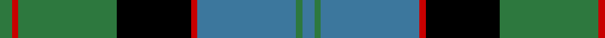
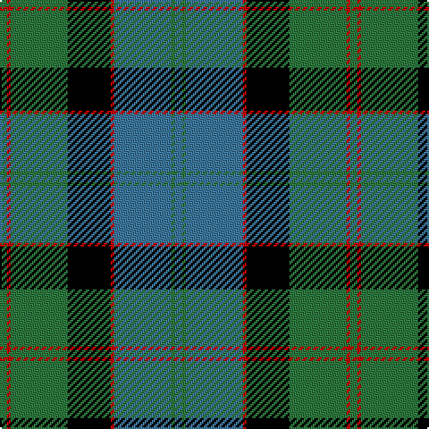

**Bands:** [GRGKRBGB](/stripes/grgkrbgb/) · **Stripes:** [G R G K R T G T](/stripes/stripes8/) G R G K R T G T

This was sourced from weddslist.  It is a [8 band tartan](/bands/bands8/).

Original link http://www.weddslist.com/cgi-bin/tartans/pg.pl?source=rb

## Register references

External register numbers recorded for this tartan.

- Scottish Register of Tartans: [1166](https://www.tartanregister.gov.uk/tartanDetails.aspx?ref=1166)
- Scottish Register of Tartans: [1758](https://www.tartanregister.gov.uk/tartanDetails.aspx?ref=1758)
- Scottish Register of Tartans: [2307](https://www.tartanregister.gov.uk/tartanDetails.aspx?ref=2307)
- Scottish Register of Tartans: [2540](https://www.tartanregister.gov.uk/tartanDetails.aspx?ref=2540)
- Scottish Register of Tartans: [2666](https://www.tartanregister.gov.uk/tartanDetails.aspx?ref=2666)
- Scottish Register of Tartans: [2862](https://www.tartanregister.gov.uk/tartanDetails.aspx?ref=2862)
- Scottish Register of Tartans: [3808](https://www.tartanregister.gov.uk/tartanDetails.aspx?ref=3808)
- Scottish Register of Tartans: [982](https://www.tartanregister.gov.uk/tartanDetails.aspx?ref=982)
- Scottish Tartans Authority (ITI): 218
- Scottish Tartans World Register: 1010
- Scottish Tartans World Register: 1042
- Scottish Tartans World Register: 127
- Scottish Tartans World Register: 1585
- Scottish Tartans World Register: 218
- Scottish Tartans World Register: 2218
- Scottish Tartans World Register: 737
- Scottish Tartans World Register: 897

## Thread count
G/4 R2 G32 K24 R2 B32 G2 B/4

## Palette
Each colour and its ΔE from the base-6 reference it is a variant of.

| Colour | Shade | Base | ΔE (OKLab) |
|---|---|---|---|
| B | <code style="background-color:#3C779D;">#3C779D</code> `#3C779D` | B <code style="background-color:#2A418A;">#2A418A</code> | 0.16 |
| G | <code style="background-color:#2D783E;">#2D783E</code> `#2D783E` | G <code style="background-color:#006100;">#006100</code> | 0.09 |
| K | <code style="background-color:#000000;">#000000</code> `#000000` | K <code style="background-color:#000000;">#000000</code> | 0.00 |
| R | <code style="background-color:#C80000;">#C80000</code> `#C80000` | R <code style="background-color:#CC0000;">#CC0000</code> | 0.01 |

# Sample pattern

## Nearest tartans

The nearest existing variants by ΔTartan distance.

1. [Ayrton](/setts/s9/r3g2k1g20k9t20k1t2r3~x2/) — ΔT 0.74
1. [Hebridean Old](/setts/s9/k2db3g16b1k13b1db18k2db2~x2/) — ΔT 0.90
1. [Gordon 3](/setts/s10/db56k6db6k6db6k44g44ly4g5ly8/) — ΔT 0.90
1. [Baird](/setts/s8/r7g3r2g33k31db31k3db3/) — ΔT 0.97
1. [Dress Watch](/setts/s8/db4k3db18k18g18db1g2w4~x2/) — ΔT 0.98
1. [Rangers F.C.](/setts/s11/r3g16k12db34k12g2k2g2k2g7r3~x2/) — ΔT 1.01
1. [Johnstone / Johnston](/setts/s8/k3db3k3db22g26k2db1ly3~x2/) — ΔT 1.04
1. [Lamont](/setts/s8/db10k1db1k1db2k8g10w1~x2/) — ΔT 1.05
1. [Hebridean Old](/setts/s8/k2t1g16t1k13t18k2t2~x2/) — ΔT 1.05
1. [MacThomas](/setts/s7/db3r2db22k11g24lp2g3~x2/) — ΔT 1.07

## Neighbour map

Every grey dot is one of 14299 variants placed by the first two principal components of the ΔTartan feature space (44% of its variance). Red is this tartan; blue dots are its nearest — click one to open its page.

<svg viewBox="0 0 640 380" role="img" style="max-width:100%;height:auto;border:1px solid #e0e0e0;border-radius:4px;display:block" xmlns="http://www.w3.org/2000/svg"><image href="/nn/cloud.v1.png" width="640" height="380"/><a href="/setts/s9/r3g2k1g20k9t20k1t2r3~x2/"><circle cx="203.8" cy="142.5" r="4" fill="#3465a4"><title>Ayrton</title></circle></a><a href="/setts/s9/k2db3g16b1k13b1db18k2db2~x2/"><circle cx="220.6" cy="160.3" r="4" fill="#3465a4"><title>Hebridean Old</title></circle></a><a href="/setts/s10/db56k6db6k6db6k44g44ly4g5ly8/"><circle cx="185.6" cy="156.3" r="4" fill="#3465a4"><title>Gordon 3</title></circle></a><a href="/setts/s8/r7g3r2g33k31db31k3db3/"><circle cx="179.2" cy="169.9" r="4" fill="#3465a4"><title>Baird</title></circle></a><a href="/setts/s8/db4k3db18k18g18db1g2w4~x2/"><circle cx="197.3" cy="180.0" r="4" fill="#3465a4"><title>Dress Watch</title></circle></a><a href="/setts/s11/r3g16k12db34k12g2k2g2k2g7r3~x2/"><circle cx="187.7" cy="141.5" r="4" fill="#3465a4"><title>Rangers F.C.</title></circle></a><a href="/setts/s8/k3db3k3db22g26k2db1ly3~x2/"><circle cx="267.0" cy="142.7" r="4" fill="#3465a4"><title>Johnstone / Johnston</title></circle></a><a href="/setts/s8/db10k1db1k1db2k8g10w1~x2/"><circle cx="184.7" cy="189.5" r="4" fill="#3465a4"><title>Lamont</title></circle></a><a href="/setts/s8/k2t1g16t1k13t18k2t2~x2/"><circle cx="231.8" cy="174.4" r="4" fill="#3465a4"><title>Hebridean Old</title></circle></a><a href="/setts/s7/db3r2db22k11g24lp2g3~x2/"><circle cx="195.3" cy="176.2" r="4" fill="#3465a4"><title>MacThomas</title></circle></a><circle cx="209.1" cy="166.5" r="5" fill="#c00000"/></svg>

ID: /setts/s8/g2r1g16k12r1t16g1t2~x2/
