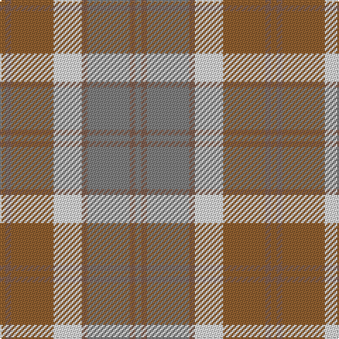

In pattern [GRGRWRRR](/patterns/grgrwrrr/).

This was sourced from weddslist.  It is a [8 stripes tartan](/stripes/stripes8/).

Original link http://www.weddslist.com/cgi-bin/tartans/pg.pl?source=sts

## Thread count
LT/4 LTa4 LT30 LN20 LTa4 N30 LTa4 N/4

## Palette
Each colour and its ΔE from the base-6 reference it is a variant of.

| Colour | Shade | Base | ΔE (OKLab) |
|---|---|---|---|
| LN | <code style="background-color:#E0E0E0;">#E0E0E0</code> `#E0E0E0` | W <code style="background-color:#F7F7F7;">#F7F7F7</code> | 0.07 |
| LT | <code style="background-color:#906030;">#906030</code> `#906030` | R <code style="background-color:#CC0000;">#CC0000</code> | 0.15 |
| LTa | <code style="background-color:#806050;">#806050</code> `#806050` | R <code style="background-color:#CC0000;">#CC0000</code> | 0.17 |
| N | <code style="background-color:#808080;">#808080</code> `#808080` | G <code style="background-color:#006100;">#006100</code> | 0.23 |

# Sample pattern

## Nearest tartans

The nearest existing variants by ΔTartan distance.

1. [Bannockbane Grey #2](/setts/s8/r2g2r15g2w10y15g2y2x2~g604000-r888888-we0e0e0-ya08858/) — ΔT 0.44
1. [Clyde Trade Tartan Tartan Number: 1296. Earliest known date: pre 1992 See Strathclyde District See products available Copyright © Blair Urquhart, Comrie, 2015](/setts/s10/w4b2w18r2b5ra16r2ra2r2ra2x2~b5c5c5c-rc80000-ra888888-wc0c0c0/) — ΔT 1.18
1. [MacPherson Gathering 1996](/setts/s9/b3r2g16r2b3r2ra16r2b3x4~b1870a4-g00643c-rc80000-ra888888/) — ΔT 1.28
1. [Clyde](/setts/s10/w4b2w18r2b5g16r2g2r2g2x2~b505050-g808080-rc00000-wc0c0c0/) — ΔT 1.37
1. [O'Monaghan (Personal)](/setts/s10/g25w2b4y7b4w2ya25w2b4y7x2~b2888c4-g789484-wfcfcfc-yd87c00-yabc8c00/) — ΔT 1.68
1. [Buchanhaven Heritage](/setts/s7/b24r27g20y6g20r2w3x2~b5c8ca8-g408060-rc82828-we0e0e0-ye0a126/) — ΔT 1.69
1. [Lakin (Personal)](/setts/s12/r5y1r1ya1r1b5ra6r1ra6b5ya5r1x4~b5c5c5c-r880000-ra888888-ya0a0a0-ya98acb8/) — ΔT 1.70
1. [Susan G Komen 06](/setts/s7/w6y27b6r40ya44w8r4~b581c24-rc46864-wfcf8e0-ya89480-yae09ca0/) — ΔT 1.73
1. [Unidentified from Winnipeg](/setts/s8/r24y8b2y8b2y8ra15g2x2~b401000-g008000-ra08060-ra806050-yff8500/) — ΔT 1.76
1. [Brodie Silver Clan Tartan Tartan Number: 1630. Earliest known date: c.1940-50 Probably a trade design based on Hunting Brodie, that has appeared in the last forty years. It is sometimes referred to as muted Brodie. (P.E. MacDonald, STS 1984) See products available Copyright © Blair Urquhart, Comrie, 2015](/setts/s7/r3b20y2b20ra20w20r3x2~b5c5c5c-rc80000-ra888888-wc0c0c0-ye8c000/) — ΔT 1.80

## Neighbour map

Every grey dot is one of 15726 variants placed by the first two principal components of the ΔTartan feature space (44% of its variance). Red is this tartan; blue dots are its nearest — click one to open its page.

<svg viewBox="0 0 640 380" role="img" style="max-width:100%;height:auto;border:1px solid #e0e0e0;border-radius:4px;display:block" xmlns="http://www.w3.org/2000/svg"><image href="/nn/cloud.v1.png" width="640" height="380"/><a href="/setts/s8/r2g2r15g2w10y15g2y2x2~g604000-r888888-we0e0e0-ya08858/"><circle cx="213.2" cy="207.3" r="4" fill="#3465a4"><title>Bannockbane Grey #2</title></circle></a><a href="/setts/s10/w4b2w18r2b5ra16r2ra2r2ra2x2~b5c5c5c-rc80000-ra888888-wc0c0c0/"><circle cx="262.5" cy="180.6" r="4" fill="#3465a4"><title>Clyde Trade Tartan Tartan Number: 1296. Earliest known date: pre 1992 See Strathclyde District See products available Copyright © Blair Urquhart, Comrie, 2015</title></circle></a><a href="/setts/s9/b3r2g16r2b3r2ra16r2b3x4~b1870a4-g00643c-rc80000-ra888888/"><circle cx="225.2" cy="202.8" r="4" fill="#3465a4"><title>MacPherson Gathering 1996</title></circle></a><a href="/setts/s10/w4b2w18r2b5g16r2g2r2g2x2~b505050-g808080-rc00000-wc0c0c0/"><circle cx="248.8" cy="175.7" r="4" fill="#3465a4"><title>Clyde</title></circle></a><a href="/setts/s10/g25w2b4y7b4w2ya25w2b4y7x2~b2888c4-g789484-wfcfcfc-yd87c00-yabc8c00/"><circle cx="211.5" cy="160.1" r="4" fill="#3465a4"><title>O'Monaghan (Personal)</title></circle></a><a href="/setts/s7/b24r27g20y6g20r2w3x2~b5c8ca8-g408060-rc82828-we0e0e0-ye0a126/"><circle cx="224.5" cy="201.4" r="4" fill="#3465a4"><title>Buchanhaven Heritage</title></circle></a><a href="/setts/s12/r5y1r1ya1r1b5ra6r1ra6b5ya5r1x4~b5c5c5c-r880000-ra888888-ya0a0a0-ya98acb8/"><circle cx="155.1" cy="206.0" r="4" fill="#3465a4"><title>Lakin (Personal)</title></circle></a><a href="/setts/s7/w6y27b6r40ya44w8r4~b581c24-rc46864-wfcf8e0-ya89480-yae09ca0/"><circle cx="219.3" cy="187.3" r="4" fill="#3465a4"><title>Susan G Komen 06</title></circle></a><a href="/setts/s8/r24y8b2y8b2y8ra15g2x2~b401000-g008000-ra08060-ra806050-yff8500/"><circle cx="230.5" cy="180.9" r="4" fill="#3465a4"><title>Unidentified from Winnipeg</title></circle></a><a href="/setts/s7/r3b20y2b20ra20w20r3x2~b5c5c5c-rc80000-ra888888-wc0c0c0-ye8c000/"><circle cx="235.4" cy="209.1" r="4" fill="#3465a4"><title>Brodie Silver Clan Tartan Tartan Number: 1630. Earliest known date: c.1940-50 Probably a trade design based on Hunting Brodie, that has appeared in the last forty years. It is sometimes referred to as muted Brodie. (P.E. MacDonald, STS 1984) See products available Copyright © Blair Urquhart, Comrie, 2015</title></circle></a><circle cx="219.7" cy="209.8" r="5" fill="#c00000"/></svg>

ID: /setts/s8/g2r2g15r2w10ra15r2ra2x2~g808080-r806050-ra906030-we0e0e0/
