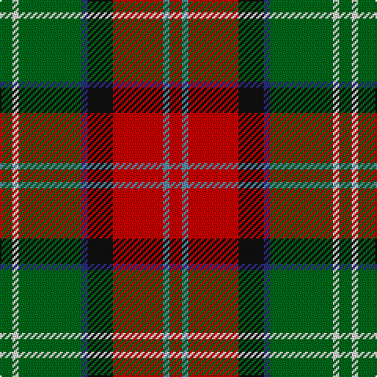

In pattern [GWGBKRBR](/patterns/gwgbkrbr/).

This was sourced from house-of-tartan.  It is a [8 stripes tartan](/stripes/stripes8/).

Original link http://www.house-of-tartan.scotland.net/house/TartanViewjs.asp?colr=Def&tnam=2162

## Thread count
G/8 LN4 G40 DB4 K16 R32 B4 R/8

## Palette
Each colour and its ΔE from the base-6 reference it is a variant of.

| Colour | Shade | Base | ΔE (OKLab) |
|---|---|---|---|
| B | <code style="background-color:#5C8CA8;">#5C8CA8</code> `#5C8CA8` | B <code style="background-color:#2A418A;">#2A418A</code> | 0.23 |
| DB | <code style="background-color:#2C2C80;">#2C2C80</code> `#2C2C80` | B <code style="background-color:#2A418A;">#2A418A</code> | 0.06 |
| G | <code style="background-color:#006818;">#006818</code> `#006818` | G <code style="background-color:#006100;">#006100</code> | 0.02 |
| K | <code style="background-color:#101010;">#101010</code> `#101010` | K <code style="background-color:#000000;">#000000</code> | 0.17 |
| LN | <code style="background-color:#E0E0E0;">#E0E0E0</code> `#E0E0E0` | W <code style="background-color:#F7F7F7;">#F7F7F7</code> | 0.07 |
| R | <code style="background-color:#C80000;">#C80000</code> `#C80000` | R <code style="background-color:#CC0000;">#CC0000</code> | 0.01 |

# Sample pattern

## Nearest tartans

The nearest existing variants by ΔTartan distance.

1. [Sawyer](/setts/s8/g2y1g10b1k4r8w1r2x4~b1c0070-g006818-k101010-ra00000-wa8ace8-yb8b8b8/) — ΔT 0.46
1. [George Watson's College](/setts/s7/b1r8y1g4w1g4ra1x6~b2888c4-g006818-r880000-rac80000-wfcfcfc-ye8c000/) — ΔT 0.59
1. [Barbour - Classic](/setts/s7/r4y2r21g11w2k20ra3x2~g642400-k101010-r946434-rac80000-wfcfcfc-ye8c000/) — ΔT 0.73
1. [Sawyer](/setts/s8/g2w1g10b1k4r8ba1r2x4~b304080-ba5480b0-g008000-k000000-rc00000-we0e0e0/) — ΔT 0.77
1. [Barbour](/setts/s7/r3k20w2g11ra21y2ra2x2~g642400-k101010-rc80000-ra946434-wfcfcfc-ye8c000/) — ΔT 0.80
1. [Barbour Corporate Tartan Tartan Number: 2489. Earliest known date: 1998 For the linings of Barbour's famous wax jackets. Tartan designed by Kinloch Anderson of Edinburgh. See products available Copyright © Blair Urquhart, Comrie, 2015](/setts/s7/g4y2g21b11w2k20r3x2~b441800-g6c6044-k101010-rc80000-wfcfcfc-ye8c000/) — ΔT 0.94
1. [Sikh (Corporate)](/setts/s8/r30k4r3k4r3g20b20y4x2~b14283c-g006818-k101010-rb84c00-ye8c000/) — ΔT 0.97
1. [Moray of Abercairney](/setts/s9/b3ba1k1r12ra1g9r1ba1b3x4~b304080-ba5480b0-g008000-k000000-rc00000-rad03030/) — ΔT 0.98
1. [Craik, of Assington](/setts/s8/b4r11b1g8r2g4k1y2x4~b304080-g008000-k000000-rc00000-yf0c000/) — ΔT 1.01
1. [Craik of Assington Personal Tartan Tartan Number: 494. Earliest known date: 1981 Restricted See products available Copyright © Blair Urquhart, Comrie, 2015](/setts/s8/b4r11b1g8r2g4k1y2x4~b2c2c80-g006818-k101010-rc80000-ye8c000/) — ΔT 1.02

## Neighbour map

Every grey dot is one of 15726 variants placed by the first two principal components of the ΔTartan feature space (44% of its variance). Red is this tartan; blue dots are its nearest — click one to open its page.

<svg viewBox="0 0 640 380" role="img" style="max-width:100%;height:auto;border:1px solid #e0e0e0;border-radius:4px;display:block" xmlns="http://www.w3.org/2000/svg"><image href="/nn/cloud.v1.png" width="640" height="380"/><a href="/setts/s8/g2y1g10b1k4r8w1r2x4~b1c0070-g006818-k101010-ra00000-wa8ace8-yb8b8b8/"><circle cx="189.1" cy="160.5" r="4" fill="#3465a4"><title>Sawyer</title></circle></a><a href="/setts/s7/b1r8y1g4w1g4ra1x6~b2888c4-g006818-r880000-rac80000-wfcfcfc-ye8c000/"><circle cx="176.2" cy="170.8" r="4" fill="#3465a4"><title>George Watson's College</title></circle></a><a href="/setts/s7/r4y2r21g11w2k20ra3x2~g642400-k101010-r946434-rac80000-wfcfcfc-ye8c000/"><circle cx="170.8" cy="159.8" r="4" fill="#3465a4"><title>Barbour - Classic</title></circle></a><a href="/setts/s8/g2w1g10b1k4r8ba1r2x4~b304080-ba5480b0-g008000-k000000-rc00000-we0e0e0/"><circle cx="158.6" cy="147.2" r="4" fill="#3465a4"><title>Sawyer</title></circle></a><a href="/setts/s7/r3k20w2g11ra21y2ra2x2~g642400-k101010-rc80000-ra946434-wfcfcfc-ye8c000/"><circle cx="165.4" cy="155.2" r="4" fill="#3465a4"><title>Barbour</title></circle></a><a href="/setts/s7/g4y2g21b11w2k20r3x2~b441800-g6c6044-k101010-rc80000-wfcfcfc-ye8c000/"><circle cx="174.0" cy="166.3" r="4" fill="#3465a4"><title>Barbour Corporate Tartan Tartan Number: 2489. Earliest known date: 1998 For the linings of Barbour's famous wax jackets. Tartan designed by Kinloch Anderson of Edinburgh. See products available Copyright © Blair Urquhart, Comrie, 2015</title></circle></a><a href="/setts/s8/r30k4r3k4r3g20b20y4x2~b14283c-g006818-k101010-rb84c00-ye8c000/"><circle cx="193.7" cy="173.2" r="4" fill="#3465a4"><title>Sikh (Corporate)</title></circle></a><a href="/setts/s9/b3ba1k1r12ra1g9r1ba1b3x4~b304080-ba5480b0-g008000-k000000-rc00000-rad03030/"><circle cx="195.2" cy="128.9" r="4" fill="#3465a4"><title>Moray of Abercairney</title></circle></a><a href="/setts/s8/b4r11b1g8r2g4k1y2x4~b304080-g008000-k000000-rc00000-yf0c000/"><circle cx="187.0" cy="170.1" r="4" fill="#3465a4"><title>Craik, of Assington</title></circle></a><a href="/setts/s8/b4r11b1g8r2g4k1y2x4~b2c2c80-g006818-k101010-rc80000-ye8c000/"><circle cx="194.2" cy="172.3" r="4" fill="#3465a4"><title>Craik of Assington Personal Tartan Tartan Number: 494. Earliest known date: 1981 Restricted See products available Copyright © Blair Urquhart, Comrie, 2015</title></circle></a><circle cx="180.4" cy="154.2" r="5" fill="#c00000"/></svg>

ID: /setts/s8/g2w1g10b1k4r8ba1r2x4~b2c2c80-ba5c8ca8-g006818-k101010-rc80000-we0e0e0/
