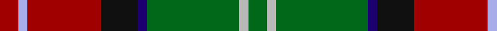

In pattern [GYGBKRWR](/patterns/gygbkrwr/).

This was sourced from register-of-tartans.  It is a [8 stripes tartan](/stripes/stripes8/).

Original link https://www.tartanregister.gov.uk/tartanDetails.aspx?ref=3662

## Attestations

This cloth appears in 2 source records; the oldest owns this page.

- 01/01/1994 — Sawyer (register-of-tartans, [record](https://www.tartanregister.gov.uk/tartanDetails.aspx?ref=3662))
- 1994 — Sawyer (Name) (tartans-authority, [record](http://www.tartansauthority.com/tartan-ferret/display/2162/))

## Register references

External register numbers recorded for this tartan.

- Scottish Register of Tartans: [3662](https://www.tartanregister.gov.uk/tartanDetails.aspx?ref=3662)
- Scottish Tartans Authority (ITI): 2162
- Scottish Tartans World Register: 2162

## Thread count
DR/8 LP4 DR32 K16 DB4 G40 N4 G/8

## Palette
Each colour and its ΔE from the base-6 reference it is a variant of.

| Colour | Shade | Base | ΔE (OKLab) |
|---|---|---|---|
| DB | <code style="background-color:#1C0070;">#1C0070</code> `#1C0070` | B <code style="background-color:#2A418A;">#2A418A</code> | 0.14 |
| DR | <code style="background-color:#A00000;">#A00000</code> `#A00000` | R <code style="background-color:#CC0000;">#CC0000</code> | 0.09 |
| G | <code style="background-color:#006818;">#006818</code> `#006818` | G <code style="background-color:#006100;">#006100</code> | 0.02 |
| K | <code style="background-color:#101010;">#101010</code> `#101010` | K <code style="background-color:#000000;">#000000</code> | 0.17 |
| LP | <code style="background-color:#A8ACE8;">#A8ACE8</code> `#A8ACE8` | W <code style="background-color:#F7F7F7;">#F7F7F7</code> | 0.23 |
| N | <code style="background-color:#B8B8B8;">#B8B8B8</code> `#B8B8B8` | Y <code style="background-color:#F2BF00;">#F2BF00</code> | 0.17 |

# Sample pattern

## Nearest tartans

The nearest existing variants by ΔTartan distance.

1. [Sawyer Family Tartan Tartan Number: 2162. Earliest known date: 1994 Information from Dr. Phil Smith, Narvon, USA. See products available Copyright © Blair Urquhart, Comrie, 2015](/setts/s8/g2w1g10b1k4r8ba1r2~b2c2c80-ba5c8ca8-g006818-k101010-rc80000-we0e0e0~x4/) — ΔT 0.46
1. [Barbour Corporate Tartan Tartan Number: 2489. Earliest known date: 1998 For the linings of Barbour's famous wax jackets. Tartan designed by Kinloch Anderson of Edinburgh. See products available Copyright © Blair Urquhart, Comrie, 2015](/setts/s7/g4y2g21b11w2k20r3~b441800-g6c6044-k101010-rc80000-wfcfcfc-ye8c000~x2/) — ΔT 0.75
1. [George Watson's College](/setts/s7/b1r8y1g4w1g4ra1~b2888c4-g006818-r880000-rac80000-wfcfcfc-ye8c000~x6/) — ΔT 0.82
1. [Barbour - Classic](/setts/s7/r4y2r21g11w2k20ra3~g642400-k101010-r946434-rac80000-wfcfcfc-ye8c000~x2/) — ΔT 0.84
1. [Barbour](/setts/s7/r3k20w2g11ra21y2ra2~g642400-k101010-rc80000-ra946434-wfcfcfc-ye8c000~x2/) — ΔT 0.91
1. [Sikh (Corporate)](/setts/s8/r30k4r3k4r3g20b20y4~b14283c-g006818-k101010-rb84c00-ye8c000~x2/) — ΔT 0.93
1. [Craik of Assington (Personal)](/setts/s8/b4r11b1g8r2g4k1y2~b1c0070-g006818-k101010-r880000-yd09800~x4/) — ΔT 1.02
1. [Caledonian Brewery (Corporate)](/setts/s7/w4g13ga6r16wa2r2ga2~g003820-ga006818-r880000-wc0c0c0-waa8ace8~x2/) — ΔT 1.06
1. [Moray of Abercairney](/setts/s9/b3ba1k1r12ra1g9r1ba1b3~b304080-ba5480b0-g008000-k000000-rc00000-rad03030~x4/) — ΔT 1.07
1. [Sawyer](/setts/s8/g2w1g10b1k4r8ba1r2~b304080-ba5480b0-g008000-k000000-rc00000-we0e0e0~x4/) — ΔT 1.10

## Neighbour map

Every grey dot is one of 15726 variants placed by the first two principal components of the ΔTartan feature space (44% of its variance). Red is this tartan; blue dots are its nearest — click one to open its page.

<svg viewBox="0 0 640 380" role="img" style="max-width:100%;height:auto;border:1px solid #e0e0e0;border-radius:4px;display:block" xmlns="http://www.w3.org/2000/svg"><image href="/nn/cloud.v1.png" width="640" height="380"/><a href="/setts/s8/g2w1g10b1k4r8ba1r2~b2c2c80-ba5c8ca8-g006818-k101010-rc80000-we0e0e0~x4/"><circle cx="180.4" cy="154.2" r="4" fill="#3465a4"><title>Sawyer Family Tartan Tartan Number: 2162. Earliest known date: 1994 Information from Dr. Phil Smith, Narvon, USA. See products available Copyright © Blair Urquhart, Comrie, 2015</title></circle></a><a href="/setts/s7/g4y2g21b11w2k20r3~b441800-g6c6044-k101010-rc80000-wfcfcfc-ye8c000~x2/"><circle cx="174.0" cy="166.3" r="4" fill="#3465a4"><title>Barbour Corporate Tartan Tartan Number: 2489. Earliest known date: 1998 For the linings of Barbour's famous wax jackets. Tartan designed by Kinloch Anderson of Edinburgh. See products available Copyright © Blair Urquhart, Comrie, 2015</title></circle></a><a href="/setts/s7/b1r8y1g4w1g4ra1~b2888c4-g006818-r880000-rac80000-wfcfcfc-ye8c000~x6/"><circle cx="176.2" cy="170.8" r="4" fill="#3465a4"><title>George Watson's College</title></circle></a><a href="/setts/s7/r4y2r21g11w2k20ra3~g642400-k101010-r946434-rac80000-wfcfcfc-ye8c000~x2/"><circle cx="170.8" cy="159.8" r="4" fill="#3465a4"><title>Barbour - Classic</title></circle></a><a href="/setts/s7/r3k20w2g11ra21y2ra2~g642400-k101010-rc80000-ra946434-wfcfcfc-ye8c000~x2/"><circle cx="165.4" cy="155.2" r="4" fill="#3465a4"><title>Barbour</title></circle></a><a href="/setts/s8/r30k4r3k4r3g20b20y4~b14283c-g006818-k101010-rb84c00-ye8c000~x2/"><circle cx="193.7" cy="173.2" r="4" fill="#3465a4"><title>Sikh (Corporate)</title></circle></a><a href="/setts/s8/b4r11b1g8r2g4k1y2~b1c0070-g006818-k101010-r880000-yd09800~x4/"><circle cx="207.4" cy="183.9" r="4" fill="#3465a4"><title>Craik of Assington (Personal)</title></circle></a><a href="/setts/s7/w4g13ga6r16wa2r2ga2~g003820-ga006818-r880000-wc0c0c0-waa8ace8~x2/"><circle cx="183.5" cy="194.8" r="4" fill="#3465a4"><title>Caledonian Brewery (Corporate)</title></circle></a><a href="/setts/s9/b3ba1k1r12ra1g9r1ba1b3~b304080-ba5480b0-g008000-k000000-rc00000-rad03030~x4/"><circle cx="195.2" cy="128.9" r="4" fill="#3465a4"><title>Moray of Abercairney</title></circle></a><a href="/setts/s8/g2w1g10b1k4r8ba1r2~b304080-ba5480b0-g008000-k000000-rc00000-we0e0e0~x4/"><circle cx="158.6" cy="147.2" r="4" fill="#3465a4"><title>Sawyer</title></circle></a><circle cx="189.1" cy="160.5" r="5" fill="#c00000"/></svg>

ID: /setts/s8/g2y1g10b1k4r8w1r2~b1c0070-g006818-k101010-ra00000-wa8ace8-yb8b8b8~x4/
