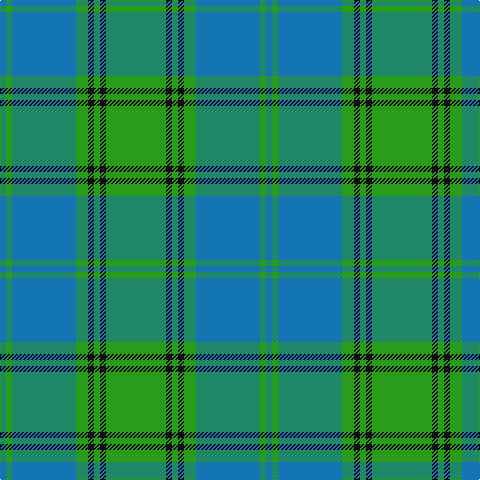

**Bands:** [BGBGKGKG](/stripes/bgbgkgkg/) · **Stripes:** [B G B G K G K G](/stripes/stripes8/) B G B G K G K G

This was sourced from tartans-authority.  It is a [8 band tartan](/bands/bands8/).

Original link http://www.tartansauthority.com/tartan-ferret/display/125/

## Thread count
B/6 G6 B64 Ga12 K6 Ga6 K6 Ga/60

## Palette
Each colour and its ΔE from the base-6 reference it is a variant of.

| Colour | Shade | Base | ΔE (OKLab) |
|---|---|---|---|
| B | <code style="background-color:#1474B4;">#1474B4</code> `#1474B4` | B <code style="background-color:#2A418A;">#2A418A</code> | 0.15 |
| G | <code style="background-color:#289C18;">#289C18</code> `#289C18` | G <code style="background-color:#006100;">#006100</code> | 0.19 |
| Ga | <code style="background-color:#289C18;">#289C18</code> `#289C18` | G <code style="background-color:#006100;">#006100</code> | 0.19 |
| K | <code style="background-color:#101010;">#101010</code> `#101010` | K <code style="background-color:#000000;">#000000</code> | 0.17 |

# Sample pattern

## Nearest tartans

The nearest existing variants by ΔTartan distance.

1. [Leatherneck, U.S.Marine Corps](/setts/s8/g28r2g2r2g8db24y3r2~x2/) — ΔT 1.32
1. [Gift of Life Michigan (Corporate)](/setts/s7/r2t1r1t11g16dg1w1~x2/) — ΔT 1.33
1. [Mayhew (Personal)](/setts/s13/k6g3k3g28b4g4b10g4b4g4b24g5w3~x2/) — ΔT 1.44
1. [Marie Curie Fields Of Hope](/setts/s9/b12lo1b2lo1b3k5g10lo1g2~x4/) — ΔT 1.47
1. [Snodgrass (Clan)](/setts/s8/k3r1ly1t11g13t5r1ly1~x4/) — ΔT 1.48
1. [Maine State](/setts/s11/g2r2t23db2t2db6t2db2g33r2t2~x2/) — ΔT 1.49
1. [Chartered Accountants of Scotland](/setts/s8/ly4g3r2g36b30k3b3k3~x2/) — ΔT 1.50
1. [Lennox Dress, Purple (Dance)](/setts/s7/g6n2g25n4t25n2t6~x2/) — ΔT 1.51
1. [MacOrrell](/setts/s9/db5ly2db17g14w1g1w1g4ly2~x2/) — ΔT 1.51
1. [Boucherville (Tartan de..) District Tartan Tartan Number: 2119. Earliest known date: 1990 From the notes accompanying the petition for accreditation. "Les symboles ont cette remarquable propriete de reunir en une expression imagee des notions diverses. Ils refletent l'histoire, les croyances, les idealogies et les aspirations de groupes humains habitant un territoire precis. Les tisserands, c'est nous tous....!" See products available Copyright © Blair Urquhart, Comrie, 2015](/setts/s9/g20ly2o5w4g2o2g2o2db6~x2/) — ΔT 1.59

## Neighbour map

Every grey dot is one of 14313 variants placed by the first two principal components of the ΔTartan feature space (44% of its variance). Red is this tartan; blue dots are its nearest — click one to open its page.

<svg viewBox="0 0 640 380" role="img" style="max-width:100%;height:auto;border:1px solid #e0e0e0;border-radius:4px;display:block" xmlns="http://www.w3.org/2000/svg"><image href="/nn/cloud.v1.png" width="640" height="380"/><a href="/setts/s8/g28r2g2r2g8db24y3r2~x2/"><circle cx="341.5" cy="187.1" r="4" fill="#3465a4"><title>Leatherneck, U.S.Marine Corps</title></circle></a><a href="/setts/s7/r2t1r1t11g16dg1w1~x2/"><circle cx="289.9" cy="156.7" r="4" fill="#3465a4"><title>Gift of Life Michigan (Corporate)</title></circle></a><a href="/setts/s13/k6g3k3g28b4g4b10g4b4g4b24g5w3~x2/"><circle cx="281.5" cy="192.8" r="4" fill="#3465a4"><title>Mayhew (Personal)</title></circle></a><a href="/setts/s9/b12lo1b2lo1b3k5g10lo1g2~x4/"><circle cx="254.4" cy="192.8" r="4" fill="#3465a4"><title>Marie Curie Fields Of Hope</title></circle></a><a href="/setts/s8/k3r1ly1t11g13t5r1ly1~x4/"><circle cx="226.6" cy="163.3" r="4" fill="#3465a4"><title>Snodgrass (Clan)</title></circle></a><a href="/setts/s11/g2r2t23db2t2db6t2db2g33r2t2~x2/"><circle cx="289.4" cy="141.8" r="4" fill="#3465a4"><title>Maine State</title></circle></a><a href="/setts/s8/ly4g3r2g36b30k3b3k3~x2/"><circle cx="304.4" cy="159.4" r="4" fill="#3465a4"><title>Chartered Accountants of Scotland</title></circle></a><a href="/setts/s7/g6n2g25n4t25n2t6~x2/"><circle cx="314.7" cy="222.9" r="4" fill="#3465a4"><title>Lennox Dress, Purple (Dance)</title></circle></a><a href="/setts/s9/db5ly2db17g14w1g1w1g4ly2~x2/"><circle cx="282.6" cy="161.0" r="4" fill="#3465a4"><title>MacOrrell</title></circle></a><a href="/setts/s9/g20ly2o5w4g2o2g2o2db6~x2/"><circle cx="258.6" cy="163.9" r="4" fill="#3465a4"><title>Boucherville (Tartan de..) District Tartan Tartan Number: 2119. Earliest known date: 1990 From the notes accompanying the petition for accreditation. &quot;Les symboles ont cette remarquable propriete de reunir en une expression imagee des notions diverses. Ils refletent l'histoire, les croyances, les idealogies et les aspirations de groupes humains habitant un territoire precis. Les tisserands, c'est nous tous....!&quot; See products available Copyright © Blair Urquhart, Comrie, 2015</title></circle></a><circle cx="294.0" cy="193.7" r="5" fill="#c00000"/></svg>

ID: /setts/s8/g30k3g3k3g6b32g3b3~x2/
