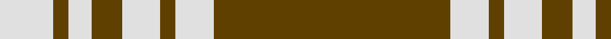

In pattern [GWGWGWGW](/patterns/gwgwgwgw/).

This was sourced from house-of-tartan.  It is a [8 stripes tartan](/stripes/stripes8/).

Original link http://www.house-of-tartan.scotland.net/house/TartanViewjs.asp?colr=Def&tnam=1752

## Thread count
LN/14 T4 LN6 T8 LN10 T4 LN10 T/62

## Palette
Each colour and its ΔE from the base-6 reference it is a variant of.

| Colour | Shade | Base | ΔE (OKLab) |
|---|---|---|---|
| LN | <code style="background-color:#E0E0E0;">#E0E0E0</code> `#E0E0E0` | W <code style="background-color:#F7F7F7;">#F7F7F7</code> | 0.07 |
| T | <code style="background-color:#604000;">#604000</code> `#604000` | G <code style="background-color:#006100;">#006100</code> | 0.14 |

# Sample pattern

## Nearest tartans

The nearest existing variants by ΔTartan distance.

1. [Menzies Brown & White](/setts/s8/g31w5g2w5g4w3g2w7~g503c14-we0e0e0~x2/) — ΔT 0.37
1. [Menzies, Brown & White](/setts/s8/r31w5r2w5r4w3r2w7~r806050-we0e0e0~x2/) — ΔT 1.30
1. [Yellow Pencil](/setts/s8/g48y9g6y9g12y4g2y16~g5b3a15-yf5b92f~x2/) — ΔT 1.32
1. [Monoch Airline](/setts/s6/y4k6y1k1y16k2~k101010-yd09800~x2/) — ΔT 1.33
1. [Schranz-Gritte](/setts/s10/y3k2y4k5y24k5y4k2y3k2~k101010-yd87c00~x2/) — ΔT 1.48
1. [Loughheed (Personal)](/setts/s8/b3y3b4b2y18b1y2b2~b4c0000-ydc943c~x4/) — ΔT 1.51
1. [Coca Cola (Corporate)](/setts/s5/w15g15w15g80r6~g604000-rc80000-wd4e8f4/) — ΔT 1.57
1. [Coca Cola](/setts/s5/w7g7w7g40r3~g604000-rc80000-wd4e8f4~x2/) — ΔT 1.61
1. [Prince of Wales (Fashion)](/setts/s10/g3r6g2r1g2r1g16w1g2w3~g00542c-rc80000-we0e0e0~x4/) — ΔT 1.64
1. [Loch Tummel](/setts/s5/r38w9r3b9w3~b401000-r906030-we0e0e0~x2/) — ΔT 1.73

## Neighbour map

Every grey dot is one of 15726 variants placed by the first two principal components of the ΔTartan feature space (44% of its variance). Red is this tartan; blue dots are its nearest — click one to open its page.

<svg viewBox="0 0 640 380" role="img" style="max-width:100%;height:auto;border:1px solid #e0e0e0;border-radius:4px;display:block" xmlns="http://www.w3.org/2000/svg"><image href="/nn/cloud.v1.png" width="640" height="380"/><a href="/setts/s8/g31w5g2w5g4w3g2w7~g503c14-we0e0e0~x2/"><circle cx="424.1" cy="178.8" r="4" fill="#3465a4"><title>Menzies Brown &amp; White</title></circle></a><a href="/setts/s8/r31w5r2w5r4w3r2w7~r806050-we0e0e0~x2/"><circle cx="452.0" cy="183.0" r="4" fill="#3465a4"><title>Menzies, Brown &amp; White</title></circle></a><a href="/setts/s8/g48y9g6y9g12y4g2y16~g5b3a15-yf5b92f~x2/"><circle cx="438.0" cy="177.4" r="4" fill="#3465a4"><title>Yellow Pencil</title></circle></a><a href="/setts/s6/y4k6y1k1y16k2~k101010-yd09800~x2/"><circle cx="446.3" cy="200.3" r="4" fill="#3465a4"><title>Monoch Airline</title></circle></a><a href="/setts/s10/y3k2y4k5y24k5y4k2y3k2~k101010-yd87c00~x2/"><circle cx="447.0" cy="180.9" r="4" fill="#3465a4"><title>Schranz-Gritte</title></circle></a><a href="/setts/s8/b3y3b4b2y18b1y2b2~b4c0000-ydc943c~x4/"><circle cx="447.2" cy="171.4" r="4" fill="#3465a4"><title>Loughheed (Personal)</title></circle></a><a href="/setts/s5/w15g15w15g80r6~g604000-rc80000-wd4e8f4/"><circle cx="444.7" cy="205.8" r="4" fill="#3465a4"><title>Coca Cola (Corporate)</title></circle></a><a href="/setts/s5/w7g7w7g40r3~g604000-rc80000-wd4e8f4~x2/"><circle cx="454.9" cy="204.6" r="4" fill="#3465a4"><title>Coca Cola</title></circle></a><a href="/setts/s10/g3r6g2r1g2r1g16w1g2w3~g00542c-rc80000-we0e0e0~x4/"><circle cx="415.7" cy="170.1" r="4" fill="#3465a4"><title>Prince of Wales (Fashion)</title></circle></a><a href="/setts/s5/r38w9r3b9w3~b401000-r906030-we0e0e0~x2/"><circle cx="407.7" cy="203.9" r="4" fill="#3465a4"><title>Loch Tummel</title></circle></a><circle cx="428.4" cy="177.9" r="5" fill="#c00000"/></svg>

ID: /setts/s8/g31w5g2w5g4w3g2w7~g604000-we0e0e0~x2/
