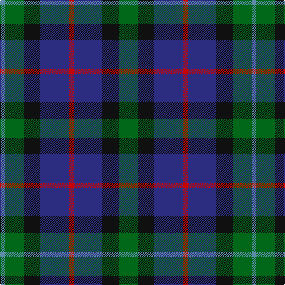

In pattern [BGKBRBKG](/patterns/bgkbrbkg/).

This was sourced from house-of-tartan.  It is a [8 stripes tartan](/stripes/stripes8/).

Original link http://www.house-of-tartan.scotland.net/house/TartanViewjs.asp?colr=Def&tnam=2298

## Thread count
B/8 G32 K28 DB48 R8 DB48 K28 G/32

## Palette
Each colour and its ΔE from the base-6 reference it is a variant of.

| Colour | Shade | Base | ΔE (OKLab) |
|---|---|---|---|
| B | <code style="background-color:#5C8CA8;">#5C8CA8</code> `#5C8CA8` | B <code style="background-color:#2C4084;">#2C4084</code> | 0.23 |
| DB | <code style="background-color:#2C2C80;">#2C2C80</code> `#2C2C80` | B <code style="background-color:#2C4084;">#2C4084</code> | 0.05 |
| DBa | <code style="background-color:#202060;">#202060</code> `#202060` | B <code style="background-color:#2C4084;">#2C4084</code> | 0.11 |
| DR | <code style="background-color:#880000;">#880000</code> `#880000` | R <code style="background-color:#C80000;">#C80000</code> | 0.14 |
| G | <code style="background-color:#006818;">#006818</code> `#006818` | G <code style="background-color:#006400;">#006400</code> | 0.02 |
| K | <code style="background-color:#101010;">#101010</code> `#101010` | K <code style="background-color:#000000;">#000000</code> | 0.17 |
| R | <code style="background-color:#C80000;">#C80000</code> `#C80000` | R <code style="background-color:#C80000;">#C80000</code> | 0.00 |

# Sample pattern

## Nearest tartans

The nearest existing variants by ΔTartan distance.

1. [Scottish Airports Corporate Tartan Tartan Number: 2510. Earliest known date: November 1988 An archetypal Kinloch Anderson blue design. Scottish Tartan Society notes say that Percy Pilcher (an early aviation pioneer 1866 -1899) had connections to the Gunn tartan (his mother was a Robinson). The design is based on that sett using the colours of the British Airports Authority with the purple line added to represent the Scottish thistle. See products available Copyright © Blair Urquhart, Comrie, 2015](/setts/s10/b36k34b6g36b8g36b6k34b36ba8-b2c2c80-ba9058d8-g006818-k101010/) — ΔT 1.09
1. [MacCallum of Berwick](/setts/s9/b20r14b62k50g46k16b14k16y10-b2c2c80-g285800-k101010-rc80000-ye8c000/) — ΔT 1.10
1. [Scotsman](/setts/s7/g42k28g18b42k6b24ba6-b2c2c80-ba780078-g006818-k101010/) — ΔT 1.11
1. [Williamson/Smart (Personal)](/setts/s8/b20r6b20ra6k42g40k30ra6-b38409c-g006818-k101010-r888888-rac8002c/) — ΔT 1.11
1. [MacNeil of Colonsay](/setts/s7/b8g12w2g12k12b12k4-b2c2c80-g285800-k101010-wffffff/) — ΔT 1.14
1. [Casely Family Tartan Tartan Number: 2146. Earliest known date: 1992 The chiefly sett of a family tartan designed by Harry Lindley for the Scottish Tartans Society, to whom Mr Gordon Casely petitioned for the design in 1990. Formal accreditation was granted in 1993. See products available Copyright © Blair Urquhart, Comrie, 2015](/setts/s10/g38r14g38k38g6b38y10b38g6k38-b2c2c80-g006818-k101010-rd05054-ydc943c/) — ΔT 1.16
1. [MacKay](/setts/s7/b16g16b2g16k16b16y4-b2c4084-g005020-k101010-ye8c000/) — ΔT 1.17
1. [Wilson's No.176](/setts/s8/k16b6g26ba24y4ba24g26b6-b5c8ca8-ba440044-g006818-k101010-ye8c000/) — ΔT 1.19
1. [Abercrombie (Wilsons No 2/64)](/setts/s7/k24g24y4g24k24b24k4-b5a008c-g005020-k101010-ye8c000/) — ΔT 1.19
1. [Wellington (Wilson)](/setts/s10/g16k18b14r4b4r4b14k18g16ba6-b2c2c80-ba5c8ca8-g285800-k101010-rc80000/) — ΔT 1.20

## Neighbour map

Every grey dot is one of 15726 variants placed by the first two principal components of the ΔTartan feature space (44% of its variance). Red is this tartan; blue dots are its nearest — click one to open its page.

<svg viewBox="0 0 640 380" role="img" style="max-width:100%;height:auto;border:1px solid #e0e0e0;border-radius:4px;display:block" xmlns="http://www.w3.org/2000/svg"><image href="/nn/cloud.v1.png" width="640" height="380"/><a href="/setts/s10/b36k34b6g36b8g36b6k34b36ba8-b2c2c80-ba9058d8-g006818-k101010/"><circle cx="179.9" cy="252.1" r="4" fill="#3465a4"><title>Scottish Airports Corporate Tartan Tartan Number: 2510. Earliest known date: November 1988 An archetypal Kinloch Anderson blue design. Scottish Tartan Society notes say that Percy Pilcher (an early aviation pioneer 1866 -1899) had connections to the Gunn tartan (his mother was a Robinson). The design is based on that sett using the colours of the British Airports Authority with the purple line added to represent the Scottish thistle. See products available Copyright © Blair Urquhart, Comrie, 2015</title></circle></a><a href="/setts/s9/b20r14b62k50g46k16b14k16y10-b2c2c80-g285800-k101010-rc80000-ye8c000/"><circle cx="155.8" cy="220.2" r="4" fill="#3465a4"><title>MacCallum of Berwick</title></circle></a><a href="/setts/s7/g42k28g18b42k6b24ba6-b2c2c80-ba780078-g006818-k101010/"><circle cx="207.4" cy="263.3" r="4" fill="#3465a4"><title>Scotsman</title></circle></a><a href="/setts/s8/b20r6b20ra6k42g40k30ra6-b38409c-g006818-k101010-r888888-rac8002c/"><circle cx="169.5" cy="220.8" r="4" fill="#3465a4"><title>Williamson/Smart (Personal)</title></circle></a><a href="/setts/s7/b8g12w2g12k12b12k4-b2c2c80-g285800-k101010-wffffff/"><circle cx="159.2" cy="276.1" r="4" fill="#3465a4"><title>MacNeil of Colonsay</title></circle></a><a href="/setts/s10/g38r14g38k38g6b38y10b38g6k38-b2c2c80-g006818-k101010-rd05054-ydc943c/"><circle cx="112.6" cy="227.4" r="4" fill="#3465a4"><title>Casely Family Tartan Tartan Number: 2146. Earliest known date: 1992 The chiefly sett of a family tartan designed by Harry Lindley for the Scottish Tartans Society, to whom Mr Gordon Casely petitioned for the design in 1990. Formal accreditation was granted in 1993. See products available Copyright © Blair Urquhart, Comrie, 2015</title></circle></a><a href="/setts/s7/b16g16b2g16k16b16y4-b2c4084-g005020-k101010-ye8c000/"><circle cx="197.6" cy="271.2" r="4" fill="#3465a4"><title>MacKay</title></circle></a><a href="/setts/s8/k16b6g26ba24y4ba24g26b6-b5c8ca8-ba440044-g006818-k101010-ye8c000/"><circle cx="147.6" cy="230.9" r="4" fill="#3465a4"><title>Wilson's No.176</title></circle></a><a href="/setts/s7/k24g24y4g24k24b24k4-b5a008c-g005020-k101010-ye8c000/"><circle cx="190.5" cy="274.7" r="4" fill="#3465a4"><title>Abercrombie (Wilsons No 2/64)</title></circle></a><a href="/setts/s10/g16k18b14r4b4r4b14k18g16ba6-b2c2c80-ba5c8ca8-g285800-k101010-rc80000/"><circle cx="99.0" cy="248.3" r="4" fill="#3465a4"><title>Wellington (Wilson)</title></circle></a><circle cx="160.3" cy="253.8" r="5" fill="#c00000"/></svg>

ID: /setts/s8/g32k28b48r8b48k28g32ba8-b2c2c80-ba5c8ca8-g006818-k101010-rc80000/
