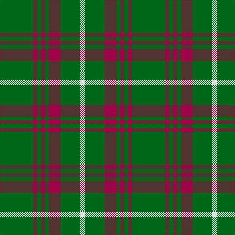

In pattern [GRGRGRGW](/stripes/grgrgrgw/).

This was sourced from tartans-authority.  It is a [8 stripe tartan](/stripes/stripes8/).

Original link http://www.tartansauthority.com/tartan-ferret/display/980/

## Also known as

This cloth is also recorded under:

- Leeds, University of #1

## Thread count
G/68 R8 G8 R8 G8 R24 G40 LN/10

## Palette
Each colour and the base-6 reference it is a variant of.

| Colour | Shade | Base |
|---|---|---|
| G | <code style="background-color:#006818;">#006818</code> `oklch(45.0% 0.142 145.0)` <small>#006818</small> | G <code style="background-color:#006100;">#006100</code> |
| LN | <code style="background-color:#E0E0E0;">#E0E0E0</code> `oklch(90.7% 0.000 89.9)` <small>#E0E0E0</small> | W <code style="background-color:#F7F7F7;">#F7F7F7</code> |
| R | <code style="background-color:#A00048;">#A00048</code> `oklch(45.4% 0.182 5.3)` <small>#A00048</small> | R <code style="background-color:#CC0000;">#CC0000</code> |

# Sample pattern

## Nearest tartans

The nearest existing variants by ΔTartan distance.

1. [Connell (Dalgliesh) (Personal)](/setts/s10/r3g12r1g2r2g2r1g12r3k1~x4/) — ΔT 1.12
1. [Crow (Name)](/setts/s8/g2db2g6db4g3db4g18ly2~x4/) — ΔT 1.13
1. [Logan #4](/setts/s7/g9r4g1r4g15r4g1~x4/) — ΔT 1.16
1. [Green Watch](/setts/s7/dg10o1dg1o1lr2dg1o1~x4/) — ΔT 1.20
1. [Northcroft (Personal)](/setts/s7/g24r4g3k14g5r2g10~x2/) — ΔT 1.22
1. [Connell (Personal?)](/setts/s6/r2g2r1g12r3k1~x4/) — ΔT 1.25
1. [Leeds, University of (Dance) #1](/setts/s14/g34m4g4m4g4m12g20w5~x2/) — ΔT 1.29
1. [Welsh National District Tartan Tartan Number: 1523. Earliest known date: 1968 The Welsh Tartan owes its origin to a Society formed in Cardiff in 1967. Its aims were cultural and political - to strengthen Celtic ties and give visible signs of being an individual nation in culture, language and dress. The colours are those of the Welsh flag. It is said that the design was based on the Lord of the Isles tartan because the present Lord is also Prince of Wales. However comparison reveals similarity only to MacDonald, MacDonald of the Isles, or perhaps Applecross district. See products available Copyright © Blair Urquhart, Comrie, 2015](/setts/s5/m2g1m1g10w1~x4/) — ΔT 1.35
1. [Leeds University Corporate Tartan Tartan Number: 980. Earliest known date: pre 2003 Leeds University Scottish Country Dance Club. See products available Copyright © Blair Urquhart, Comrie, 2015](/setts/s8/g9m2g2m2g2m8g11w2~x4/) — ΔT 1.36
1. [Arkansas](/setts/s7/g3w1g12r6g3k3g2~x4/) — ΔT 1.43

## Neighbour map

Every grey dot is one of 14299 variants placed by the first two principal components of the ΔTartan feature space (44% of its variance). Red is this tartan; blue dots are its nearest — click one to open its page.

<svg viewBox="0 0 640 380" role="img" style="max-width:100%;height:auto;border:1px solid #e0e0e0;border-radius:4px;display:block" xmlns="http://www.w3.org/2000/svg"><image href="/nn/cloud.v1.png" width="640" height="380"/><a href="/setts/s10/r3g12r1g2r2g2r1g12r3k1~x4/"><circle cx="475.1" cy="206.4" r="4" fill="#3465a4"><title>Connell (Dalgliesh) (Personal)</title></circle></a><a href="/setts/s8/g2db2g6db4g3db4g18ly2~x4/"><circle cx="439.5" cy="235.0" r="4" fill="#3465a4"><title>Crow (Name)</title></circle></a><a href="/setts/s7/g9r4g1r4g15r4g1~x4/"><circle cx="428.6" cy="217.3" r="4" fill="#3465a4"><title>Logan #4</title></circle></a><a href="/setts/s7/dg10o1dg1o1lr2dg1o1~x4/"><circle cx="459.3" cy="214.5" r="4" fill="#3465a4"><title>Green Watch</title></circle></a><a href="/setts/s7/g24r4g3k14g5r2g10~x2/"><circle cx="418.0" cy="239.4" r="4" fill="#3465a4"><title>Northcroft (Personal)</title></circle></a><a href="/setts/s6/r2g2r1g12r3k1~x4/"><circle cx="445.8" cy="217.8" r="4" fill="#3465a4"><title>Connell (Personal?)</title></circle></a><a href="/setts/s14/g34m4g4m4g4m12g20w5~x2/"><circle cx="397.3" cy="204.6" r="4" fill="#3465a4"><title>Leeds, University of (Dance) #1</title></circle></a><a href="/setts/s5/m2g1m1g10w1~x4/"><circle cx="479.5" cy="228.3" r="4" fill="#3465a4"><title>Welsh National District Tartan Tartan Number: 1523. Earliest known date: 1968 The Welsh Tartan owes its origin to a Society formed in Cardiff in 1967. Its aims were cultural and political - to strengthen Celtic ties and give visible signs of being an individual nation in culture, language and dress. The colours are those of the Welsh flag. It is said that the design was based on the Lord of the Isles tartan because the present Lord is also Prince of Wales. However comparison reveals similarity only to MacDonald, MacDonald of the Isles, or perhaps Applecross district. See products available Copyright © Blair Urquhart, Comrie, 2015</title></circle></a><a href="/setts/s8/g9m2g2m2g2m8g11w2~x4/"><circle cx="350.3" cy="249.9" r="4" fill="#3465a4"><title>Leeds University Corporate Tartan Tartan Number: 980. Earliest known date: pre 2003 Leeds University Scottish Country Dance Club. See products available Copyright © Blair Urquhart, Comrie, 2015</title></circle></a><a href="/setts/s7/g3w1g12r6g3k3g2~x4/"><circle cx="367.1" cy="208.6" r="4" fill="#3465a4"><title>Arkansas</title></circle></a><circle cx="430.4" cy="226.3" r="5" fill="#c00000"/></svg>

ID: /setts/s8/g34m4g4m4g4m12g20w5~x2/
