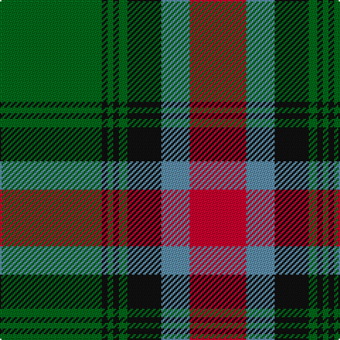

In pattern [GKGKGKBR](/patterns/gkgkgkbr/).

This was sourced from register-of-tartans.  It is a [8 stripes tartan](/stripes/stripes8/).

Original link https://www.tartanregister.gov.uk/tartanDetails.aspx?ref=1333

## Thread count
G/72 K4 G4 K4 G6 K24 B20 R/40

## Palette
Each colour and its ΔE from the base-6 reference it is a variant of.

| Colour | Shade | Base | ΔE (OKLab) |
|---|---|---|---|
| B | <code style="background-color:#5C8CA8;">#5C8CA8</code> `#5C8CA8` | B <code style="background-color:#2A418A;">#2A418A</code> | 0.23 |
| G | <code style="background-color:#006818;">#006818</code> `#006818` | G <code style="background-color:#006100;">#006100</code> | 0.02 |
| K | <code style="background-color:#101010;">#101010</code> `#101010` | K <code style="background-color:#000000;">#000000</code> | 0.17 |
| R | <code style="background-color:#C8002C;">#C8002C</code> `#C8002C` | R <code style="background-color:#CC0000;">#CC0000</code> | 0.03 |

# Sample pattern

## Nearest tartans

The nearest existing variants by ΔTartan distance.

1. [Georgia District Tartan Tartan Number: 794. Earliest known date: 1982 The tartan commemorates the founding of the State of Georgia and combines elements in the design associated with its historic past. General Oglethorpe commanded the Highland Independant Company of Foot which, in 1746, wore the Black Watch tartan. Captain John 'Mohr' MacIntosh is remembered in the MacIntosh red. Georgia tartan is much in evidence at the annual Stone Mountain Highland Games held in Atlanta, Georgias capital. See products available Copyright © Blair Urquhart, Comrie, 2015](/setts/s8/g36k2g2k2g3k12b10r20x2~b5c8ca8-g006818-k101010-rc80000/) — ΔT 0.13
1. [MacNett](/setts/s9/k1b1g16r16k12b8g16b1k1x2~b2c2c80-g347400-k101010-rc80000/) — ΔT 0.77
1. [Buccleuch Weavers Tartan Tartan Number: 6009. Earliest known date: pre 2003 A Fashion tartan from Marton Mills See products available Copyright © Blair Urquhart, Comrie, 2015](/setts/s8/y15k1y2k1y2k10g14w2x2~g4c5428-k101010-we0e0e0-ya08858/) — ΔT 0.78
1. [Buccleuch (Fashion)](/setts/s8/y15k1y2k1y2k10g14w2x2~g5c6428-k101010-we0e0e0-ya08858/) — ΔT 0.82
1. [Cape Breton University](/setts/s10/b4r17b4g4b2g4b4g27b4y4x2~b202060-g006818-re86000-yfccc00/) — ΔT 0.86
1. [Midpac Tissue (non woven)](/setts/s8/r5k2g1k2r5k2g18y3x2~g285800-k101010-rc80000-ybc8c00/) — ΔT 0.91
1. [Georgia, State of (District)](/setts/s8/g36k2g2k2g3k12b10r20x2~b5c8ca8-g5c6428-k101010-rc8002c/) — ΔT 0.93
1. [Glen Tilt #2](/setts/s10/w1g1r1g14r1b6r11g1r1w1x4~b2888c4-g006818-r880000-we0e0e0/) — ΔT 0.97
1. [Cork](/setts/s9/g28r12g4b20y2b3y2b3g7x2~b304080-g008000-rc00000-yf0c000/) — ΔT 1.00
1. [MacHardy (Clans Originaux)](/setts/s8/g4r4k12w2k12g32r4k3x2~g006818-k101010-rc80000-we0e0e0/) — ΔT 1.06

## Neighbour map

Every grey dot is one of 15726 variants placed by the first two principal components of the ΔTartan feature space (44% of its variance). Red is this tartan; blue dots are its nearest — click one to open its page.

<svg viewBox="0 0 640 380" role="img" style="max-width:100%;height:auto;border:1px solid #e0e0e0;border-radius:4px;display:block" xmlns="http://www.w3.org/2000/svg"><image href="/nn/cloud.v1.png" width="640" height="380"/><a href="/setts/s8/g36k2g2k2g3k12b10r20x2~b5c8ca8-g006818-k101010-rc80000/"><circle cx="272.5" cy="164.8" r="4" fill="#3465a4"><title>Georgia District Tartan Tartan Number: 794. Earliest known date: 1982 The tartan commemorates the founding of the State of Georgia and combines elements in the design associated with its historic past. General Oglethorpe commanded the Highland Independant Company of Foot which, in 1746, wore the Black Watch tartan. Captain John 'Mohr' MacIntosh is remembered in the MacIntosh red. Georgia tartan is much in evidence at the annual Stone Mountain Highland Games held in Atlanta, Georgias capital. See products available Copyright © Blair Urquhart, Comrie, 2015</title></circle></a><a href="/setts/s9/k1b1g16r16k12b8g16b1k1x2~b2c2c80-g347400-k101010-rc80000/"><circle cx="234.0" cy="176.1" r="4" fill="#3465a4"><title>MacNett</title></circle></a><a href="/setts/s8/y15k1y2k1y2k10g14w2x2~g4c5428-k101010-we0e0e0-ya08858/"><circle cx="227.6" cy="168.7" r="4" fill="#3465a4"><title>Buccleuch Weavers Tartan Tartan Number: 6009. Earliest known date: pre 2003 A Fashion tartan from Marton Mills See products available Copyright © Blair Urquhart, Comrie, 2015</title></circle></a><a href="/setts/s8/y15k1y2k1y2k10g14w2x2~g5c6428-k101010-we0e0e0-ya08858/"><circle cx="228.1" cy="168.4" r="4" fill="#3465a4"><title>Buccleuch (Fashion)</title></circle></a><a href="/setts/s10/b4r17b4g4b2g4b4g27b4y4x2~b202060-g006818-re86000-yfccc00/"><circle cx="249.2" cy="159.2" r="4" fill="#3465a4"><title>Cape Breton University</title></circle></a><a href="/setts/s8/r5k2g1k2r5k2g18y3x2~g285800-k101010-rc80000-ybc8c00/"><circle cx="307.8" cy="162.9" r="4" fill="#3465a4"><title>Midpac Tissue (non woven)</title></circle></a><a href="/setts/s8/g36k2g2k2g3k12b10r20x2~b5c8ca8-g5c6428-k101010-rc8002c/"><circle cx="288.9" cy="164.9" r="4" fill="#3465a4"><title>Georgia, State of (District)</title></circle></a><a href="/setts/s10/w1g1r1g14r1b6r11g1r1w1x4~b2888c4-g006818-r880000-we0e0e0/"><circle cx="264.8" cy="151.6" r="4" fill="#3465a4"><title>Glen Tilt #2</title></circle></a><a href="/setts/s9/g28r12g4b20y2b3y2b3g7x2~b304080-g008000-rc00000-yf0c000/"><circle cx="272.0" cy="175.9" r="4" fill="#3465a4"><title>Cork</title></circle></a><a href="/setts/s8/g4r4k12w2k12g32r4k3x2~g006818-k101010-rc80000-we0e0e0/"><circle cx="294.1" cy="175.9" r="4" fill="#3465a4"><title>MacHardy (Clans Originaux)</title></circle></a><circle cx="271.5" cy="164.3" r="5" fill="#c00000"/></svg>

ID: /setts/s8/g36k2g2k2g3k12b10r20x2~b5c8ca8-g006818-k101010-rc8002c/
