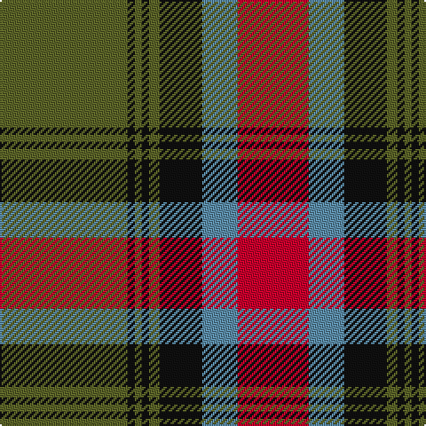

In pattern [GKGKGKBR](/patterns/gkgkgkbr/).

This was sourced from tartans-authority.  It is a [8 stripes tartan](/stripes/stripes8/).

Original link http://www.tartansauthority.com/tartan-ferret/display/794/

## Thread count
G/72 K4 G4 K4 G6 K24 B20 R/40

## Palette
Each colour and its ΔE from the base-6 reference it is a variant of.

| Colour | Shade | Base | ΔE (OKLab) |
|---|---|---|---|
| B | <code style="background-color:#5C8CA8;">#5C8CA8</code> `#5C8CA8` | B <code style="background-color:#2A418A;">#2A418A</code> | 0.23 |
| G | <code style="background-color:#5C6428;">#5C6428</code> `#5C6428` | G <code style="background-color:#006100;">#006100</code> | 0.10 |
| K | <code style="background-color:#101010;">#101010</code> `#101010` | K <code style="background-color:#000000;">#000000</code> | 0.17 |
| R | <code style="background-color:#C8002C;">#C8002C</code> `#C8002C` | R <code style="background-color:#CC0000;">#CC0000</code> | 0.03 |

# Sample pattern

## Nearest tartans

The nearest existing variants by ΔTartan distance.

1. [Midpac Tissue (non woven)](/setts/s8/r5k2g1k2r5k2g18y3~g285800-k101010-rc80000-ybc8c00~x2/) — ΔT 0.92
1. [Logan with Yellow](/setts/s7/b8r3y1r3g14r3y1~b780078-g006818-rc80000-ye8c000~x4/) — ΔT 0.93
1. [MacKillop (Clan)](/setts/s10/g3r2b2r14ba1b4r2g12r2b2~b2c2c80-ba2474e8-g006818-rc80000~x8/) — ΔT 0.93
1. [Georgia, State of](/setts/s8/g36k2g2k2g3k12b10r20~b5c8ca8-g006818-k101010-rc8002c~x2/) — ΔT 0.93
1. [Logan - 1819 (with yellow)](/setts/s7/b8r3y1r3g14r3y1~b440044-g285800-rc80000-ye8c000~x4/) — ΔT 0.95
1. [Cranston, dress](/setts/s8/r30b3r2b3r6b14g26ga6~b304080-g30a010-ga008000-rc00000/) — ΔT 0.96
1. [Georgia District Tartan Tartan Number: 794. Earliest known date: 1982 The tartan commemorates the founding of the State of Georgia and combines elements in the design associated with its historic past. General Oglethorpe commanded the Highland Independant Company of Foot which, in 1746, wore the Black Watch tartan. Captain John 'Mohr' MacIntosh is remembered in the MacIntosh red. Georgia tartan is much in evidence at the annual Stone Mountain Highland Games held in Atlanta, Georgias capital. See products available Copyright © Blair Urquhart, Comrie, 2015](/setts/s8/g36k2g2k2g3k12b10r20~b5c8ca8-g006818-k101010-rc80000~x2/) — ΔT 0.97
1. [Plummer Family Personal Tartan Tartan Number: 2778. Earliest known date: 2001 From a D C Dalgliesh swatch in 2001 via Phil Smith June 2004. See products available Copyright © Blair Urquhart, Comrie, 2015](/setts/s6/r30k8g30b4r3b2~b1860a8-g005028-k101010-rc80000~x2/) — ΔT 0.98
1. [Cook (Name)](/setts/s7/g12ga6g6r15k1r1k2~g003820-ga048888-k101010-rc80000~x2/) — ΔT 1.00
1. [McCook/Cook (Name)](/setts/s7/g12b6g6r15k1r1k2~b2888c4-g006818-k101010-rc80000~x4/) — ΔT 1.01

## Neighbour map

Every grey dot is one of 15726 variants placed by the first two principal components of the ΔTartan feature space (44% of its variance). Red is this tartan; blue dots are its nearest — click one to open its page.

<svg viewBox="0 0 640 380" role="img" style="max-width:100%;height:auto;border:1px solid #e0e0e0;border-radius:4px;display:block" xmlns="http://www.w3.org/2000/svg"><image href="/nn/cloud.v1.png" width="640" height="380"/><a href="/setts/s8/r5k2g1k2r5k2g18y3~g285800-k101010-rc80000-ybc8c00~x2/"><circle cx="307.8" cy="162.9" r="4" fill="#3465a4"><title>Midpac Tissue (non woven)</title></circle></a><a href="/setts/s7/b8r3y1r3g14r3y1~b780078-g006818-rc80000-ye8c000~x4/"><circle cx="246.1" cy="178.0" r="4" fill="#3465a4"><title>Logan with Yellow</title></circle></a><a href="/setts/s10/g3r2b2r14ba1b4r2g12r2b2~b2c2c80-ba2474e8-g006818-rc80000~x8/"><circle cx="277.4" cy="162.2" r="4" fill="#3465a4"><title>MacKillop (Clan)</title></circle></a><a href="/setts/s8/g36k2g2k2g3k12b10r20~b5c8ca8-g006818-k101010-rc8002c~x2/"><circle cx="271.5" cy="164.3" r="4" fill="#3465a4"><title>Georgia, State of</title></circle></a><a href="/setts/s7/b8r3y1r3g14r3y1~b440044-g285800-rc80000-ye8c000~x4/"><circle cx="247.2" cy="180.3" r="4" fill="#3465a4"><title>Logan - 1819 (with yellow)</title></circle></a><a href="/setts/s8/r30b3r2b3r6b14g26ga6~b304080-g30a010-ga008000-rc00000/"><circle cx="241.4" cy="169.8" r="4" fill="#3465a4"><title>Cranston, dress</title></circle></a><a href="/setts/s8/g36k2g2k2g3k12b10r20~b5c8ca8-g006818-k101010-rc80000~x2/"><circle cx="272.5" cy="164.8" r="4" fill="#3465a4"><title>Georgia District Tartan Tartan Number: 794. Earliest known date: 1982 The tartan commemorates the founding of the State of Georgia and combines elements in the design associated with its historic past. General Oglethorpe commanded the Highland Independant Company of Foot which, in 1746, wore the Black Watch tartan. Captain John 'Mohr' MacIntosh is remembered in the MacIntosh red. Georgia tartan is much in evidence at the annual Stone Mountain Highland Games held in Atlanta, Georgias capital. See products available Copyright © Blair Urquhart, Comrie, 2015</title></circle></a><a href="/setts/s6/r30k8g30b4r3b2~b1860a8-g005028-k101010-rc80000~x2/"><circle cx="279.4" cy="187.3" r="4" fill="#3465a4"><title>Plummer Family Personal Tartan Tartan Number: 2778. Earliest known date: 2001 From a D C Dalgliesh swatch in 2001 via Phil Smith June 2004. See products available Copyright © Blair Urquhart, Comrie, 2015</title></circle></a><a href="/setts/s7/g12ga6g6r15k1r1k2~g003820-ga048888-k101010-rc80000~x2/"><circle cx="251.6" cy="190.4" r="4" fill="#3465a4"><title>Cook (Name)</title></circle></a><a href="/setts/s7/g12b6g6r15k1r1k2~b2888c4-g006818-k101010-rc80000~x4/"><circle cx="247.8" cy="188.1" r="4" fill="#3465a4"><title>McCook/Cook (Name)</title></circle></a><circle cx="288.9" cy="164.9" r="5" fill="#c00000"/></svg>

ID: /setts/s8/g36k2g2k2g3k12b10r20~b5c8ca8-g5c6428-k101010-rc8002c~x2/
