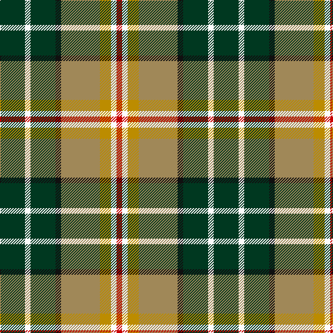

In pattern [GWGKYYWR](/patterns/gwgkyywr/).

This was sourced from tartans-authority.  It is a [8 stripes tartan](/stripes/stripes8/).

Original link http://www.tartansauthority.com/tartan-ferret/display/3571/

## Attestations

This cloth appears in 2 source records; the oldest owns this page.

- pre 2002 — MacShane (Clan) (tartans-authority, [record](http://www.tartansauthority.com/tartan-ferret/display/3571/))
- undated — MacShane (register-of-tartans, [record](https://www.tartanregister.gov.uk/tartanDetails.aspx?ref=5123))

## Thread count
DG/36 W8 DG36 K8 LT56 DY16 W8 R/8

## Palette
Each colour and its ΔE from the base-6 reference it is a variant of.

| Colour | Shade | Base | ΔE (OKLab) |
|---|---|---|---|
| DG | <code style="background-color:#003820;">#003820</code> `#003820` | G <code style="background-color:#006400;">#006400</code> | 0.16 |
| DY | <code style="background-color:#BC8C00;">#BC8C00</code> `#BC8C00` | Y <code style="background-color:#E8C000;">#E8C000</code> | 0.16 |
| K | <code style="background-color:#101010;">#101010</code> `#101010` | K <code style="background-color:#000000;">#000000</code> | 0.17 |
| LT | <code style="background-color:#A08858;">#A08858</code> `#A08858` | Y <code style="background-color:#E8C000;">#E8C000</code> | 0.21 |
| R | <code style="background-color:#C80000;">#C80000</code> `#C80000` | R <code style="background-color:#C80000;">#C80000</code> | 0.00 |
| W | <code style="background-color:#FCFCFC;">#FCFCFC</code> `#FCFCFC` | W <code style="background-color:#F4F4F0;">#F4F4F0</code> | 0.03 |

# Sample pattern

## Nearest tartans

The nearest existing variants by ΔTartan distance.

1. [Wilson's, No 109](/setts/s8/g16r22k6y4b16g30r10w4-b800080-g008000-k000000-rc00000-we0e0e0-yf0c000/) — ΔT 0.98
1. [Bannockbane, Green](/setts/s7/g8ga6g48w31r42gb6r8-g003000-ga30a010-gb008000-r906030-we0e0e0/) — ΔT 1.00
1. [Sawyer](/setts/s8/g8w4g40b4k16r32ba4r8-b304080-ba5480b0-g008000-k000000-rc00000-we0e0e0/) — ΔT 1.06
1. [Bisset Clan Tartan Tartan Number: 1478. Earliest known date: 1976 One of the first tartans designed by the Scottish Tartans Society for a Mrs E. Bisset, who gave the following details for the colours of the sett: The blue and white of the Bisset shield, yellow and black representing the motto, red for the 'eternal flame' and the local tartan; all on a green background. The motto of the Bissets is 'Abscissa virescit' meaning 'Cut me down and I shall grow again'. The yellow represents the wood chips from the axe and the green for the fresh new growth. Bissets are represented in the histories of prominent Scottish families through the female line. Both Chisholms and Frasers married heiress's of the Bisset family. The result being that the Bisset surname has greatly reduced in number. There is no chief of the family at present (1993) but the senior branch are the Bissets of Lessendrum in Aberdeenshire. See products available Copyright © Blair Urquhart, Comrie, 2015](/setts/s9/r12g24k8g8k4y4g8b12w4-b2c2c80-g006818-k101010-rc80000-we0e0e0-ye8c000/) — ΔT 1.07
1. [Ontario Northern Canadian District Tartan Tartan Number: 956. Earliest known date: 1967 The six colours represent the nickel bearing rocks (grey), the snow (white), the sky and the lakes (blue), gold, the forests and fields (green), and the Indian Nation (red brown). See products available Copyright © Blair Urquhart, Comrie, 2015](/setts/s7/g34r10b4w24b4y8ga14-b2c2c80-g604000-ga006818-r888888-we0e0e0-ye8c000/) — ΔT 1.11
1. [Bannockbane Dark Green](/setts/s7/g8ga6g48w30y42gb6y8-g003820-ga289c18-gb006818-we0e0e0-ya08858/) — ΔT 1.12
1. [Hackett William (Coatbridge) Hunting (Personal)](/setts/s8/k40y8r8y40g40w10g4ya4-g346428-k101010-rff0000-wffffff-ycfb47f-ya86ac5f/) — ΔT 1.12
1. [South Africa 1994 (Fashion)](/setts/s7/k40y8b26w8g60w8r26-b2c2c80-g006818-k101010-rc80000-we0e0e0-ye8c000/) — ΔT 1.15
1. [Bisset](/setts/s9/r12g24k8g8k4y4g8b12w4-b304080-g008000-k000000-rc00000-we0e0e0-yf0c000/) — ΔT 1.15
1. [George Watson's College](/setts/s7/b6r48y6g24w6g24ra6-b2888c4-g006818-r880000-rac80000-wfcfcfc-ye8c000/) — ΔT 1.15

## Neighbour map

Every grey dot is one of 15726 variants placed by the first two principal components of the ΔTartan feature space (44% of its variance). Red is this tartan; blue dots are its nearest — click one to open its page.

<svg viewBox="0 0 640 380" role="img" style="max-width:100%;height:auto;border:1px solid #e0e0e0;border-radius:4px;display:block" xmlns="http://www.w3.org/2000/svg"><image href="/nn/cloud.v1.png" width="640" height="380"/><a href="/setts/s8/g16r22k6y4b16g30r10w4-b800080-g008000-k000000-rc00000-we0e0e0-yf0c000/"><circle cx="131.0" cy="179.1" r="4" fill="#3465a4"><title>Wilson's, No 109</title></circle></a><a href="/setts/s7/g8ga6g48w31r42gb6r8-g003000-ga30a010-gb008000-r906030-we0e0e0/"><circle cx="140.3" cy="184.4" r="4" fill="#3465a4"><title>Bannockbane, Green</title></circle></a><a href="/setts/s8/g8w4g40b4k16r32ba4r8-b304080-ba5480b0-g008000-k000000-rc00000-we0e0e0/"><circle cx="157.8" cy="146.8" r="4" fill="#3465a4"><title>Sawyer</title></circle></a><a href="/setts/s9/r12g24k8g8k4y4g8b12w4-b2c2c80-g006818-k101010-rc80000-we0e0e0-ye8c000/"><circle cx="134.6" cy="193.6" r="4" fill="#3465a4"><title>Bisset Clan Tartan Tartan Number: 1478. Earliest known date: 1976 One of the first tartans designed by the Scottish Tartans Society for a Mrs E. Bisset, who gave the following details for the colours of the sett: The blue and white of the Bisset shield, yellow and black representing the motto, red for the 'eternal flame' and the local tartan; all on a green background. The motto of the Bissets is 'Abscissa virescit' meaning 'Cut me down and I shall grow again'. The yellow represents the wood chips from the axe and the green for the fresh new growth. Bissets are represented in the histories of prominent Scottish families through the female line. Both Chisholms and Frasers married heiress's of the Bisset family. The result being that the Bisset surname has greatly reduced in number. There is no chief of the family at present (1993) but the senior branch are the Bissets of Lessendrum in Aberdeenshire. See products available Copyright © Blair Urquhart, Comrie, 2015</title></circle></a><a href="/setts/s7/g34r10b4w24b4y8ga14-b2c2c80-g604000-ga006818-r888888-we0e0e0-ye8c000/"><circle cx="84.5" cy="166.5" r="4" fill="#3465a4"><title>Ontario Northern Canadian District Tartan Tartan Number: 956. Earliest known date: 1967 The six colours represent the nickel bearing rocks (grey), the snow (white), the sky and the lakes (blue), gold, the forests and fields (green), and the Indian Nation (red brown). See products available Copyright © Blair Urquhart, Comrie, 2015</title></circle></a><a href="/setts/s7/g8ga6g48w30y42gb6y8-g003820-ga289c18-gb006818-we0e0e0-ya08858/"><circle cx="141.9" cy="184.6" r="4" fill="#3465a4"><title>Bannockbane Dark Green</title></circle></a><a href="/setts/s8/k40y8r8y40g40w10g4ya4-g346428-k101010-rff0000-wffffff-ycfb47f-ya86ac5f/"><circle cx="84.7" cy="144.2" r="4" fill="#3465a4"><title>Hackett William (Coatbridge) Hunting (Personal)</title></circle></a><a href="/setts/s7/k40y8b26w8g60w8r26-b2c2c80-g006818-k101010-rc80000-we0e0e0-ye8c000/"><circle cx="76.0" cy="178.8" r="4" fill="#3465a4"><title>South Africa 1994 (Fashion)</title></circle></a><a href="/setts/s9/r12g24k8g8k4y4g8b12w4-b304080-g008000-k000000-rc00000-we0e0e0-yf0c000/"><circle cx="115.5" cy="186.5" r="4" fill="#3465a4"><title>Bisset</title></circle></a><a href="/setts/s7/b6r48y6g24w6g24ra6-b2888c4-g006818-r880000-rac80000-wfcfcfc-ye8c000/"><circle cx="175.5" cy="171.2" r="4" fill="#3465a4"><title>George Watson's College</title></circle></a><circle cx="125.0" cy="170.8" r="5" fill="#c00000"/></svg>

ID: /setts/s8/g36w8g36k8y56ya16w8r8-g003820-k101010-rc80000-wfcfcfc-ya08858-yabc8c00/
