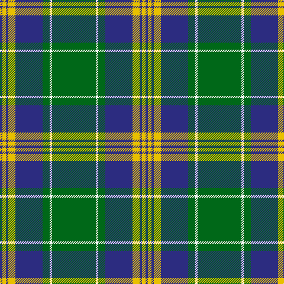

In pattern [BYBYBGWG](/patterns/bybybgwg/).

This was sourced from tartans-authority.  It is a [8 stripes tartan](/stripes/stripes8/).

Original link http://www.tartansauthority.com/tartan-ferret/display/6577/

## Thread count
DB/4 Y6 DB4 Y12 DB46 G12 W4 G/74

## Palette
Each colour and its ΔE from the base-6 reference it is a variant of.

| Colour | Shade | Base | ΔE (OKLab) |
|---|---|---|---|
| DB | <code style="background-color:#2C2C80;">#2C2C80</code> `#2C2C80` | B <code style="background-color:#2A418A;">#2A418A</code> | 0.06 |
| G | <code style="background-color:#006818;">#006818</code> `#006818` | G <code style="background-color:#006100;">#006100</code> | 0.02 |
| W | <code style="background-color:#F8F8F8;">#F8F8F8</code> `#F8F8F8` | W <code style="background-color:#F7F7F7;">#F7F7F7</code> | 0.00 |
| Y | <code style="background-color:#E8C000;">#E8C000</code> `#E8C000` | Y <code style="background-color:#F2BF00;">#F2BF00</code> | 0.02 |

# Sample pattern

## Nearest tartans

The nearest existing variants by ΔTartan distance.

1. [MacOrrell](/setts/s9/b5y2b17g14w1g1w1g4y2~b304080-g008000-we0e0e0-yf0c000~x2/) — ΔT 0.73
1. [Johnston / Johnstone](/setts/s8/y3g2k1g30b24k2b2k2~b304080-g008000-k000000-yf0c000~x2/) — ΔT 0.92
1. [Leatherneck U.S.Marine Corps Corporate Tartan Tartan Number: 975. Earliest known date: 1986 Designed by Madam Leask and the Scottish Tartans Society Accredited in 1981. See products available Copyright © Blair Urquhart, Comrie, 2015](/setts/s8/g28r2g2r2g8b24y3r2~b2c2c80-g006818-rc80000-ye8c000~x2/) — ΔT 0.94
1. [New Mexico](/setts/s8/r1g16b2g10b22y4r2y1~b304080-g008000-rc00000-yf0c000~x2/) — ΔT 0.97
1. [Rowan](/setts/s9/b1k1b8y1g12y1b8k1b1~b304080-g008000-k000000-yf0c000~x2/) — ΔT 0.98
1. [Keppoch](/setts/s7/k5g2k5g2b8g25w4~b2c2c80-g006818-k101010-wf8f8f8~x2/) — ΔT 0.99
1. [MacOrrell Family Tartan Tartan Number: 672. Earliest known date: Date unknown The MacOrrell tartan has similarities with the MacDonald, Lord of the Isles sett, which may point a connection with the name MacDonnell or MacDonald. The name Orr was used by a sept of the MacGregors and also of the Campbells of Argyll, suggesting that the root of the name originated in the Lochaber and Argyll districts. There is an undated sample of the tartan in the cloth archive of the Scottish Tartans Society. See products available Copyright © Blair Urquhart, Comrie, 2015](/setts/s9/b5y2b17g14w1g1w1g4y2~b2c2c80-g006818-we0e0e0-ye8c000~x2/) — ΔT 1.01
1. [Leatherneck](/setts/s8/g40r3g4r3g12b32y4r3~b1c0070-g006818-r880000-yd09800~x2/) — ΔT 1.05
1. [Tennessee State (US State)](/setts/s10/r2b12w1b1g1r1g7b1g12w1~b2c2c80-g006818-rc80000-we0e0e0~x4/) — ΔT 1.08
1. [Kiernan](/setts/s10/w2g4k6r2k2r2k3r2g20w1~g287438-k101010-rc80000-we0e0e0~x2/) — ΔT 1.09

## Neighbour map

Every grey dot is one of 15726 variants placed by the first two principal components of the ΔTartan feature space (44% of its variance). Red is this tartan; blue dots are its nearest — click one to open its page.

<svg viewBox="0 0 640 380" role="img" style="max-width:100%;height:auto;border:1px solid #e0e0e0;border-radius:4px;display:block" xmlns="http://www.w3.org/2000/svg"><image href="/nn/cloud.v1.png" width="640" height="380"/><a href="/setts/s9/b5y2b17g14w1g1w1g4y2~b304080-g008000-we0e0e0-yf0c000~x2/"><circle cx="279.3" cy="159.7" r="4" fill="#3465a4"><title>MacOrrell</title></circle></a><a href="/setts/s8/y3g2k1g30b24k2b2k2~b304080-g008000-k000000-yf0c000~x2/"><circle cx="321.1" cy="134.5" r="4" fill="#3465a4"><title>Johnston / Johnstone</title></circle></a><a href="/setts/s8/g28r2g2r2g8b24y3r2~b2c2c80-g006818-rc80000-ye8c000~x2/"><circle cx="327.9" cy="178.4" r="4" fill="#3465a4"><title>Leatherneck U.S.Marine Corps Corporate Tartan Tartan Number: 975. Earliest known date: 1986 Designed by Madam Leask and the Scottish Tartans Society Accredited in 1981. See products available Copyright © Blair Urquhart, Comrie, 2015</title></circle></a><a href="/setts/s8/r1g16b2g10b22y4r2y1~b304080-g008000-rc00000-yf0c000~x2/"><circle cx="286.8" cy="162.3" r="4" fill="#3465a4"><title>New Mexico</title></circle></a><a href="/setts/s9/b1k1b8y1g12y1b8k1b1~b304080-g008000-k000000-yf0c000~x2/"><circle cx="294.1" cy="176.5" r="4" fill="#3465a4"><title>Rowan</title></circle></a><a href="/setts/s7/k5g2k5g2b8g25w4~b2c2c80-g006818-k101010-wf8f8f8~x2/"><circle cx="294.3" cy="187.4" r="4" fill="#3465a4"><title>Keppoch</title></circle></a><a href="/setts/s9/b5y2b17g14w1g1w1g4y2~b2c2c80-g006818-we0e0e0-ye8c000~x2/"><circle cx="278.3" cy="159.9" r="4" fill="#3465a4"><title>MacOrrell Family Tartan Tartan Number: 672. Earliest known date: Date unknown The MacOrrell tartan has similarities with the MacDonald, Lord of the Isles sett, which may point a connection with the name MacDonnell or MacDonald. The name Orr was used by a sept of the MacGregors and also of the Campbells of Argyll, suggesting that the root of the name originated in the Lochaber and Argyll districts. There is an undated sample of the tartan in the cloth archive of the Scottish Tartans Society. See products available Copyright © Blair Urquhart, Comrie, 2015</title></circle></a><a href="/setts/s8/g40r3g4r3g12b32y4r3~b1c0070-g006818-r880000-yd09800~x2/"><circle cx="328.5" cy="183.6" r="4" fill="#3465a4"><title>Leatherneck</title></circle></a><a href="/setts/s10/r2b12w1b1g1r1g7b1g12w1~b2c2c80-g006818-rc80000-we0e0e0~x4/"><circle cx="298.3" cy="170.9" r="4" fill="#3465a4"><title>Tennessee State (US State)</title></circle></a><a href="/setts/s10/w2g4k6r2k2r2k3r2g20w1~g287438-k101010-rc80000-we0e0e0~x2/"><circle cx="310.7" cy="137.3" r="4" fill="#3465a4"><title>Kiernan</title></circle></a><circle cx="314.6" cy="156.8" r="5" fill="#c00000"/></svg>

ID: /setts/s8/g37w2g6b23y6b2y3b2~b2c2c80-g006818-wf8f8f8-ye8c000~x2/
