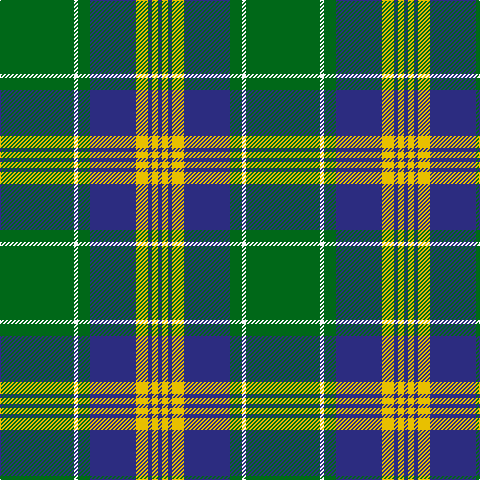

This page is one **sett** — a single exact thread-count. It belongs to the [tartan](/tartans/g37w2g6db23ly6db2ly3db2/)
(the same proportion at any scale), whose colour order is pattern [BYBYBGWG](/stripes/bybybgwg/).

Sourced from tartans-authority.  It is a [8 stripe tartan](/stripes/stripes8/).

Original link http://www.tartansauthority.com/tartan-ferret/display/6577/

## Thread count
G/74 W4 G12 DB46 Y12 DB4 Y6 DB/4

## Palette

Palette: <strong>Tartan Register</strong>
<table><thead><tr><th>Colour</th><th>Threads</th><th>Shade</th><th>Base</th><th>OKLCh</th></tr></thead><tbody><tr><td>G/</td><td style="text-align:right;font-variant-numeric:tabular-nums">74</td><td><code style="background-color:#006818;">#006818</code> <small style="color:#888">#006818</small></td><td>G <code style="background-color:#006100;">#006100</code></td><td><small style="color:#888">oklch(45.0% 0.142 145.0)</small></td></tr><tr><td>W</td><td style="text-align:right;font-variant-numeric:tabular-nums">4</td><td><code style="background-color:#F8F8F8;">#F8F8F8</code> <small style="color:#888">#F8F8F8</small></td><td>W <code style="background-color:#F7F7F7;">#F7F7F7</code></td><td><small style="color:#888">oklch(97.9% 0.000 89.9)</small></td></tr><tr><td>G</td><td style="text-align:right;font-variant-numeric:tabular-nums">12</td><td><code style="background-color:#006818;">#006818</code> <small style="color:#888">#006818</small></td><td>G <code style="background-color:#006100;">#006100</code></td><td><small style="color:#888">oklch(45.0% 0.142 145.0)</small></td></tr><tr><td>DB</td><td style="text-align:right;font-variant-numeric:tabular-nums">46</td><td><code style="background-color:#2C2C80;">#2C2C80</code> <small style="color:#888">#2C2C80</small></td><td>B <code style="background-color:#2A418A;">#2A418A</code></td><td><small style="color:#888">oklch(35.0% 0.138 276.6)</small></td></tr><tr><td>Y</td><td style="text-align:right;font-variant-numeric:tabular-nums">12</td><td><code style="background-color:#E8C000;">#E8C000</code> <small style="color:#888">#E8C000</small></td><td>Y <code style="background-color:#F2BF00;">#F2BF00</code></td><td><small style="color:#888">oklch(81.9% 0.168 93.7)</small></td></tr><tr><td>DB</td><td style="text-align:right;font-variant-numeric:tabular-nums">4</td><td><code style="background-color:#2C2C80;">#2C2C80</code> <small style="color:#888">#2C2C80</small></td><td>B <code style="background-color:#2A418A;">#2A418A</code></td><td><small style="color:#888">oklch(35.0% 0.138 276.6)</small></td></tr><tr><td>Y</td><td style="text-align:right;font-variant-numeric:tabular-nums">6</td><td><code style="background-color:#E8C000;">#E8C000</code> <small style="color:#888">#E8C000</small></td><td>Y <code style="background-color:#F2BF00;">#F2BF00</code></td><td><small style="color:#888">oklch(81.9% 0.168 93.7)</small></td></tr><tr><td>DB/</td><td style="text-align:right;font-variant-numeric:tabular-nums">4</td><td><code style="background-color:#2C2C80;">#2C2C80</code> <small style="color:#888">#2C2C80</small></td><td>B <code style="background-color:#2A418A;">#2A418A</code></td><td><small style="color:#888">oklch(35.0% 0.138 276.6)</small></td></tr></tbody></table>

# Sample pattern

## Nearest tartans

The nearest existing variants by ΔTartan distance, with this tartan at the top so the swatches line up against it.

ΔTartan

Tartan

Sett

—

<a href="/ttd/edit/#slug=g37w2g6db23ly6db2ly3db2~x2">MacAuliffe (Name)</a> <a class="nn-out" href="/setts/s8/g37w2g6db23ly6db2ly3db2~x2/" title="open its dictionary page">↗</a>

0.73

<a href="/ttd/edit/#slug=db5ly2db17g14w1g1w1g4ly2~x2">MacOrrell</a> <a class="nn-out" href="/setts/s9/db5ly2db17g14w1g1w1g4ly2~x2/" title="open its dictionary page">↗</a>

0.92

<a href="/ttd/edit/#slug=ly3g2k1g30db24k2db2k2~x2">Johnston / Johnstone</a> <a class="nn-out" href="/setts/s8/ly3g2k1g30db24k2db2k2~x2/" title="open its dictionary page">↗</a>

0.94

<a href="/ttd/edit/#slug=g28r2g2r2g8db24ly3r2~x2">Leatherneck U.S.Marine Corps Corporate Tartan Tartan Number: 975. Earliest known date: 1986 Designed by Madam Leask and the Scottish Tartans Society Accredited in 1981. See products available Copyright © Blair Urquhart, Comrie, 2015</a> <a class="nn-out" href="/setts/s8/g28r2g2r2g8db24ly3r2~x2/" title="open its dictionary page">↗</a>

0.96

<a href="/ttd/edit/#slug=r1g16db2g10db22ly4r2ly1~x2">New Mexico</a> <a class="nn-out" href="/setts/s8/r1g16db2g10db22ly4r2ly1~x2/" title="open its dictionary page">↗</a>

0.98

<a href="/ttd/edit/#slug=db1k1db8ly1g12ly1db8k1db1~x2">Rowan</a> <a class="nn-out" href="/setts/s9/db1k1db8ly1g12ly1db8k1db1~x2/" title="open its dictionary page">↗</a>

0.99

<a href="/ttd/edit/#slug=k5g2k5g2db8g25w4~x2">Keppoch</a> <a class="nn-out" href="/setts/s7/k5g2k5g2db8g25w4~x2/" title="open its dictionary page">↗</a>

1.08

<a href="/ttd/edit/#slug=r2db12w1db1g1r1g7db1g12w1~x4">Tennessee State (US State)</a> <a class="nn-out" href="/setts/s10/r2db12w1db1g1r1g7db1g12w1~x4/" title="open its dictionary page">↗</a>

1.09

<a href="/ttd/edit/#slug=w2g4k6r2k2r2k3r2g20w1~x2">Kiernan</a> <a class="nn-out" href="/setts/s10/w2g4k6r2k2r2k3r2g20w1~x2/" title="open its dictionary page">↗</a>

1.14

<a href="/ttd/edit/#slug=k3g36db28r2db2ly3~x2">Carmichael</a> <a class="nn-out" href="/setts/s6/k3g36db28r2db2ly3~x2/" title="open its dictionary page">↗</a>

1.14

<a href="/ttd/edit/#slug=dg60w3k12o5dg9o6k4w10">New York Jets</a> <a class="nn-out" href="/setts/s8/dg60w3k12o5dg9o6k4w10/" title="open its dictionary page">↗</a>

## Neighbour map

Every grey dot is one of 14299 variants placed by the first two principal components of the ΔTartan feature space (44% of its variance). Red is this tartan; blue dots are its nearest — click one to open its page.

<svg viewBox="0 0 640 380" role="img" style="max-width:100%;height:auto;border:1px solid #e0e0e0;border-radius:4px;display:block" xmlns="http://www.w3.org/2000/svg"><image href="/nn/cloud.v1.png" width="640" height="380"/><a href="/setts/s9/db5ly2db17g14w1g1w1g4ly2~x2/"><circle cx="282.4" cy="160.8" r="4" fill="#3465a4"><title>MacOrrell</title></circle></a><a href="/setts/s8/ly3g2k1g30db24k2db2k2~x2/"><circle cx="324.4" cy="135.4" r="4" fill="#3465a4"><title>Johnston / Johnstone</title></circle></a><a href="/setts/s8/g28r2g2r2g8db24ly3r2~x2/"><circle cx="330.5" cy="180.5" r="4" fill="#3465a4"><title>Leatherneck U.S.Marine Corps Corporate Tartan Tartan Number: 975. Earliest known date: 1986 Designed by Madam Leask and the Scottish Tartans Society Accredited in 1981. See products available Copyright © Blair Urquhart, Comrie, 2015</title></circle></a><a href="/setts/s8/r1g16db2g10db22ly4r2ly1~x2/"><circle cx="289.7" cy="164.1" r="4" fill="#3465a4"><title>New Mexico</title></circle></a><a href="/setts/s9/db1k1db8ly1g12ly1db8k1db1~x2/"><circle cx="297.3" cy="177.1" r="4" fill="#3465a4"><title>Rowan</title></circle></a><a href="/setts/s7/k5g2k5g2db8g25w4~x2/"><circle cx="297.4" cy="186.8" r="4" fill="#3465a4"><title>Keppoch</title></circle></a><a href="/setts/s10/r2db12w1db1g1r1g7db1g12w1~x4/"><circle cx="301.2" cy="172.8" r="4" fill="#3465a4"><title>Tennessee State (US State)</title></circle></a><a href="/setts/s10/w2g4k6r2k2r2k3r2g20w1~x2/"><circle cx="313.1" cy="136.3" r="4" fill="#3465a4"><title>Kiernan</title></circle></a><a href="/setts/s6/k3g36db28r2db2ly3~x2/"><circle cx="296.5" cy="163.5" r="4" fill="#3465a4"><title>Carmichael</title></circle></a><a href="/setts/s8/dg60w3k12o5dg9o6k4w10/"><circle cx="360.5" cy="142.9" r="4" fill="#3465a4"><title>New York Jets</title></circle></a><circle cx="317.6" cy="156.9" r="5" fill="#c00000"/></svg>

ID: /setts/s8/g37w2g6db23ly6db2ly3db2~x2/
