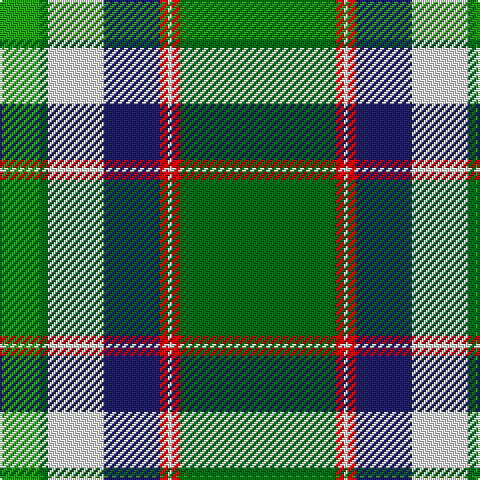

This page is one **sett** — a single exact thread-count. It belongs to the [tartan](/tartans/ga39r2w1r2db14w14ga2g10/)
(the same proportion at any scale), whose colour order is pattern [GGWBRWRG](/stripes/ggwbrwrg/).

Sourced from tartans-authority.  It is a [8 stripe tartan](/stripes/stripes8/).

Original link http://www.tartansauthority.com/tartan-ferret/display/6744/

## Thread count
Ga/78 R4 W2 R4 DB28 W28 Ga4 G/20

## Palette
Each colour and the base-6 reference it is a variant of.

| Colour | Shade | Base |
|---|---|---|
| DB | <code style="background-color:#202060;">#202060</code> `oklch(28.9% 0.111 276.9)` <small>#202060</small> | B <code style="background-color:#2A418A;">#2A418A</code> |
| G | <code style="background-color:#289C18;">#289C18</code> `oklch(60.6% 0.191 141.6)` <small>#289C18</small> | G <code style="background-color:#006100;">#006100</code> |
| Ga | <code style="background-color:#006818;">#006818</code> `oklch(45.0% 0.142 145.0)` <small>#006818</small> | G <code style="background-color:#006100;">#006100</code> |
| R | <code style="background-color:#C80000;">#C80000</code> `oklch(52.3% 0.215 29.2)` <small>#C80000</small> | R <code style="background-color:#CC0000;">#CC0000</code> |
| W | <code style="background-color:#FCFCFC;">#FCFCFC</code> `oklch(99.1% 0.000 89.9)` <small>#FCFCFC</small> | W <code style="background-color:#F7F7F7;">#F7F7F7</code> |

# Sample pattern

## Nearest tartans

The nearest existing variants by ΔTartan distance, with this tartan at the top so the swatches line up against it.

ΔTartan

Tartan

Sett

—

<a href="/ttd/edit/#slug=g39r2w1r2db14w14g2g10~x2">Southwell (Australian) (Personal)</a> <a class="nn-out" href="/setts/s8/g39r2w1r2db14w14g2g10~x2/" title="open its dictionary page">↗</a>

1.03

<a href="/ttd/edit/#slug=r6g2w21ly2k8ly2g32w1k3~x2">Fiander, Julian (Personal)</a> <a class="nn-out" href="/setts/s9/r6g2w21ly2k8ly2g32w1k3~x2/" title="open its dictionary page">↗</a>

1.21

<a href="/ttd/edit/#slug=g4k2g28r4g4k18g4lp4g4lp7k1w3~x2">Moss</a> <a class="nn-out" href="/setts/s12/g4k2g28r4g4k18g4lp4g4lp7k1w3~x2/" title="open its dictionary page">↗</a>

1.37

<a href="/ttd/edit/#slug=w2k4db16lo12g36k1k6lo2w2~x2">National Millennium (Commemorative)</a> <a class="nn-out" href="/setts/s9/w2k4db16lo12g36k1k6lo2w2~x2/" title="open its dictionary page">↗</a>

1.37

<a href="/ttd/edit/#slug=w3k1r4g20k3b30w4r2~x2">Scottish Prison Service (Corporate)</a> <a class="nn-out" href="/setts/s8/w3k1r4g20k3b30w4r2~x2/" title="open its dictionary page">↗</a>

1.37

<a href="/ttd/edit/#slug=w9g2g2w3g18w2k2w1k19g33lo2~x2">New World Irish</a> <a class="nn-out" href="/setts/s11/w9g2g2w3g18w2k2w1k19g33lo2~x2/" title="open its dictionary page">↗</a>

1.38

<a href="/ttd/edit/#slug=g90r1k10w6k4g6r10db62ly8">Stirling, University of</a> <a class="nn-out" href="/setts/s9/g90r1k10w6k4g6r10db62ly8/" title="open its dictionary page">↗</a>

1.38

<a href="/ttd/edit/#slug=db10k12g3k1g1k1g30lo4w4~x2">Hutchens (Kansas) (Personal)</a> <a class="nn-out" href="/setts/s9/db10k12g3k1g1k1g30lo4w4~x2/" title="open its dictionary page">↗</a>

1.39

<a href="/ttd/edit/#slug=dt3lo2dt30lo1w18lg30lo2lg3~x2">Bannockbane Green</a> <a class="nn-out" href="/setts/s8/dt3lo2dt30lo1w18lg30lo2lg3~x2/" title="open its dictionary page">↗</a>

1.42

<a href="/ttd/edit/#slug=y3g32y36o12k2w68g3k2~x2">Kintail Dress</a> <a class="nn-out" href="/setts/s8/y3g32y36o12k2w68g3k2~x2/" title="open its dictionary page">↗</a>

1.43

<a href="/ttd/edit/#slug=g42ly1w2ly1g5dg12w32g4~x2">Longniddry Green Error (Dance)</a> <a class="nn-out" href="/setts/s8/g42ly1w2ly1g5dg12w32g4~x2/" title="open its dictionary page">↗</a>

## Neighbour map

Every grey dot is one of 14299 variants placed by the first two principal components of the ΔTartan feature space (44% of its variance). Red is this tartan; blue dots are its nearest — click one to open its page.

<svg viewBox="0 0 640 380" role="img" style="max-width:100%;height:auto;border:1px solid #e0e0e0;border-radius:4px;display:block" xmlns="http://www.w3.org/2000/svg"><image href="/nn/cloud.v1.png" width="640" height="380"/><a href="/setts/s9/r6g2w21ly2k8ly2g32w1k3~x2/"><circle cx="217.2" cy="86.6" r="4" fill="#3465a4"><title>Fiander, Julian (Personal)</title></circle></a><a href="/setts/s12/g4k2g28r4g4k18g4lp4g4lp7k1w3~x2/"><circle cx="263.1" cy="99.3" r="4" fill="#3465a4"><title>Moss</title></circle></a><a href="/setts/s9/w2k4db16lo12g36k1k6lo2w2~x2/"><circle cx="219.3" cy="86.0" r="4" fill="#3465a4"><title>National Millennium (Commemorative)</title></circle></a><a href="/setts/s8/w3k1r4g20k3b30w4r2~x2/"><circle cx="252.5" cy="115.9" r="4" fill="#3465a4"><title>Scottish Prison Service (Corporate)</title></circle></a><a href="/setts/s11/w9g2g2w3g18w2k2w1k19g33lo2~x2/"><circle cx="185.2" cy="90.7" r="4" fill="#3465a4"><title>New World Irish</title></circle></a><a href="/setts/s9/g90r1k10w6k4g6r10db62ly8/"><circle cx="284.1" cy="72.3" r="4" fill="#3465a4"><title>Stirling, University of</title></circle></a><a href="/setts/s9/db10k12g3k1g1k1g30lo4w4~x2/"><circle cx="278.3" cy="116.2" r="4" fill="#3465a4"><title>Hutchens (Kansas) (Personal)</title></circle></a><a href="/setts/s8/dt3lo2dt30lo1w18lg30lo2lg3~x2/"><circle cx="203.1" cy="104.8" r="4" fill="#3465a4"><title>Bannockbane Green</title></circle></a><a href="/setts/s8/y3g32y36o12k2w68g3k2~x2/"><circle cx="227.6" cy="96.1" r="4" fill="#3465a4"><title>Kintail Dress</title></circle></a><a href="/setts/s8/g42ly1w2ly1g5dg12w32g4~x2/"><circle cx="303.8" cy="103.7" r="4" fill="#3465a4"><title>Longniddry Green Error (Dance)</title></circle></a><circle cx="253.6" cy="101.4" r="5" fill="#c00000"/></svg>

ID: /setts/s8/g39r2w1r2db14w14g2g10~x2/
