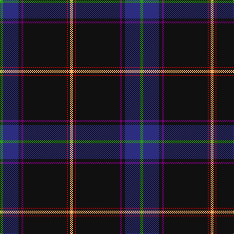

In pattern [GBKBKRKY](/stripes/gbkbkrky/).

This was sourced from tartans-authority.  It is a [8 stripe tartan](/stripes/stripes8/).

Original link http://www.tartansauthority.com/tartan-ferret/display/10436/

## Attestations

This cloth appears in 2 source records; the oldest owns this page.

- March 2011 — Cumnock (District) (tartans-authority, [record](http://www.tartansauthority.com/tartan-ferret/display/10436/))
- undated — Cumnock District Tartan Tartan Number: 10436. Earliest known date: March 2011 Based on the MacMillan hunting tartan in honour of the founder of the Cumnock Games, Councillor James McMillan. The blue is from the lion rampant in the Cumnock coat of arms. The orange and red commemorate the great iron ore blast furnaces at Lugar and the surrounding black is for the coal mines that fed those furnaces and formed the heart of the Cumnock community. Approved by Cumnock Community Council. See products available Copyright © Blair Urquhart, Comrie, 2015 (house-of-tartan, [record](http://www.house-of-tartan.scotland.net/house/TartanViewjs.asp?colr=Def&tnam=10436))

## Thread count
G/6 DB32 K6 P4 K90 R2 K4 LG/6

## Palette
Each colour and the base-6 reference it is a variant of.

| Colour | Shade | Base |
|---|---|---|
| DB | <code style="background-color:#2C2C80;">#2C2C80</code> `oklch(35.0% 0.138 276.6)` <small>#2C2C80</small> | B <code style="background-color:#2A418A;">#2A418A</code> |
| G | <code style="background-color:#289C18;">#289C18</code> `oklch(60.6% 0.191 141.6)` <small>#289C18</small> | G <code style="background-color:#006100;">#006100</code> |
| K | <code style="background-color:#101010;">#101010</code> `oklch(17.3% 0.000 89.9)` <small>#101010</small> | K <code style="background-color:#000000;">#000000</code> |
| LG | <code style="background-color:#FCB464;">#FCB464</code> `oklch(82.2% 0.128 67.3)` <small>#FCB464</small> | Y <code style="background-color:#F2BF00;">#F2BF00</code> |
| P | <code style="background-color:#780078;">#780078</code> `oklch(40.2% 0.185 328.4)` <small>#780078</small> | B <code style="background-color:#2A418A;">#2A418A</code> |
| R | <code style="background-color:#C80000;">#C80000</code> `oklch(52.3% 0.215 29.2)` <small>#C80000</small> | R <code style="background-color:#CC0000;">#CC0000</code> |

# Sample pattern

## Nearest tartans

The nearest existing variants by ΔTartan distance, with this tartan at the top so the swatches line up against it.

ΔTartan

Tartan

Sett

—

<a href="/ttd/edit/#slug=g3db16k3dp2k45r1k2lo3~x2">Cumnock (District)</a> <a class="nn-out" href="/setts/s8/g3db16k3dp2k45r1k2lo3~x2/" title="open its dictionary page">↗</a>

0.97

<a href="/ttd/edit/#slug=g3db16k3p2k45r1k2lo3~x2">Cumnock</a> <a class="nn-out" href="/setts/s8/g3db16k3p2k45r1k2lo3~x2/" title="open its dictionary page">↗</a>

1.18

<a href="/ttd/edit/#slug=db46ly1ly3dg13ly1r7g3ly1~x2">Victorian Highland Pipe Band Assoc</a> <a class="nn-out" href="/setts/s8/db46ly1ly3dg13ly1r7g3ly1~x2/" title="open its dictionary page">↗</a>

1.28

<a href="/ttd/edit/#slug=db60w1db6g10r1g7k2lo2w2~x2">Mohammed, Abu Hassan (Personal)</a> <a class="nn-out" href="/setts/s9/db60w1db6g10r1g7k2lo2w2~x2/" title="open its dictionary page">↗</a>

1.28

<a href="/ttd/edit/#slug=n24lo2n4lo1n3k3dg1k50r1r3~x2">Coleburn (Corporate)</a> <a class="nn-out" href="/setts/s10/n24lo2n4lo1n3k3dg1k50r1r3~x2/" title="open its dictionary page">↗</a>

1.28

<a href="/ttd/edit/#slug=k96db8k12dp3k3dp3k3g20r8k3r4w4">Watt (Corporate/Name)</a> <a class="nn-out" href="/setts/s12/k96db8k12dp3k3dp3k3g20r8k3r4w4/" title="open its dictionary page">↗</a>

1.31

<a href="/ttd/edit/#slug=dt60lr11o5n5k1o4~x2">Christie (London) Hunting</a> <a class="nn-out" href="/setts/s6/dt60lr11o5n5k1o4~x2/" title="open its dictionary page">↗</a>

1.33

<a href="/ttd/edit/#slug=k43ly3dg1w1db1ly3db25r2~x2">Royal Yacht Britannia</a> <a class="nn-out" href="/setts/s8/k43ly3dg1w1db1ly3db25r2~x2/" title="open its dictionary page">↗</a>

1.33

<a href="/ttd/edit/#slug=g20r10ly2db100w1y10">Ravetta (Name)</a> <a class="nn-out" href="/setts/s6/g20r10ly2db100w1y10/" title="open its dictionary page">↗</a>

1.34

<a href="/ttd/edit/#slug=dt46w1lo3dg13w1r7g3w1~x2">Victorian Highland Pipe Band Association (Australia)</a> <a class="nn-out" href="/setts/s8/dt46w1lo3dg13w1r7g3w1~x2/" title="open its dictionary page">↗</a>

1.35

<a href="/ttd/edit/#slug=k10r5k5dg55db2lo1w1~x2">Moeller, Karsten (Personal)</a> <a class="nn-out" href="/setts/s7/k10r5k5dg55db2lo1w1~x2/" title="open its dictionary page">↗</a>

## Neighbour map

Every grey dot is one of 14299 variants placed by the first two principal components of the ΔTartan feature space (44% of its variance). Red is this tartan; blue dots are its nearest — click one to open its page.

<svg viewBox="0 0 640 380" role="img" style="max-width:100%;height:auto;border:1px solid #e0e0e0;border-radius:4px;display:block" xmlns="http://www.w3.org/2000/svg"><image href="/nn/cloud.v1.png" width="640" height="380"/><a href="/setts/s8/g3db16k3p2k45r1k2lo3~x2/"><circle cx="415.7" cy="86.4" r="4" fill="#3465a4"><title>Cumnock</title></circle></a><a href="/setts/s8/db46ly1ly3dg13ly1r7g3ly1~x2/"><circle cx="391.4" cy="88.3" r="4" fill="#3465a4"><title>Victorian Highland Pipe Band Assoc</title></circle></a><a href="/setts/s9/db60w1db6g10r1g7k2lo2w2~x2/"><circle cx="488.3" cy="77.3" r="4" fill="#3465a4"><title>Mohammed, Abu Hassan (Personal)</title></circle></a><a href="/setts/s10/n24lo2n4lo1n3k3dg1k50r1r3~x2/"><circle cx="409.7" cy="79.2" r="4" fill="#3465a4"><title>Coleburn (Corporate)</title></circle></a><a href="/setts/s12/k96db8k12dp3k3dp3k3g20r8k3r4w4/"><circle cx="446.0" cy="76.9" r="4" fill="#3465a4"><title>Watt (Corporate/Name)</title></circle></a><a href="/setts/s6/dt60lr11o5n5k1o4~x2/"><circle cx="470.9" cy="109.1" r="4" fill="#3465a4"><title>Christie (London) Hunting</title></circle></a><a href="/setts/s8/k43ly3dg1w1db1ly3db25r2~x2/"><circle cx="354.3" cy="90.6" r="4" fill="#3465a4"><title>Royal Yacht Britannia</title></circle></a><a href="/setts/s6/g20r10ly2db100w1y10/"><circle cx="470.5" cy="109.1" r="4" fill="#3465a4"><title>Ravetta (Name)</title></circle></a><a href="/setts/s8/dt46w1lo3dg13w1r7g3w1~x2/"><circle cx="402.7" cy="95.7" r="4" fill="#3465a4"><title>Victorian Highland Pipe Band Association (Australia)</title></circle></a><a href="/setts/s7/k10r5k5dg55db2lo1w1~x2/"><circle cx="482.4" cy="107.8" r="4" fill="#3465a4"><title>Moeller, Karsten (Personal)</title></circle></a><circle cx="439.0" cy="96.1" r="5" fill="#c00000"/></svg>

ID: /setts/s8/g3db16k3dp2k45r1k2lo3~x2/
