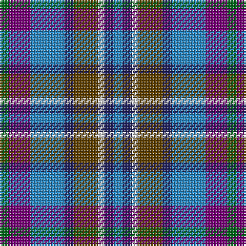

**Bands:** [GBBBGWBB](/stripes/gbbbgwbb/) · **Stripes:** [G DP T DB DY W DB T](/stripes/stripes8/) G DP T DB DY W DB T

This was sourced from house-of-tartan.  It is a [8 band tartan](/bands/bands8/).

Original link http://www.house-of-tartan.scotland.net/house/TartanViewjs.asp?colr=Def&tnam=89

## Thread count
G/6 P14 B22 DB6 T16 LN4 DB6 B/6

## Palette
Each colour and its ΔE from the base-6 reference it is a variant of.

| Colour | Shade | Base | ΔE (OKLab) |
|---|---|---|---|
| B | <code style="background-color:#2888C4;">#2888C4</code> `#2888C4` | B <code style="background-color:#2A418A;">#2A418A</code> | 0.21 |
| DB | <code style="background-color:#202060;">#202060</code> `#202060` | B <code style="background-color:#2A418A;">#2A418A</code> | 0.11 |
| G | <code style="background-color:#006818;">#006818</code> `#006818` | G <code style="background-color:#006100;">#006100</code> | 0.02 |
| LN | <code style="background-color:#E0E0E0;">#E0E0E0</code> `#E0E0E0` | W <code style="background-color:#F7F7F7;">#F7F7F7</code> | 0.07 |
| P | <code style="background-color:#780078;">#780078</code> `#780078` | B <code style="background-color:#2A418A;">#2A418A</code> | 0.17 |
| T | <code style="background-color:#604000;">#604000</code> `#604000` | G <code style="background-color:#006100;">#006100</code> | 0.14 |

# Sample pattern

## Nearest tartans

The nearest existing variants by ΔTartan distance.

1. [Scotia](/setts/s8/g3p7b11db3o8w2db3b3~x2/) — ΔT 0.78
1. [Cherokee](/setts/s8/g4t2g9k4g2r6db12w2~x2/) — ΔT 1.16
1. [Waterford County Crest (Fashion)](/setts/s8/w8db5db30lr4db13lr13g5lo5~x2/) — ΔT 1.19
1. [DunBroch](/setts/s11/db4t8k2t5lb2t5dg8dr7dg2dr7dg3~x2/) — ΔT 1.25
1. [Caitriot](/setts/s9/w3t2n14o8t14db16n13t2w3~x2/) — ΔT 1.26
1. [Mitsukoshi](/setts/s10/y12k3w3k3w3k3y13n6db17r3~x2/) — ΔT 1.26
1. [Devon Companion](/setts/s7/o5db4ly1db4k4dy4w1~x4/) — ΔT 1.27
1. [Smithers (Name)](/setts/s11/dp2b6n1b3lb1b4k6g5k1g5dp2~x4/) — ΔT 1.28
1. [Fox-Eves Wedding](/setts/s6/r9dt6db13dt21y18w4~x2/) — ΔT 1.29
1. [Caitriot](/setts/s9/w3t2n14lr8t14db16n13t2w3~x2/) — ΔT 1.32

## Neighbour map

Every grey dot is one of 14299 variants placed by the first two principal components of the ΔTartan feature space (44% of its variance). Red is this tartan; blue dots are its nearest — click one to open its page.

<svg viewBox="0 0 640 380" role="img" style="max-width:100%;height:auto;border:1px solid #e0e0e0;border-radius:4px;display:block" xmlns="http://www.w3.org/2000/svg"><image href="/nn/cloud.v1.png" width="640" height="380"/><a href="/setts/s8/g3p7b11db3o8w2db3b3~x2/"><circle cx="79.3" cy="201.5" r="4" fill="#3465a4"><title>Scotia</title></circle></a><a href="/setts/s8/g4t2g9k4g2r6db12w2~x2/"><circle cx="90.5" cy="190.9" r="4" fill="#3465a4"><title>Cherokee</title></circle></a><a href="/setts/s8/w8db5db30lr4db13lr13g5lo5~x2/"><circle cx="99.5" cy="171.8" r="4" fill="#3465a4"><title>Waterford County Crest (Fashion)</title></circle></a><a href="/setts/s11/db4t8k2t5lb2t5dg8dr7dg2dr7dg3~x2/"><circle cx="55.6" cy="222.2" r="4" fill="#3465a4"><title>DunBroch</title></circle></a><a href="/setts/s9/w3t2n14o8t14db16n13t2w3~x2/"><circle cx="136.0" cy="204.0" r="4" fill="#3465a4"><title>Caitriot</title></circle></a><a href="/setts/s10/y12k3w3k3w3k3y13n6db17r3~x2/"><circle cx="96.8" cy="175.7" r="4" fill="#3465a4"><title>Mitsukoshi</title></circle></a><a href="/setts/s7/o5db4ly1db4k4dy4w1~x4/"><circle cx="53.1" cy="230.2" r="4" fill="#3465a4"><title>Devon Companion</title></circle></a><a href="/setts/s11/dp2b6n1b3lb1b4k6g5k1g5dp2~x4/"><circle cx="96.4" cy="206.9" r="4" fill="#3465a4"><title>Smithers (Name)</title></circle></a><a href="/setts/s6/r9dt6db13dt21y18w4~x2/"><circle cx="123.0" cy="254.4" r="4" fill="#3465a4"><title>Fox-Eves Wedding</title></circle></a><a href="/setts/s9/w3t2n14lr8t14db16n13t2w3~x2/"><circle cx="114.1" cy="193.6" r="4" fill="#3465a4"><title>Caitriot</title></circle></a><circle cx="86.3" cy="211.1" r="5" fill="#c00000"/></svg>

ID: /setts/s8/g3dp7t11db3dy8w2db3t3~x2/
