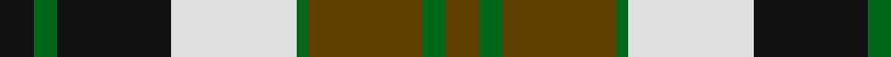

In pattern [GGGGWKGK](/patterns/ggggwkgk/).

This was sourced from register-of-tartans.  It is a [8 stripes tartan](/stripes/stripes8/).

Original link https://www.tartanregister.gov.uk/tartanDetails.aspx?ref=882

## Thread count
K/18 G12 K60 LN66 G6 T60 G12 T/18

## Palette
Each colour and its ΔE from the base-6 reference it is a variant of.

| Colour | Shade | Base | ΔE (OKLab) |
|---|---|---|---|
| G | <code style="background-color:#006818;">#006818</code> `#006818` | G <code style="background-color:#006100;">#006100</code> | 0.02 |
| K | <code style="background-color:#101010;">#101010</code> `#101010` | K <code style="background-color:#000000;">#000000</code> | 0.17 |
| LN | <code style="background-color:#E0E0E0;">#E0E0E0</code> `#E0E0E0` | W <code style="background-color:#F7F7F7;">#F7F7F7</code> | 0.07 |
| T | <code style="background-color:#604000;">#604000</code> `#604000` | G <code style="background-color:#006100;">#006100</code> | 0.14 |
| W | <code style="background-color:#F8F8F8;">#F8F8F8</code> `#F8F8F8` | W <code style="background-color:#F7F7F7;">#F7F7F7</code> | 0.00 |

# Sample pattern

## Nearest tartans

The nearest existing variants by ΔTartan distance.

1. [National Trust](/setts/s8/g2b8g8r3b1w12g2b1~b401000-g004010-r906030-we0e0e0~x2/) — ΔT 0.51
1. [Bannockbane Light Tan](/setts/s8/k4y2k13y1w8ya13y2ya4~k101010-we0e0e0-ye8c000-yaa08858~x2/) — ΔT 0.84
1. [Bannockbane, Light Tan](/setts/s8/k4y2k13y1w8r13y2r4~k000000-r906030-we0e0e0-yf0c000~x2/) — ΔT 0.92
1. [Bannockbane Grey #1](/setts/s8/k4y2k13y1w8r13y2r4~k101010-r888888-wfcfcfc-ye8c000~x2/) — ΔT 0.96
1. [Cape Breton](/setts/s7/y5k5g17k6ga24k6y3~g008000-ga808080-k000000-yf0c000~x2/) — ΔT 0.98
1. [Bannockbane Hunting (MacBean and Bishop)](/setts/s8/g3r2g14r1w10ga14r2ga3~g002814-ga808080-rbe7832-we0e0e0~x2/) — ΔT 0.99
1. [Cape Breton (yellow stripes)](/setts/s7/y6k6g30k8w18k6y3~g789484-k000000-wc0c0c0-ye8c000~x2/) — ΔT 1.00
1. [National Trust](/setts/s8/g2b8g8y3b1w12g2b1~b441800-g006818-we0e0e0-ya08858~x2/) — ΔT 1.00
1. [National Trust Corporate Tartan Tartan Number: 2117. Earliest known date: pre 1991 Sent in by Tweedmill for information. See products available Copyright © Blair Urquhart, Comrie, 2015](/setts/s8/g2b8g8r3b1w12g2ga1~b441800-g003820-ga5c6428-rd05054-we0e0e0~x2/) — ΔT 1.04
1. [Borthwick Dress](/setts/s9/g12k2r12k3w7k16w7k3w6~g006818-k101010-r880000-wfcfcfc~x2/) — ΔT 1.05

## Neighbour map

Every grey dot is one of 15726 variants placed by the first two principal components of the ΔTartan feature space (44% of its variance). Red is this tartan; blue dots are its nearest — click one to open its page.

<svg viewBox="0 0 640 380" role="img" style="max-width:100%;height:auto;border:1px solid #e0e0e0;border-radius:4px;display:block" xmlns="http://www.w3.org/2000/svg"><image href="/nn/cloud.v1.png" width="640" height="380"/><a href="/setts/s8/g2b8g8r3b1w12g2b1~b401000-g004010-r906030-we0e0e0~x2/"><circle cx="141.1" cy="171.1" r="4" fill="#3465a4"><title>National Trust</title></circle></a><a href="/setts/s8/k4y2k13y1w8ya13y2ya4~k101010-we0e0e0-ye8c000-yaa08858~x2/"><circle cx="154.8" cy="171.2" r="4" fill="#3465a4"><title>Bannockbane Light Tan</title></circle></a><a href="/setts/s8/k4y2k13y1w8r13y2r4~k000000-r906030-we0e0e0-yf0c000~x2/"><circle cx="150.6" cy="171.9" r="4" fill="#3465a4"><title>Bannockbane, Light Tan</title></circle></a><a href="/setts/s8/k4y2k13y1w8r13y2r4~k101010-r888888-wfcfcfc-ye8c000~x2/"><circle cx="149.4" cy="170.1" r="4" fill="#3465a4"><title>Bannockbane Grey #1</title></circle></a><a href="/setts/s7/y5k5g17k6ga24k6y3~g008000-ga808080-k000000-yf0c000~x2/"><circle cx="129.5" cy="201.8" r="4" fill="#3465a4"><title>Cape Breton</title></circle></a><a href="/setts/s8/g3r2g14r1w10ga14r2ga3~g002814-ga808080-rbe7832-we0e0e0~x2/"><circle cx="165.0" cy="168.1" r="4" fill="#3465a4"><title>Bannockbane Hunting (MacBean and Bishop)</title></circle></a><a href="/setts/s7/y6k6g30k8w18k6y3~g789484-k000000-wc0c0c0-ye8c000~x2/"><circle cx="145.2" cy="182.8" r="4" fill="#3465a4"><title>Cape Breton (yellow stripes)</title></circle></a><a href="/setts/s8/g2b8g8y3b1w12g2b1~b441800-g006818-we0e0e0-ya08858~x2/"><circle cx="142.3" cy="171.2" r="4" fill="#3465a4"><title>National Trust</title></circle></a><a href="/setts/s8/g2b8g8r3b1w12g2ga1~b441800-g003820-ga5c6428-rd05054-we0e0e0~x2/"><circle cx="120.2" cy="153.5" r="4" fill="#3465a4"><title>National Trust Corporate Tartan Tartan Number: 2117. Earliest known date: pre 1991 Sent in by Tweedmill for information. See products available Copyright © Blair Urquhart, Comrie, 2015</title></circle></a><a href="/setts/s9/g12k2r12k3w7k16w7k3w6~g006818-k101010-r880000-wfcfcfc~x2/"><circle cx="96.7" cy="198.0" r="4" fill="#3465a4"><title>Borthwick Dress</title></circle></a><circle cx="123.2" cy="183.2" r="5" fill="#c00000"/></svg>

ID: /setts/s8/g3ga2g10ga1w11k10ga2k3~g604000-ga006818-k101010-we0e0e0~x6/
