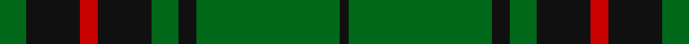

In pattern [GKRKGKGK](/stripes/gkrkgkgk/).

This was sourced from register-of-tartans.  It is a [8 stripe tartan](/stripes/stripes8/).

Original link https://www.tartanregister.gov.uk/tartanDetails.aspx?ref=1405

## Attestations

This cloth appears in 2 source records; the oldest owns this page.

- 01/01/1983 — Glenbarr (register-of-tartans, [record](https://www.tartanregister.gov.uk/tartanDetails.aspx?ref=1405))
- pre 2007 — Glenbarr (Corporate) (tartans-authority, [record](http://www.tartansauthority.com/tartan-ferret/display/7366/))

## Register references

External register numbers recorded for this tartan.

- Scottish Register of Tartans: [1405](https://www.tartanregister.gov.uk/tartanDetails.aspx?ref=1405)
- Scottish Tartans Authority (ITI): 7366
- Scottish Tartans World Register: 2785

## Thread count
G/12 K24 R8 K24 G12 K8 G64 K/4

## Palette
Each colour and the base-6 reference it is a variant of.

| Colour | Shade | Base |
|---|---|---|
| G | <code style="background-color:#006818;">#006818</code> `oklch(45.0% 0.142 145.0)` <small>#006818</small> | G <code style="background-color:#006100;">#006100</code> |
| K | <code style="background-color:#101010;">#101010</code> `oklch(17.3% 0.000 89.9)` <small>#101010</small> | K <code style="background-color:#000000;">#000000</code> |
| R | <code style="background-color:#C80000;">#C80000</code> `oklch(52.3% 0.215 29.2)` <small>#C80000</small> | R <code style="background-color:#CC0000;">#CC0000</code> |

# Sample pattern

## Nearest tartans

The nearest existing variants by ΔTartan distance.

1. [MacArthur-Fox 1993 (Personal)](/setts/s8/k22g5k2g5k11g33k2r4~x2/) — ΔT 0.51
1. [Duchess of Fife #2](/setts/s6/g70k26g12k14db3k16~x2/) — ΔT 0.96
1. [American Monahan (Personal)](/setts/s11/k13g3k4g3k3g19lo1g19k3g2lo4~x2/) — ΔT 0.97
1. [Guildry of Stirling](/setts/s10/g18k3g3k3g3k21g2k21g21k4~x2/) — ΔT 0.98
1. [Angle, Green (Fashion)](/setts/s7/lo1dg11k6dg3lo1dg1lo1~x4/) — ΔT 1.00
1. [MacArthur-Fox Green](/setts/s10/r4g4k2g31k10ly3g5k11g6k3~x2/) — ΔT 1.18
1. [MacKinross](/setts/s7/k6db1k6g4k10g20r2~x2/) — ΔT 1.20
1. [Forbes #6](/setts/s6/r1dg16k8dg4k4ly1~x2/) — ΔT 1.23
1. [MacArthur (Variant)](/setts/s6/r3g30k12g6k16ly2~x2/) — ΔT 1.23
1. [Paton (Personal)](/setts/s7/r3g20k20g20lo2g2lo2~x2/) — ΔT 1.26

## Neighbour map

Every grey dot is one of 14299 variants placed by the first two principal components of the ΔTartan feature space (44% of its variance). Red is this tartan; blue dots are its nearest — click one to open its page.

<svg viewBox="0 0 640 380" role="img" style="max-width:100%;height:auto;border:1px solid #e0e0e0;border-radius:4px;display:block" xmlns="http://www.w3.org/2000/svg"><image href="/nn/cloud.v1.png" width="640" height="380"/><a href="/setts/s8/k22g5k2g5k11g33k2r4~x2/"><circle cx="362.7" cy="208.5" r="4" fill="#3465a4"><title>MacArthur-Fox 1993 (Personal)</title></circle></a><a href="/setts/s6/g70k26g12k14db3k16~x2/"><circle cx="420.0" cy="221.6" r="4" fill="#3465a4"><title>Duchess of Fife #2</title></circle></a><a href="/setts/s11/k13g3k4g3k3g19lo1g19k3g2lo4~x2/"><circle cx="401.5" cy="193.4" r="4" fill="#3465a4"><title>American Monahan (Personal)</title></circle></a><a href="/setts/s10/g18k3g3k3g3k21g2k21g21k4~x2/"><circle cx="349.4" cy="231.6" r="4" fill="#3465a4"><title>Guildry of Stirling</title></circle></a><a href="/setts/s7/lo1dg11k6dg3lo1dg1lo1~x4/"><circle cx="396.8" cy="226.0" r="4" fill="#3465a4"><title>Angle, Green (Fashion)</title></circle></a><a href="/setts/s10/r4g4k2g31k10ly3g5k11g6k3~x2/"><circle cx="349.8" cy="176.0" r="4" fill="#3465a4"><title>MacArthur-Fox Green</title></circle></a><a href="/setts/s7/k6db1k6g4k10g20r2~x2/"><circle cx="333.1" cy="203.8" r="4" fill="#3465a4"><title>MacKinross</title></circle></a><a href="/setts/s6/r1dg16k8dg4k4ly1~x2/"><circle cx="388.7" cy="221.9" r="4" fill="#3465a4"><title>Forbes #6</title></circle></a><a href="/setts/s6/r3g30k12g6k16ly2~x2/"><circle cx="319.5" cy="213.9" r="4" fill="#3465a4"><title>MacArthur (Variant)</title></circle></a><a href="/setts/s7/r3g20k20g20lo2g2lo2~x2/"><circle cx="347.8" cy="221.4" r="4" fill="#3465a4"><title>Paton (Personal)</title></circle></a><circle cx="376.8" cy="215.1" r="5" fill="#c00000"/></svg>

ID: /setts/s8/g3k6r2k6g3k2g16k1~x4/
