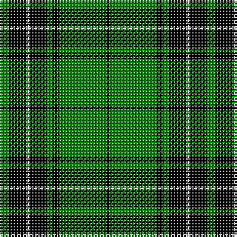

In pattern [GKWKGKGK](/patterns/gkwkgkgk/).

This was sourced from weddslist.  It is a [8 stripes tartan](/stripes/stripes8/).

Original link http://www.weddslist.com/cgi-bin/tartans/pg.pl?source=sts

## Thread count
G/6 K12 LN2 K12 G4 K4 G32 K/2

## Palette
Each colour and its ΔE from the base-6 reference it is a variant of.

| Colour | Shade | Base | ΔE (OKLab) |
|---|---|---|---|
| G | <code style="background-color:#008000;">#008000</code> `#008000` | G <code style="background-color:#006100;">#006100</code> | 0.10 |
| K | <code style="background-color:#000000;">#000000</code> `#000000` | K <code style="background-color:#000000;">#000000</code> | 0.00 |
| LN | <code style="background-color:#E0E0E0;">#E0E0E0</code> `#E0E0E0` | W <code style="background-color:#F7F7F7;">#F7F7F7</code> | 0.07 |

# Sample pattern

## Nearest tartans

The nearest existing variants by ΔTartan distance.

1. [Fife, Duchess of..](/setts/s6/g30k12g6k6b2k5x2~b304080-g008000-k000000/) — ΔT 0.70
1. [Duchess of Fife](/setts/s6/g70k26g12k14b3k16x2~b1474b4-g007800-k000000/) — ΔT 0.91
1. [Forbes](/setts/s6/r1g16k8g4k4y1x2~g008000-k000000-rc00000-yf0c000/) — ΔT 1.13
1. [MacIver hunting](/setts/s9/w3g27k5g5k32g5k5g27y3x2~g008000-k000000-we0e0e0-yf0c000/) — ΔT 1.13
1. [MacLean VS](/setts/s8/g3k6w1k6g2k2g16k1x2~g004c00-k000000-wd0d0d0/) — ΔT 1.29
1. [Hartmann](/setts/s8/b4k8w3k8g4k4g32k4x2~b8080d0-g008000-k000000-we0e0e0/) — ΔT 1.31
1. [MacArthur, ?](/setts/s6/r3g30k12g6k16y2x2~g008000-k000000-rc00000-yf0c000/) — ΔT 1.34
1. [Fort William](/setts/s11/g17b2ga2b2k21b2k3g30k2b2k4x2~b5480b0-g008000-ga30a010-k000000/) — ΔT 1.39
1. [Sin-Cos](/setts/s10/k60g64ga5g8ga5g64k60y8k8y8~g228b22-ga006400-k000000-yffd700/) — ΔT 1.48
1. [Paton](/setts/s7/r3g24k28g19y3g3y3x2~g008000-k000000-rc00000-yf0c000/) — ΔT 1.48

## Neighbour map

Every grey dot is one of 15726 variants placed by the first two principal components of the ΔTartan feature space (44% of its variance). Red is this tartan; blue dots are its nearest — click one to open its page.

<svg viewBox="0 0 640 380" role="img" style="max-width:100%;height:auto;border:1px solid #e0e0e0;border-radius:4px;display:block" xmlns="http://www.w3.org/2000/svg"><image href="/nn/cloud.v1.png" width="640" height="380"/><a href="/setts/s6/g30k12g6k6b2k5x2~b304080-g008000-k000000/"><circle cx="340.8" cy="215.1" r="4" fill="#3465a4"><title>Fife, Duchess of..</title></circle></a><a href="/setts/s6/g70k26g12k14b3k16x2~b1474b4-g007800-k000000/"><circle cx="360.3" cy="200.6" r="4" fill="#3465a4"><title>Duchess of Fife</title></circle></a><a href="/setts/s6/r1g16k8g4k4y1x2~g008000-k000000-rc00000-yf0c000/"><circle cx="315.5" cy="193.1" r="4" fill="#3465a4"><title>Forbes</title></circle></a><a href="/setts/s9/w3g27k5g5k32g5k5g27y3x2~g008000-k000000-we0e0e0-yf0c000/"><circle cx="283.3" cy="188.0" r="4" fill="#3465a4"><title>MacIver hunting</title></circle></a><a href="/setts/s8/g3k6w1k6g2k2g16k1x2~g004c00-k000000-wd0d0d0/"><circle cx="361.4" cy="203.6" r="4" fill="#3465a4"><title>MacLean VS</title></circle></a><a href="/setts/s8/b4k8w3k8g4k4g32k4x2~b8080d0-g008000-k000000-we0e0e0/"><circle cx="266.9" cy="178.3" r="4" fill="#3465a4"><title>Hartmann</title></circle></a><a href="/setts/s6/r3g30k12g6k16y2x2~g008000-k000000-rc00000-yf0c000/"><circle cx="274.3" cy="199.8" r="4" fill="#3465a4"><title>MacArthur, ?</title></circle></a><a href="/setts/s11/g17b2ga2b2k21b2k3g30k2b2k4x2~b5480b0-g008000-ga30a010-k000000/"><circle cx="284.5" cy="149.1" r="4" fill="#3465a4"><title>Fort William</title></circle></a><a href="/setts/s10/k60g64ga5g8ga5g64k60y8k8y8~g228b22-ga006400-k000000-yffd700/"><circle cx="235.1" cy="172.9" r="4" fill="#3465a4"><title>Sin-Cos</title></circle></a><a href="/setts/s7/r3g24k28g19y3g3y3x2~g008000-k000000-rc00000-yf0c000/"><circle cx="259.9" cy="202.4" r="4" fill="#3465a4"><title>Paton</title></circle></a><circle cx="331.3" cy="191.4" r="5" fill="#c00000"/></svg>

ID: /setts/s8/g3k6w1k6g2k2g16k1x2~g008000-k000000-we0e0e0/
