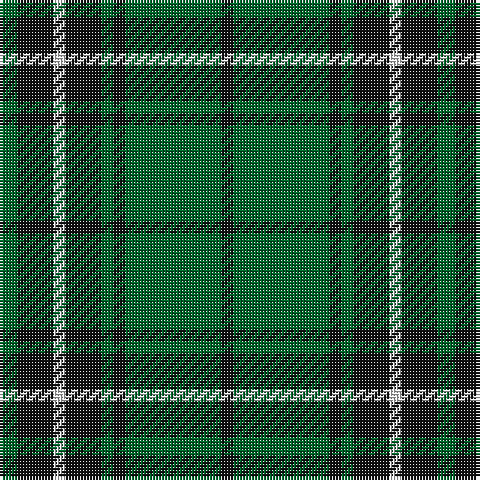

This page is one **sett** — a single exact thread-count. It belongs to the [tartan](/tartans/g3k6w2k6g2k2g16k2/)
(the same proportion at any scale), whose colour order is pattern [GKWKGKGK](/stripes/gkwkgkgk/).

Sourced from register-of-tartans.  It is a [8 stripe tartan](/stripes/stripes8/).

Original link https://www.tartanregister.gov.uk/tartanDetails.aspx?ref=2617

## Also known as

This cloth is also recorded under:

- MacLean of Duart Hunting

2 attestations — the source records this cloth was collapsed from (oldest owns this page)

<ul>
<li>01/01/1842 — MacLean of Duart Hunting (register-of-tartans, <a href="https://www.tartanregister.gov.uk/tartanDetails.aspx?ref=2617">record</a>)</li>
<li>1842 — MacLean of Duart Htg (VS) (Clan) (tartans-authority, <a href="http://www.tartansauthority.com/tartan-ferret/display/824/">record</a>)</li>
</ul>

## Register references

External register numbers recorded for this tartan.

- Scottish Register of Tartans: [2617](https://www.tartanregister.gov.uk/tartanDetails.aspx?ref=2617)
- Scottish Tartans Authority (ITI): 824
- Scottish Tartans World Register: 824

## Thread count
G/6 K12 LN4 K12 G4 K4 G32 K/4

## Palette

Palette: <strong>Tartan Register</strong> <small style="color:#888">(2 of 3 colours)</small>
<table><thead><tr><th>Colour</th><th>Threads</th><th>Shade</th><th>Base</th><th>OKLCh</th></tr></thead><tbody><tr><td>G/</td><td style="text-align:right;font-variant-numeric:tabular-nums">6</td><td><code style="background-color:#006428;">#006428</code> <small style="color:#888">#006428</small></td><td>G <code style="background-color:#006100;">#006100</code></td><td><small style="color:#888">oklch(43.9% 0.124 149.0)</small></td></tr><tr><td>K</td><td style="text-align:right;font-variant-numeric:tabular-nums">12</td><td><code style="background-color:#101010;">#101010</code> <small style="color:#888">#101010</small></td><td>K <code style="background-color:#000000;">#000000</code></td><td><small style="color:#888">oklch(17.3% 0.000 89.9)</small></td></tr><tr><td>LN</td><td style="text-align:right;font-variant-numeric:tabular-nums">4</td><td><code style="background-color:#E0E0E0;">#E0E0E0</code> <small style="color:#888">#E0E0E0</small></td><td>W <code style="background-color:#F7F7F7;">#F7F7F7</code></td><td><small style="color:#888">oklch(90.7% 0.000 89.9)</small></td></tr><tr><td>K</td><td style="text-align:right;font-variant-numeric:tabular-nums">12</td><td><code style="background-color:#101010;">#101010</code> <small style="color:#888">#101010</small></td><td>K <code style="background-color:#000000;">#000000</code></td><td><small style="color:#888">oklch(17.3% 0.000 89.9)</small></td></tr><tr><td>G</td><td style="text-align:right;font-variant-numeric:tabular-nums">4</td><td><code style="background-color:#006428;">#006428</code> <small style="color:#888">#006428</small></td><td>G <code style="background-color:#006100;">#006100</code></td><td><small style="color:#888">oklch(43.9% 0.124 149.0)</small></td></tr><tr><td>K</td><td style="text-align:right;font-variant-numeric:tabular-nums">4</td><td><code style="background-color:#101010;">#101010</code> <small style="color:#888">#101010</small></td><td>K <code style="background-color:#000000;">#000000</code></td><td><small style="color:#888">oklch(17.3% 0.000 89.9)</small></td></tr><tr><td>G</td><td style="text-align:right;font-variant-numeric:tabular-nums">32</td><td><code style="background-color:#006428;">#006428</code> <small style="color:#888">#006428</small></td><td>G <code style="background-color:#006100;">#006100</code></td><td><small style="color:#888">oklch(43.9% 0.124 149.0)</small></td></tr><tr><td>K/</td><td style="text-align:right;font-variant-numeric:tabular-nums">4</td><td><code style="background-color:#101010;">#101010</code> <small style="color:#888">#101010</small></td><td>K <code style="background-color:#000000;">#000000</code></td><td><small style="color:#888">oklch(17.3% 0.000 89.9)</small></td></tr></tbody></table>

# Sample pattern

## Nearest tartans

The nearest existing variants by ΔTartan distance, with this tartan at the top so the swatches line up against it.

ΔTartan

Tartan

Sett

—

<a href="/ttd/edit/#slug=g3k6w2k6g2k2g16k2~x2">MacLean of Duart Hunting</a> <a class="nn-out" href="/setts/s8/g3k6w2k6g2k2g16k2~x2/" title="open its dictionary page">↗</a>

1.07

<a href="/ttd/edit/#slug=g40k20t10k4t7g13k4t4~x2">Letham (S.Australia)</a> <a class="nn-out" href="/setts/s8/g40k20t10k4t7g13k4t4~x2/" title="open its dictionary page">↗</a>

1.09

<a href="/ttd/edit/#slug=g18k3g3k3g3k21g2k21g21k4~x2">Guildry of Stirling</a> <a class="nn-out" href="/setts/s10/g18k3g3k3g3k21g2k21g21k4~x2/" title="open its dictionary page">↗</a>

1.12

<a href="/ttd/edit/#slug=g6k16r3k16g28k4g12w3~x2">MacAulay of Lewis</a> <a class="nn-out" href="/setts/s8/g6k16r3k16g28k4g12w3~x2/" title="open its dictionary page">↗</a>

1.16

<a href="/ttd/edit/#slug=k4g32k4g4k8w3k8t4~x2">Hartmann (Personal)</a> <a class="nn-out" href="/setts/s8/k4g32k4g4k8w3k8t4~x2/" title="open its dictionary page">↗</a>

1.24

<a href="/ttd/edit/#slug=w2g12k3g3k16g3k3g12ly2~x2">MacIver Hunting</a> <a class="nn-out" href="/setts/s9/w2g12k3g3k16g3k3g12ly2~x2/" title="open its dictionary page">↗</a>

1.28

<a href="/ttd/edit/#slug=g3k6r2k6g3k2g16k1~x4">Glenbarr</a> <a class="nn-out" href="/setts/s8/g3k6r2k6g3k2g16k1~x4/" title="open its dictionary page">↗</a>

1.30

<a href="/ttd/edit/#slug=k15g2k2g4r2g2r2g2k2~x2">Gaelic Society of Moscow (Corporate)</a> <a class="nn-out" href="/setts/s9/k15g2k2g4r2g2r2g2k2~x2/" title="open its dictionary page">↗</a>

1.32

<a href="/ttd/edit/#slug=k22g5k2g5k11g33k2r4~x2">MacArthur-Fox 1993 (Personal)</a> <a class="nn-out" href="/setts/s8/k22g5k2g5k11g33k2r4~x2/" title="open its dictionary page">↗</a>

1.33

<a href="/ttd/edit/#slug=db1g12db4lb1db4g4db1~x4">St. Dennis &amp; Cranley School</a> <a class="nn-out" href="/setts/s7/db1g12db4lb1db4g4db1~x4/" title="open its dictionary page">↗</a>

1.33

<a href="/ttd/edit/#slug=dg2o14dg8o3dg12db2~x2">Confederate Infantry</a> <a class="nn-out" href="/setts/s6/dg2o14dg8o3dg12db2~x2/" title="open its dictionary page">↗</a>

## Neighbour map

Every grey dot is one of 14299 variants placed by the first two principal components of the ΔTartan feature space (44% of its variance). Red is this tartan; blue dots are its nearest — click one to open its page.

<svg viewBox="0 0 640 380" role="img" style="max-width:100%;height:auto;border:1px solid #e0e0e0;border-radius:4px;display:block" xmlns="http://www.w3.org/2000/svg"><image href="/nn/cloud.v1.png" width="640" height="380"/><a href="/setts/s8/g40k20t10k4t7g13k4t4~x2/"><circle cx="299.5" cy="226.7" r="4" fill="#3465a4"><title>Letham (S.Australia)</title></circle></a><a href="/setts/s10/g18k3g3k3g3k21g2k21g21k4~x2/"><circle cx="349.4" cy="231.6" r="4" fill="#3465a4"><title>Guildry of Stirling</title></circle></a><a href="/setts/s8/g6k16r3k16g28k4g12w3~x2/"><circle cx="280.1" cy="221.8" r="4" fill="#3465a4"><title>MacAulay of Lewis</title></circle></a><a href="/setts/s8/k4g32k4g4k8w3k8t4~x2/"><circle cx="305.3" cy="190.7" r="4" fill="#3465a4"><title>Hartmann (Personal)</title></circle></a><a href="/setts/s9/w2g12k3g3k16g3k3g12ly2~x2/"><circle cx="273.8" cy="205.1" r="4" fill="#3465a4"><title>MacIver Hunting</title></circle></a><a href="/setts/s8/g3k6r2k6g3k2g16k1~x4/"><circle cx="376.8" cy="215.1" r="4" fill="#3465a4"><title>Glenbarr</title></circle></a><a href="/setts/s9/k15g2k2g4r2g2r2g2k2~x2/"><circle cx="347.3" cy="216.3" r="4" fill="#3465a4"><title>Gaelic Society of Moscow (Corporate)</title></circle></a><a href="/setts/s8/k22g5k2g5k11g33k2r4~x2/"><circle cx="362.7" cy="208.5" r="4" fill="#3465a4"><title>MacArthur-Fox 1993 (Personal)</title></circle></a><a href="/setts/s7/db1g12db4lb1db4g4db1~x4/"><circle cx="369.6" cy="224.8" r="4" fill="#3465a4"><title>St. Dennis &amp; Cranley School</title></circle></a><a href="/setts/s6/dg2o14dg8o3dg12db2~x2/"><circle cx="313.8" cy="262.0" r="4" fill="#3465a4"><title>Confederate Infantry</title></circle></a><circle cx="321.0" cy="231.1" r="5" fill="#c00000"/></svg>

ID: /setts/s8/g3k6w2k6g2k2g16k2~x2/
