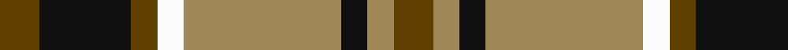
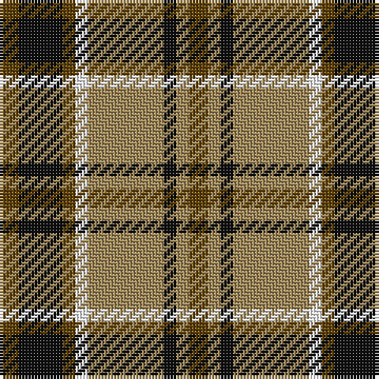

In pattern [GKGWYKYG](/patterns/gkgwykyg/).

This was sourced from register-of-tartans.  It is a [8 stripes tartan](/stripes/stripes8/).

Original link https://www.tartanregister.gov.uk/tartanDetails.aspx?ref=867

## Thread count
T/6 K14 T4 W4 LT24 K4 LT4 T/6

## Palette
Each colour and its ΔE from the base-6 reference it is a variant of.

| Colour | Shade | Base | ΔE (OKLab) |
|---|---|---|---|
| K | <code style="background-color:#101010;">#101010</code> `#101010` | K <code style="background-color:#000000;">#000000</code> | 0.17 |
| LT | <code style="background-color:#A08858;">#A08858</code> `#A08858` | Y <code style="background-color:#F2BF00;">#F2BF00</code> | 0.21 |
| T | <code style="background-color:#604000;">#604000</code> `#604000` | G <code style="background-color:#006100;">#006100</code> | 0.14 |
| W | <code style="background-color:#FCFCFC;">#FCFCFC</code> `#FCFCFC` | W <code style="background-color:#F7F7F7;">#F7F7F7</code> | 0.01 |

# Sample pattern

## Nearest tartans

The nearest existing variants by ΔTartan distance.

1. [Daks](/setts/s8/r3k7r2w2ra12k2ra2r3~k000000-r806050-ra906030-we0e0e0~x2/) — ΔT 0.78
1. [Holden Brown (Corporate)](/setts/s8/w13k3w3k3w3k15g18r3~g604000-k101010-rc80000-we8ccb8~x2/) — ΔT 0.94
1. [Wilson's No.193](/setts/s8/g6k1r1b2r2b2r1k1~b2888c4-g006818-k101010-rc80000~x4/) — ΔT 1.04
1. [MacKintosh Dress (Scott Adie)](/setts/s6/r3w8b4g14r4b2~b2c2c80-g285800-rc80000-we0e0e0~x4/) — ΔT 1.08
1. [Unidentified, specimen](/setts/s10/b1g4b1r1b1y1b5r6b1y1~b304080-g008000-rc00000-yf0c000~x2/) — ΔT 1.08
1. [Aberlour](/setts/s8/w23k4w4k4w4k22r23y5~k101010-r98481c-we8ccb8-ya08858~x2/) — ΔT 1.09
1. [Thompson/Thomson/MacTavish special grey](/setts/s6/r3g27k6y13k14r3~g808080-k101010-rdc0000-yc89664~x2/) — ΔT 1.10
1. [Holden Beige (Corporate)](/setts/s8/w13k3w3k3w3k15y18r3~k101010-rc80000-we8ccb8-ya08858~x2/) — ΔT 1.11
1. [Bronte House Check (Fashion)](/setts/s6/r10g60b13w24b24g8~b003c64-g604000-re87878-we8ccb8/) — ΔT 1.12
1. [Un-named (D C Dalgliesh) #3](/setts/s6/g3y24k15r3g25k3~g408060-k101010-ra888b4-ye09894~x2/) — ΔT 1.14

## Neighbour map

Every grey dot is one of 15726 variants placed by the first two principal components of the ΔTartan feature space (44% of its variance). Red is this tartan; blue dots are its nearest — click one to open its page.

<svg viewBox="0 0 640 380" role="img" style="max-width:100%;height:auto;border:1px solid #e0e0e0;border-radius:4px;display:block" xmlns="http://www.w3.org/2000/svg"><image href="/nn/cloud.v1.png" width="640" height="380"/><a href="/setts/s8/r3k7r2w2ra12k2ra2r3~k000000-r806050-ra906030-we0e0e0~x2/"><circle cx="172.5" cy="204.8" r="4" fill="#3465a4"><title>Daks</title></circle></a><a href="/setts/s8/w13k3w3k3w3k15g18r3~g604000-k101010-rc80000-we8ccb8~x2/"><circle cx="130.5" cy="198.6" r="4" fill="#3465a4"><title>Holden Brown (Corporate)</title></circle></a><a href="/setts/s8/g6k1r1b2r2b2r1k1~b2888c4-g006818-k101010-rc80000~x4/"><circle cx="161.7" cy="216.5" r="4" fill="#3465a4"><title>Wilson's No.193</title></circle></a><a href="/setts/s6/r3w8b4g14r4b2~b2c2c80-g285800-rc80000-we0e0e0~x4/"><circle cx="148.3" cy="216.1" r="4" fill="#3465a4"><title>MacKintosh Dress (Scott Adie)</title></circle></a><a href="/setts/s10/b1g4b1r1b1y1b5r6b1y1~b304080-g008000-rc00000-yf0c000~x2/"><circle cx="186.9" cy="195.9" r="4" fill="#3465a4"><title>Unidentified, specimen</title></circle></a><a href="/setts/s8/w23k4w4k4w4k22r23y5~k101010-r98481c-we8ccb8-ya08858~x2/"><circle cx="128.8" cy="195.5" r="4" fill="#3465a4"><title>Aberlour</title></circle></a><a href="/setts/s6/r3g27k6y13k14r3~g808080-k101010-rdc0000-yc89664~x2/"><circle cx="190.4" cy="208.1" r="4" fill="#3465a4"><title>Thompson/Thomson/MacTavish special grey</title></circle></a><a href="/setts/s8/w13k3w3k3w3k15y18r3~k101010-rc80000-we8ccb8-ya08858~x2/"><circle cx="126.5" cy="194.6" r="4" fill="#3465a4"><title>Holden Beige (Corporate)</title></circle></a><a href="/setts/s6/r10g60b13w24b24g8~b003c64-g604000-re87878-we8ccb8/"><circle cx="230.3" cy="221.4" r="4" fill="#3465a4"><title>Bronte House Check (Fashion)</title></circle></a><a href="/setts/s6/g3y24k15r3g25k3~g408060-k101010-ra888b4-ye09894~x2/"><circle cx="177.6" cy="207.2" r="4" fill="#3465a4"><title>Un-named (D C Dalgliesh) #3</title></circle></a><circle cx="177.2" cy="205.8" r="5" fill="#c00000"/></svg>

ID: /setts/s8/g3k7g2w2y12k2y2g3~g604000-k101010-wfcfcfc-ya08858~x2/
